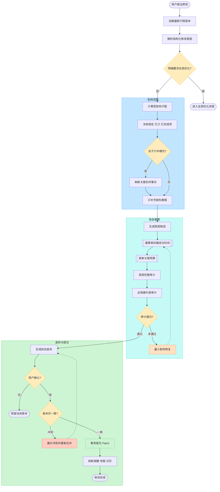

# 旅游规划智能体工作流图

> 对应详细规格：[旅游规划智能体详细流程规格](./agent-workflow-detailed-spec.md)

## 1. 新旅行主工作流

```mermaid
flowchart TD
    startNode(["用户发起规划"])
    loadContext["加载权威快照"]
    routeIntent["识别意图与执行模式"]

    subgraph intakePhase ["需求与约束"]
        structureRequirements["结构化需求"]
        compileConstraints["编译约束"]
        readinessGate{"存在阻塞缺项?"}
        clarifyInput[/"集中询问关键项"/]
        confirmBasis{"确认规划依据?"}
    end

    subgraph researchPhase ["有界研究"]
        researchPlan["生成最小研究计划"]
        gatherFacts[["并行获取核心事实"]]
        evidenceLedger[("Evidence 账本")]
        evidenceGate{"核心证据足够?"}
        targetedResearch["定向补充一次"]
    end

    subgraph planningPhase ["候选与确定性求解"]
        prunePlaces["候选分层筛选"]
        designSkeletons["生成日程骨架"]
        coarseFilter["粗粒度可行性过滤"]
        solveRouteTime[["路线与时间求解"]]
        calculateBudget[["多人预算计算"]]
    end

    subgraph qualityPhase ["质量门与修复"]
        deterministicAudit["确定性规则审计"]
        qualityGate{"硬质量门通过?"}
        targetedRepair["按问题最小修复"]
        modelReview["模型体验复核"]
    end

    subgraph approvalPhase ["提案与提交"]
        buildProposal["生成结构化差异"]
        userApproval{"用户确认?"}
        waitRevision(["等待继续修改"])
        versionGate{"版本仍一致?"}
        resolveConflict["展示冲突并重算"]
        commitTrip["事务提交新版本"]
        renderPlan[/"渲染卡片 地图 文档"/]
        finishNode(["规划完成"])
    end

    startNode --> loadContext --> routeIntent --> structureRequirements
    structureRequirements --> compileConstraints --> readinessGate
    readinessGate -->|"是"| clarifyInput
    clarifyInput -.-> structureRequirements
    readinessGate -->|"否"| confirmBasis
    confirmBasis -->|"修改"| structureRequirements
    confirmBasis -->|"确认"| researchPlan
    researchPlan --> gatherFacts --> evidenceLedger --> evidenceGate
    evidenceGate -->|"不足"| targetedResearch
    targetedResearch -.-> gatherFacts
    evidenceGate -->|"足够"| prunePlaces
    prunePlaces --> designSkeletons --> coarseFilter --> solveRouteTime --> calculateBudget
    calculateBudget --> deterministicAudit --> qualityGate
    qualityGate -->|"未通过"| targetedRepair
    targetedRepair -.-> solveRouteTime
    qualityGate -->|"通过"| modelReview --> buildProposal --> userApproval
    userApproval -->|"暂不应用"| waitRevision
    userApproval -->|"应用"| versionGate
    versionGate -->|"冲突"| resolveConflict
    resolveConflict -.-> buildProposal
    versionGate -->|"一致"| commitTrip --> renderPlan --> finishNode

    style intakePhase fill:#C2E5FF,stroke:#3DADFF
    style researchPhase fill:#DCCCFF,stroke:#874FFF
    style planningPhase fill:#C6FAF6,stroke:#5AD8CC
    style qualityPhase fill:#FFECBD,stroke:#FFC943
    style approvalPhase fill:#CDF4D3,stroke:#66D575
    style readinessGate fill:#FFECBD,stroke:#FFC943
    style evidenceGate fill:#FFECBD,stroke:#FFC943
    style qualityGate fill:#FFECBD,stroke:#FFC943
    style userApproval fill:#FFECBD,stroke:#FFC943
    style versionGate fill:#FFECBD,stroke:#FFC943
    style targetedRepair fill:#FFE0C2,stroke:#FF9E42
    style resolveConflict fill:#FFCDC2,stroke:#FF7556
    style commitTrip fill:#CDF4D3,stroke:#66D575
```

## 2. 局部修改与行中调整

## 3. 图中关键边界

- 模型节点：需求结构化、研究计划、日程骨架、体验复核、定向修复和用户解释。
- 确定性节点：路线时间、预算、约束审计、影响子图、版本检查和事务提交。
- 只读外部调用集中在“有界研究”和“只补充缺失数据”，不能在所有节点自由调用。
- 未通过硬质量门的方案不能进入用户确认。
- 用户确认的是结构化差异，不是模型自然语言文本。
- 局部修改默认只重算受影响子图；全局优化必须由用户明确要求或硬约束传播触发。
