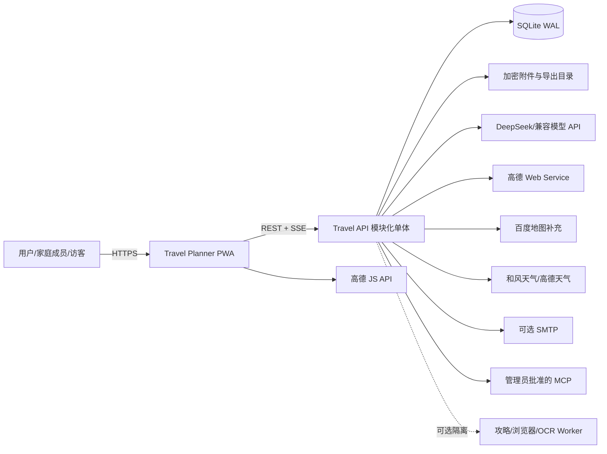

# DD-01 系统架构与架构决策

> 版本：1.0-draft
> 状态：详细设计
> 需求来源：SRS 5、6.15、6.27、6.28、11、12；NFR-DEP、NFR-PERF、NFR-MNT、NFR-AVL

## 1. 设计目标

系统采用面向个人、家庭和小团队的自托管模块化单体。目标不是追求理论上的无限扩展，而是在 2 核/2 GB NAS 上稳定完成旅行规划，同时保留模型、地图、天气、数据库和可选 Worker 的替换能力。

关键质量属性排序如下：

1. 数据正确性、可恢复性和隐私；
2. Agent 输出质量和可解释性；
3. 低资源占用和部署简单；
4. 移动端旅行中可用性；
5. Provider 可替换性；
6. 横向扩展能力。

## 2. 系统上下文



浏览器只直接接触页面展示所需的高德 JS Key。Web Service Key、模型 Key、百度 Server AK、天气 Key、SMTP 密码和 MCP 凭据只保存在服务端加密配置中。

## 3. 部署视图

### 3.1 默认 Profile

默认 Docker Compose 只启动两个长期容器：

| 容器 | 责任 | 资源软目标 |
|---|---|---|
| `web` | 静态 PWA、反向代理、TLS 终止可选 | 空闲 20～50 MB |
| `api` | FastAPI、领域服务、Agent、轻量后台任务、SQLite 所有写入 | 空闲 220～380 MB |

数据库、附件、备份和导出使用宿主机指定目录挂载。PP-OCR 与 Chromium 以受控子进程按需启动，不作为永久驻留容器。可选攻略 Worker 使用独立 Compose Profile，默认关闭。

### 3.2 扩展 Profile

| Profile | 增加组件 | 启用条件 |
|---|---|---|
| `postgres` | PostgreSQL | 明显多人并发、远程部署或检索需求增加 |
| `guide-worker` | 只读浏览器 Worker | 管理员明确启用并通过资源、安全 PoC |
| `external-ocr` | 独立 OCR 服务 | 本地 OCR 质量或调度不能满足需求 |

首版不默认引入 Redis、Celery、Kafka、向量数据库、Ollama 或 Kubernetes。

## 4. 逻辑模块

| 模块 | 责任 | 禁止承担的责任 |
|---|---|---|
| Identity | 登录、Session、密码恢复、用户 | 不决定家庭内旅行权限 |
| Family | 家庭组、成员档案、邀请、角色 | 不保存证件号码 |
| Preferences | 分级偏好、用户记忆、确认 | 不直接接受模型推断为硬约束 |
| Trips | Trip 生命周期、参与者、版本指针 | 不直接调用 LLM |
| Itinerary | TripItem、TripLeg、锁定、排序、连续性 | 不保存第三方原始响应 |
| Planning | PlanningRun、Proposal、Patch、质量门 | 不直接提交正式状态 |
| Research | Evidence、Source、Claim、检索计划 | 不把网页文本当作可信指令 |
| Geography | POI、地理编码、坐标转换、地图链接 | 不泄漏 Server Key 到客户端 |
| Routing | 多方式路线、费用估算、RouteQuote | 不把估算伪装成实时价格 |
| Budget | 预算规则、价格区间、人数分摊、版本 | 不处理支付 |
| Orders | 订单草稿、确认、匹配、变更 | 不代订或登录交易平台 |
| Expenses | 消费、垫付、退款、押金、分摊 | 不连接支付账户 |
| Documents | 上传、OCR、导入、导出 | 不把未确认 OCR 结果直接落正式表 |
| Sharing | 家庭/公开分享、脱敏副本、有效期 | 不公开原始私有附件 |
| Notifications | 站内提醒、SMTP、日历导出 | 不成为关键写事务的一部分 |
| Usage | Provider 用量、估算费用、配额、熔断 | 不记录明文凭据 |
| Administration | 配置、任务、备份、恢复、审计查询 | 不绕过审计修改业务数据 |

## 5. 分层和调用规则

```text
api/                HTTP、SSE、DTO、认证依赖
application/        Command、Query、UseCase、事务边界
domain/             Entity、ValueObject、Policy、DomainService、Port
agents/             WorkflowRuntime、AgentNode、Context、Prompt、Evaluator
infrastructure/     SQL Repository、Provider Adapter、MCP、文件、调度器
workers/            OCR、PDF、可选浏览器等受控进程入口
```

强制规则：

- Router 不直接访问 ORM；
- AgentNode 不直接访问数据库，只能通过只读 Context 和工具端口；
- Provider Adapter 不返回供应商原始结构，必须转换为内部 DTO；
- Repository 不包含业务决策；
- 领域对象不依赖网络或系统时间，时间和 ID 由端口注入；
- 所有正式写入由 Application UseCase 统一开启事务；
- 异步副作用必须在事务提交后由 Outbox 驱动。

## 6. 进程与并发模型

### 6.1 API 进程

SQLite Profile 固定一个 API Worker，以避免多个进程竞争写锁和重复执行内置任务。FastAPI 使用异步 I/O 处理模型和 Provider 请求；CPU/高内存任务进入受限子进程。

### 6.2 任务等级

| 等级 | 示例 | 执行方式 | 默认并发 |
|---|---|---|---|
| 轻量 | 缓存刷新、提醒扫描、Outbox 派发 | API 内异步任务 | 2～4 |
| 网络型 | 地图、天气、模型请求 | 异步 I/O + Provider 信号量 | 按 Provider 1～3 |
| CPU 型 | OCR、复杂导入、优化求解 | 子进程 + DB 租约 | 1 |
| 高内存 | PDF/Chromium、浏览器攻略 | 独立子进程/Profile | 全局 1 |

任务使用数据库租约实现单实例领取，任务必须可重试且幂等。进程重启后，过期租约可被重新领取。

## 7. 数据流原则

### 7.1 查询

```text
HTTP Query → 身份与作用域 → QueryService → Repository/View → DTO → ETag/version
```

### 7.2 用户命令

```text
HTTP Command + Idempotency-Key + expected_version
  → 权限/Schema/领域规则
  → Transaction
  → 聚合变更 + Version + Audit + Outbox
  → Commit
  → 202/200 + 新版本
```

### 7.3 AI 变更

```text
PlanningRun → 最新快照 → 工具读取/外部证据 → Proposal(base_version)
  → 用户查看 Diff → ApplyProposal(expected_version)
  → 重新校验 → Transaction → 正式状态
```

## 8. Provider 端口

所有外部服务都实现统一元数据和错误语义：

```text
ProviderRequestContext
  request_id, user_id, trip_id, deadline, locale,
  max_cost, allow_cache, source_policy, privacy_scope

ProviderResult<T>
  data, provider, queried_at, expires_at, cache_status,
  confidence, source_refs[], usage, warnings[]
```

Provider 错误分为 `invalid_request`、`unauthorized`、`quota_exceeded`、`rate_limited`、`timeout`、`unavailable`、`upstream_changed` 和 `unsafe_content`。上层只能依据分类决定重试或降级，不解析供应商错误字符串。

## 9. 架构决策记录

### ADR-001：采用模块化单体

- 状态：接受；
- 决策：前端 PWA + 单个 FastAPI 应用，按领域模块隔离；
- 原因：目标用户量小、资源受限、事务一致性要求高；
- 后果：部署和调试简单；模块边界必须通过代码规则和测试维持；
- 重新评估触发：单进程吞吐成为实际瓶颈，且不能通过后台任务隔离解决。

### ADR-002：SQLite WAL 是默认数据库

- 状态：接受；
- 决策：单 API Worker 写入，外键开启，短事务，附件不入 BLOB；
- 原因：空闲资源低、备份直接、适合家庭规模；
- 后果：长写事务和多进程写入被禁止；
- 退出路径：Repository 保持数据库中立，提供 PostgreSQL Profile。

### ADR-003：结构化状态优先于聊天历史

- 状态：接受且不可绕过；
- 决策：每次模型调用重新读取当前快照，聊天只作为意图和解释来源；
- 后果：模型不能凭旧对话恢复当前状态；Prompt 必须带版本号与锁定项。

### ADR-004：AI 使用 Proposal/Patch 两阶段提交

- 状态：接受；
- 决策：模型生成符合 Schema 的 Patch，用户确认后由确定性代码执行；
- 原因：避免幻觉、旧版本和越权修改；
- 后果：需要 Proposal 存储、Diff UI 和冲突处理。

### ADR-005：自有轻量 WorkflowRuntime

- 状态：接受；
- 决策：领域契约不依赖 LangGraph/Pydantic AI；可通过适配器引入；
- 原因：降低常驻内存、框架锁定和升级风险；
- 后果：必须自行实现节点状态、检查点、重试和可观测性。

### ADR-006：REST + SSE

- 状态：接受；
- 决策：命令和查询使用 REST，长任务状态和模型增量输出使用单向 SSE；
- 原因：移动 Web 兼容、代理友好、比 WebSocket 简单；
- 后果：客户端命令仍走 HTTP；断线用事件序号恢复。

### ADR-007：高德主地图、百度补充

- 状态：接受；
- 决策：页面渲染和主要国内路线使用高德；百度用于补充验证和外部跳转；
- 后果：内部统一 WGS-84/GCJ-02/BD-09 显式坐标类型，不允许裸经纬度跨 Provider。

### ADR-008：敏感数据应用层信封加密

- 状态：接受；
- 决策：API Key、私密对话、附件、订单和消费敏感字段使用 DEK 加密，DEK 由部署级 KEK 包装；
- 原因：SQLite/文件卷泄露时仍提供保护；
- 后果：搜索字段需单独设计盲索引或最小化明文元数据，备份和密钥必须配对恢复。

### ADR-009：重任务按需子进程

- 状态：接受；
- 决策：OCR、Chromium PDF、浏览器工具不常驻，统一全局高内存信号量；
- 后果：首次任务有冷启动延迟，但满足空闲内存目标。

### ADR-010：外部事实必须证据化

- 状态：接受；
- 决策：价格、路线、天气、营业时间和攻略主张不直接写入计划文本，先形成 Evidence/Observation；
- 后果：界面可展示来源、新鲜度、估算/实时状态，Agent 可做冲突分析。

### ADR-011：远程 MCP 默认拒绝

- 状态：接受；
- 决策：只有系统管理员能登记和测试 MCP；工具导入后仍需权限映射、Schema 校验、网络策略和用户级启停；
- 后果：不能把任意 MCP 工具原样暴露给模型。

### ADR-012：Apache-2.0 作为项目许可证基线

- 状态：暂定接受；
- 决策：项目代码按 Apache-2.0 准备，发布前生成第三方依赖清单并完成许可证复核；
- 后果：不引入与发布方式冲突的代码或数据资源。

## 10. 建议代码仓库结构

```text
apps/
  web/                         React + TypeScript + Vite PWA
  api/
    src/travel_agent/
      api/                     routers, dependencies, dto
      application/             commands, queries, use_cases
      domain/                  entities, policies, ports
      agents/                  runtime, nodes, prompts, evaluators
      infrastructure/          db, providers, mcp, files, jobs
      settings/                typed configuration
    migrations/
packages/
  contracts/                   OpenAPI生成物、JSON Schema、事件类型
deploy/
  compose.yaml
  env.example
  profiles/
docs/
  design/
tests/
  unit/
  integration/
  contract/
  e2e/
  evals/
```

## 11. 约束检查

| 需求约束 | 设计响应 | 状态 |
|---|---|---|
| 空闲 <512 MB | 两个常驻容器，重任务按需启动 | 可设计，待压测 |
| 正常峰值 <2 GB | 高内存任务全局并发 1，子进程退出释放 | 可设计，待压测 |
| 多用户/家庭 | 作用域授权 + 乐观版本，而非多租户微服务 | 已覆盖 |
| 模型可替换 | `ModelProvider` 端口 | 已覆盖 |
| 地图可补充 | `MapProvider`/`RouteProvider` 端口 | 已覆盖 |
| Docker AMD64 | Compose 默认 Profile | 已覆盖 |
| 可恢复 | 版本、审计、Outbox、加密备份 | 已覆盖 |

## 12. 待后续文档固化的接口

- DD-02 固化实体、字段、索引和数据保留；
- DD-03 固化状态机、Patch 操作、事务和冲突；
- DD-04 固化 REST/SSE 外部契约；
- DD-05 固化 AgentNode、Tool 和 Provider 接口；
- DD-06 固化密钥格式、权限决策和威胁控制；
- DD-08 固化 Compose、任务租约和资源限制参数。
