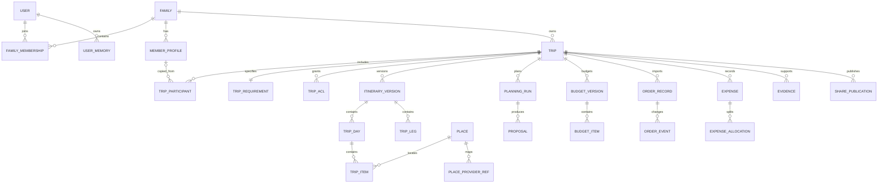
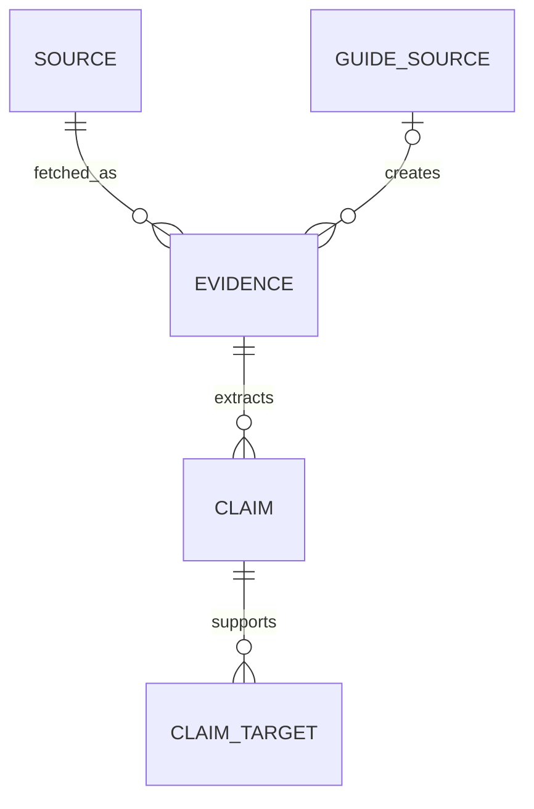

# DD-02 领域模型与数据库设计

> 版本：1.0-draft
> 数据库基线：SQLite 3 + WAL；PostgreSQL 兼容预留
> 需求来源：SRS 3～9、FR-STATE、FR-FAM、FR-MEM、FR-TRIP、FR-EDIT、FR-BUD、FR-ORD、FR-EXP、FR-SHARE、FR-AUD、DR-001～007

## 1. 建模原则

- 内部主键使用 UUIDv7 文本形式；不得使用地图 POI ID、订单号或用户名作为主键；
- 所有时间戳以 UTC ISO-8601 保存，另存业务时区 IANA 名称；
- 金额使用最小货币单位整数 `amount_minor`，并保存 `currency` 与汇率观察；
- 用户可编辑的当前状态与不可变历史分离；
- 订单、消费、价格观察和证据采用追加事实，不用覆盖丢失原值；
- 软删除实体保存 `deleted_at`，隐私彻底删除执行正文擦除并保留无敏感墓碑；
- 高频过滤字段使用普通列，扩展元数据才使用 JSON；
- 密文列命名为 `*_ciphertext`，同时保存 `key_version`，不得在同列混存明文；
- 每张业务表至少包含 `id`、`created_at`、`updated_at`；不可变表只含 `created_at`。

## 2. 聚合边界

| 聚合根 | 强一致范围 | 聚合外引用 |
|---|---|---|
| User | 账号状态、密码凭据、Session 撤销版本 | FamilyMembership、UserMemory |
| Family | 家庭设置、成员关系、邀请 | Trip 只存 family_id |
| Trip | 当前版本、权限、参与者、需求、可见性 | Version、Proposal、Order、Expense 独立追加 |
| ItineraryVersion | 一次不可变行程快照 | Evidence 通过引用表关联 |
| PlanningRun | 工作流状态、节点检查点、工具调用 | Proposal |
| Proposal | 基线版本、Patch、Diff、审批结果 | Apply 后生成新 Version |
| OrderRecord | 订单当前视图与追加状态事件 | 匹配 TripItem/TripLeg |
| Expense | 消费事实与更正/冲销链 | 分摊记录 |
| SharePublication | 独立脱敏快照、访问策略 | 不反向读取私有当前行程 |
| BackgroundJob | 租约、进度、重试和结果 | 业务对象弱引用 |

## 3. 核心 ERD

为保证图可读性，只展示关键关系；附件、审计、用量和任务在后续子图展开。

## 4. 身份、家庭与权限表

### 4.1 `users`

| 字段 | 类型 | 约束/含义 |
|---|---|---|
| `id` | TEXT | UUIDv7 PK |
| `username_normalized` | TEXT | UNIQUE，Unicode 规范化后值 |
| `email_normalized` | TEXT NULL | UNIQUE WHERE NOT NULL |
| `display_name_ciphertext` | BLOB | 用户显示名加密 |
| `password_hash` | TEXT | Argon2id 编码串 |
| `system_role` | TEXT | `admin/member`；访客不建账号 |
| `status` | TEXT | `active/locked/disabled/pending_delete/deleted` |
| `session_epoch` | INTEGER | 密码/权限变更时递增，撤销旧 Session |
| `locale` | TEXT | 首版 `zh-CN`，预留多语言 |
| `timezone` | TEXT | 默认 `Asia/Shanghai` |
| `last_login_at` | TEXT NULL | UTC |
| `deleted_at` | TEXT NULL | 软删除时间 |

索引：`username_normalized`、`email_normalized`、`status`。

### 4.2 `families`、`family_memberships`

`families` 保存 `name_ciphertext`、`owner_user_id`、`default_locale`、`settings_json`、`storage_limit_bytes`。`family_memberships` 保存 `family_id`、`user_id`、`role(owner/admin/member/guest)`、`status`、`joined_at`，唯一键 `(family_id,user_id)`。

`guest` 表示已登录的家庭访客；匿名分享访问不创建 Membership。家庭管理员不能通过角色自动读取成员的私有 Trip，仍须由 Trip ACL 授权。

### 4.3 `member_profiles`

保存家庭复用档案：`family_id`、可选 `linked_user_id`、昵称密文、成员类型、出生年或年龄段、优惠资格 JSON、饮食/健康/行动能力密文、旅行偏好 JSON、字段可见性 JSON。禁止证件号码字段。

### 4.4 `trip_acl`

| 字段 | 含义 |
|---|---|
| `trip_id` | 旅行 |
| `subject_type` | `user/family/anonymous_link` |
| `subject_id` | 用户、家庭或分享主体 ID |
| `permission` | `view/comment/copy/edit/manage` |
| `granted_by` | 授权人 |
| `expires_at` | 可选失效时间 |

唯一键 `(trip_id,subject_type,subject_id,permission)`。权限只增不隐含：`manage` 的具体能力由授权策略映射，不用字符串大小比较。

## 5. 偏好与记忆

### 5.1 `preferences`

| 字段 | 含义 |
|---|---|
| `scope_type` | `family/user/trip` |
| `scope_id` | 对应主体 ID |
| `category` | 交通、酒店、餐饮、节奏、作息等 |
| `key` | 稳定机器键 |
| `level` | `must/should/normal/exclude` |
| `value_json` | 类型化值 |
| `source_type` | `user/preset/import/memory_suggestion` |
| `confirmed_at` | 硬约束生效必须非空 |
| `disabled_at` | 禁用但保留历史 |

读取合并顺序：单次旅行明确值 > 个人明确值 > 家庭默认值；`exclude` 与 `must` 冲突时必须询问，不能自动覆盖。

### 5.2 `user_memories` 与 `memory_suggestions`

长期记忆保存结构化 `memory_key`、加密 `value`、来源旅行、确认人、可信度和状态。模型提取先写 `memory_suggestions(status=pending)`，用户接受后创建/更新 `user_memories`。用户可禁用或删除；删除后 Prompt 组装器不得继续读取历史聊天中的同一推断。

## 6. Trip 与需求模型

### 6.1 `trips`

| 字段 | 类型 | 说明 |
|---|---|---|
| `id` | TEXT | PK |
| `family_id` | TEXT | 所属家庭 |
| `owner_user_id` | TEXT | 责任人 |
| `title_ciphertext` | BLOB | 标题 |
| `status` | TEXT | DD-03 旅行状态 |
| `visibility` | TEXT | `private/selected/family/public` |
| `current_version_no` | INTEGER | 乐观锁及当前版本指针 |
| `current_itinerary_version_id` | TEXT NULL | 当前正式行程版本 |
| `start_date` / `end_date` | TEXT NULL | 本地日期，便于查询 |
| `origin_summary_ciphertext` | BLOB NULL | 精确住址不进入公开摘要 |
| `primary_timezone` | TEXT | IANA 名称 |
| `deleted_at` | TEXT NULL | 软删除 |

更新正式结构时使用 `UPDATE trips ... WHERE id=? AND current_version_no=?`。受影响行数为零即版本冲突。

### 6.2 `trip_requirements`

一个 Trip 对应一条当前需求文档，含出发/目的地候选、日期灵活度、预算目标、风格、方案数量、交通偏好、酒店/餐饮/作息、安全、来源策略和用户确认摘要。核心查询字段单列，长尾选项放 `requirement_json`。每次修改仍通过 Trip Version 记录快照。

### 6.3 `trip_participants`

从 MemberProfile 复制旅行时点快照，后续修改不反向污染家庭档案。保存 `profile_source_id`、显示名、年龄/成员类型、资格、饮食、健康/行动提示、是否临时成员、参与日期范围。敏感字段加密。

## 7. 不可变行程版本

### 7.1 `itinerary_versions`

| 字段 | 说明 |
|---|---|
| `trip_id`, `version_no` | 联合唯一 |
| `parent_version_id` | 前一版本；恢复也创建新版本，不移动旧指针 |
| `change_type` | `initial/user_edit/ai_apply/order_apply/restore/import/system` |
| `snapshot_schema_version` | JSON 快照 Schema 版本 |
| `snapshot_ciphertext` | 规范化完整快照压缩后加密 |
| `snapshot_hash` | 明文规范化内容的 HMAC/哈希校验值 |
| `summary_ciphertext` | 人类可读变更摘要 |
| `created_by_type/id` | user/agent/system/admin |
| `proposal_id` | 若由 AI 提案应用则关联 |

为查询与编辑效率，当前及历史版本同时拥有规范化子表 `trip_days`、`trip_items`、`trip_legs`，都包含 `itinerary_version_id`。历史行不可更新；生成新版本时复制未改子树并写新行。30 天/10 城规模下可接受，后续可采用结构共享优化，但不能改变版本语义。

### 7.2 `trip_days`

保存 `local_date`、`timezone`、城市 Place、建议开始/结束、节奏、天气摘要、日状态和排序。唯一键 `(itinerary_version_id,local_date,city_sequence)`。

### 7.3 `trip_items`

主要字段：

- 稳定 `logical_id`：跨版本识别同一逻辑项目；每个版本有独立行 `id`；
- `type`：`place/restaurant/hotel/rest/meeting/transport_node/free_time/emergency/other`；
- `execution_status`：候选、计划、确认、预订、开始、到达、完成、跳过、取消、延误；
- `preference_tags_json`：必去、想去、AI推荐、备选、不感兴趣；
- `locked_fields_json`：锁定城市、日期、地点、时间、订单、交通等具体字段；
- `start_at_local`、`end_at_local`、`duration_minutes`、`timezone`；
- `place_id`、`entrance_place_id`；
- `participant_ids_json`、`source_refs_json`；
- 费用摘要、可信状态、备注密文和 `sort_key`。

`sort_key` 采用可插入的十进制字符串/分数排序键；同日拖动通常只修改邻近项，定期后台压缩排序键。

### 7.4 `trip_legs`

保存跨版本 `logical_id`、起终点 Item/Place、交通方式、计划出发到达、时长、距离、换乘、步行、缓冲、RouteQuote 引用、费用、坐标系、导航链接参数、可信状态和来源。唯一约束确保同一版本的主路线不产生重复相邻段；备用段用 `variant_group_id` 区分。

## 8. 地点、路线和外部事实

### 8.1 `places`

内部地点保存规范名称、多语言名称 JSON、地址密文/公开摘要、城市编码、地点类型、入口/中心关系和规范坐标。`coordinates` 不使用通用 JSON：保存 `longitude_e7`、`latitude_e7`、`coordinate_system`、`provider`、`accuracy_meters`、`observed_at`。

### 8.2 `place_provider_refs`

唯一键 `(provider,provider_place_id)`，保存供应商名称/地址/类别、GCJ-02 或 BD-09 坐标、匹配置信度和最后验证时间。多个供应商引用可指向同一内部 Place，合并/拆分必须写审计。

### 8.3 `evidence`、`sources`、`claims`

- `sources`：URL、来源类型、平台、作者/机构、发布时间、许可/访问说明；
- `evidence`：采集时间、有效期、内容哈希、加密摘要、可信等级、提取方式、原始附件引用；
- `claims`：主语、谓语、类型化值、单位、适用时间、置信度、事实状态；
- `claim_targets`：把 Claim 关联到 Place、TripItem、Route、BudgetItem 等。

外部正文默认不长期完整复制；保留必要摘录、摘要、哈希和原链接。用户上传内容按用户文件保留策略处理。

### 8.4 `route_quotes` 与 `weather_observations`

路线报价保存 Provider 请求归一化哈希、方式、距离、时长、过路费/打车/公交等费用、路线摘要、查询时间、过期时间和原始响应加密引用。天气保存位置、粒度、预报时点、温度、降水、风、预警、来源和发布时间。两者均不可直接覆盖历史观察。

## 9. 预算、价格与汇率

### 9.1 `budget_versions`、`budget_items`

预算与行程版本关联但独立版本化，避免每次实际消费改变计划行程。预算条目保存：

- 分类和逻辑关联对象；
- `pricing_unit`：人、成人、儿童、老人、车辆、房间、房晚、订单、天、项；
- 数量、建议下限/目标/上限；
- 当前采用的 PriceObservation；
- 必选/可选、包含/排除项、计算公式版本；
- 分摊策略和参与人；
- 原币、折算币、汇率观察。

### 9.2 `price_observations`

保存 `price_level(statistical/route_quote/queried/locked/order/actual)`、金额范围、单位、来源、观察时间、有效期、置信度和证据。更高层次的价格成为“当前采用值”，但不删除低层次观察。

### 9.3 `exchange_rate_observations`

首版由用户手工维护。保存币种对、汇率十进制定点值、适用日期、来源说明和是否实际支付汇率。所有报表必须能回溯当时采用的汇率。

## 10. 订单与消费账本

### 10.1 `order_records` 与 `order_events`

`order_records` 是当前投影视图，包含供应商、订单类型、订单号密文、时间/地点、参与者、座位/房型、总价、币种、退改摘要、匹配目标、确认状态和附件。`order_events` 是不可变事实：`recognized/confirmed/changed/cancelled/refunded/rematched`，保存前后摘要、原因、来源和操作者。

OCR 结果先进入 `import_drafts`，用户确认后才创建 OrderRecord。订单匹配保存候选列表、理由和置信度，不能仅保留最终目标。

### 10.2 `expenses`

每条 Expense 都是追加事实：

| 字段 | 含义 |
|---|---|
| `entry_type` | `charge/refund/deposit/preauth/reversal/correction` |
| `root_expense_id` | 同一更正链根 |
| `reverses_expense_id` | 被冲销记录 |
| `amount_minor/currency` | 可正数存储，由类型决定方向，避免正负混乱 |
| `occurred_at/timezone` | 实际发生时间 |
| `payer_participant_id` | 垫付人 |
| `trip_item_id/order_id` | 可选计划关联 |
| `planned_status` | `planned/unplanned` |
| `payment_method_ciphertext` | 仅记录，不接支付 |
| `reason_ciphertext` | 更正/删除原因 |

`expense_allocations` 保存参与人、应承担金额和算法。每次更正产生新 Expense，并用冲销链计算净额；原记录不更新金额。

## 11. Agent、Proposal 与工具调用

### 11.1 `planning_runs`

保存 `trip_id`、`run_type`、`base_version_no`、状态、当前节点、触发者、请求摘要密文、模型配置快照、来源策略、预算/Token 上限、开始/结束时间、错误分类和恢复点。

### 11.2 `agent_checkpoints`

每个节点完成后保存输入哈希、结构化输出密文、上下文版本、重试次数和耗时。大输出存加密文件，表中保留引用。检查点只可追加；恢复时校验 Trip 版本，版本变化则从依赖节点重新运行。

### 11.3 `proposals`

保存 `base_version_no`、`proposal_type`、`patch_schema_version`、Patch 密文、Diff 摘要、影响范围、质量报告、状态、失效时间、审批人和应用后版本。Proposal 不保存为 Trip 当前状态。

### 11.4 `tool_calls`

保存工具名/版本、节点、参数脱敏摘要、参数哈希、权限决策、Provider、缓存状态、耗时、用量、结果摘要、错误类别和 Evidence 引用。密钥、Cookie、完整敏感响应不得写日志。

## 12. 分享、文件与导出

### 12.1 `share_publications`

发布时生成独立的 `sanitized_snapshot_ciphertext` 与公开渲染文件，不在访问时查询私有 Trip 当前版本。保存权限模式、密码哈希、有效期、撤销时间、搜索引擎策略和脱敏报告。私有版本变化不会自动更新公开副本；发布者必须重新预览、确认和创建新发布版本。

### 12.2 `attachments`

保存所有者作用域、相对路径、原文件名密文、MIME、大小、SHA-256、加密算法、DEK 版本、扫描状态和保留状态。物理文件路径由 AttachmentStore 生成，客户端输入不能决定服务器路径。

### 12.3 `export_artifacts`

保存格式、模板版本、基线行程/预算版本、生成参数、文件引用、状态和过期时间。最终用户明确选择长期保留的文档转为长期附件；临时导出按期删除。

## 13. 审计、Outbox、任务与用量

### 13.1 `audit_events`

不可变字段包括序号、操作者类型/ID、来源、动作、对象类型/ID、Trip、请求 ID、前后版本、前后摘要密文、原因、IP/UA 哈希、时间。隐私删除后执行正文擦除，保留动作、时间、匿名主体和不可识别对象墓碑。

### 13.2 `outbox_events`

与业务事务同库提交，含事件类型、聚合 ID、聚合版本、载荷、创建时间、领取租约、尝试次数和完成时间。唯一键 `(aggregate_type,aggregate_id,aggregate_version,event_type)` 防止重复副作用。

### 13.3 `background_jobs`

含类型、优先级、状态、计划时间、租约拥有者/过期、进度、重试策略、输入/结果引用、取消标志和资源等级。敏感输入加密。

### 13.4 `provider_usage_records`

记录 Provider、能力、请求数、缓存命中、计量单位、Token、供应商返回用量、估算成本、价格规则版本、成功/失败和日期。统计不能阻断 DeepSeek 调用，但外部 Provider 可以按管理员设置硬限额。

## 14. 索引和 SQLite 约束

必要索引：

- 所有外键列；
- `trips(family_id,status,start_date)`、`trips(owner_user_id,updated_at)`；
- `itinerary_versions(trip_id,version_no DESC)`；
- `trip_items(itinerary_version_id,trip_day_id,sort_key)`；
- `trip_legs(itinerary_version_id,from_item_id,to_item_id)`；
- `evidence(trip_id,expires_at)`、`sources(url_hash)`；
- `planning_runs(trip_id,status,created_at)`；
- `proposals(trip_id,status,created_at)`；
- `orders(trip_id,status)`、`expenses(trip_id,occurred_at)`；
- `audit_events(trip_id,sequence_no)`；
- `outbox_events(processed_at,available_at)`、`background_jobs(status,scheduled_at)`；
- `provider_usage_records(provider,usage_date)`。

SQLite 设置：`journal_mode=WAL`、`foreign_keys=ON`、`busy_timeout=5000`、`synchronous=NORMAL`；备份或高风险迁移前临时执行 checkpoint。写事务不得包含网络请求、模型调用、OCR 或 PDF 生成。

## 15. 数据删除与保留

| 数据 | 默认策略 |
|---|---|
| 旅行、聊天、最终文档 | 加密长期保留，用户可删除 |
| 审计 | 长期；隐私删除时去标识化 |
| 模型调用元数据 | 90 天，可配置 |
| 普通应用日志 | 30 天，可配置 |
| OCR 临时产物 | 确认/取消后尽快删除，最长 24 小时 |
| Provider 原始响应缓存 | 按能力 TTL，过期后删除或仅留摘要 |
| 订单/票据原件 | 加密保留，用户可独立删除原件 |
| 导出临时文件 | 默认 24 小时 |
| 备份 | 默认 7 日 + 4 周 |

彻底删除必须通过后台 Job：冻结主体 → 解析所有权 → 删除/擦除正文和文件 → 去标识化审计 → 重建搜索索引 → 生成删除证明摘要。失败可重试，不能出现数据库已删而文件仍公开可访问。

## 16. 数据模型验收

- 同一 Trip 任意时刻只有一个 `current_version_no`；
- 历史 ItineraryVersion 和 Expense 事实不可原地修改；
- 恢复历史版本会创建一个新版本；
- 任何 TripItem/TripLeg 都能追溯来源、版本和操作者；
- 任一采用价格都能追溯 PriceObservation；
- 公开分享仅能读取独立脱敏快照；
- 所有敏感附件只能经授权下载端点读取；
- SQLite 外键检查、唯一约束和迁移回滚测试全部通过。
