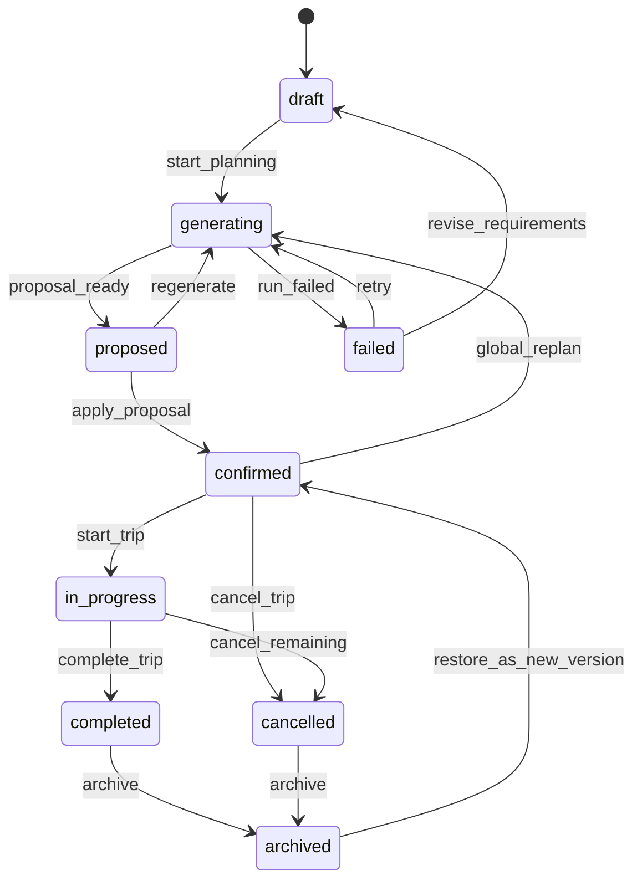
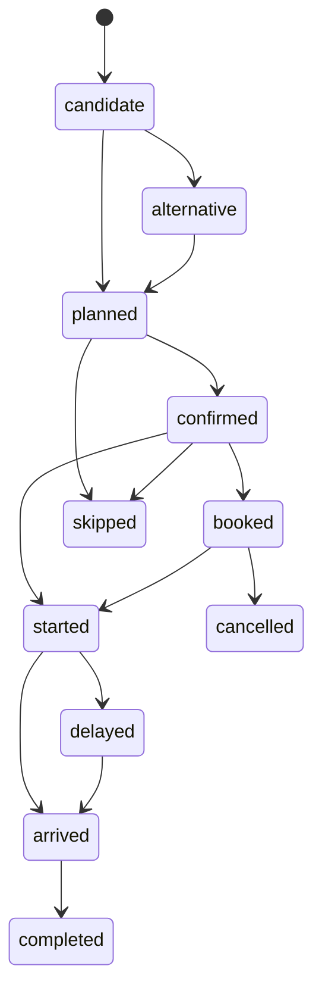
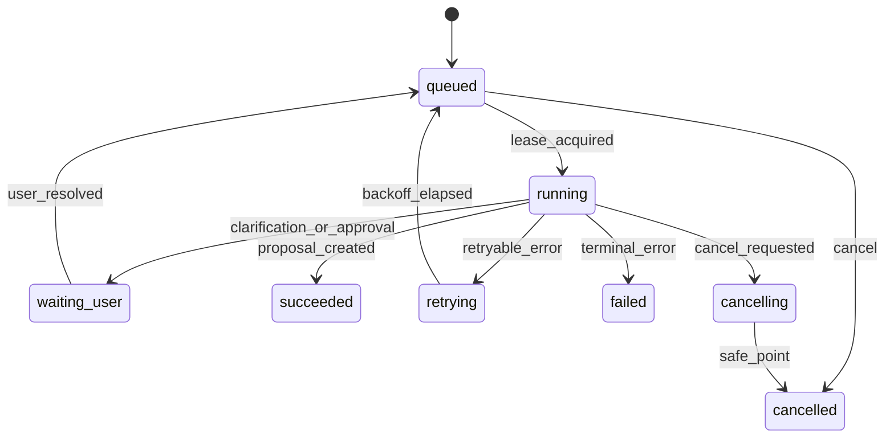
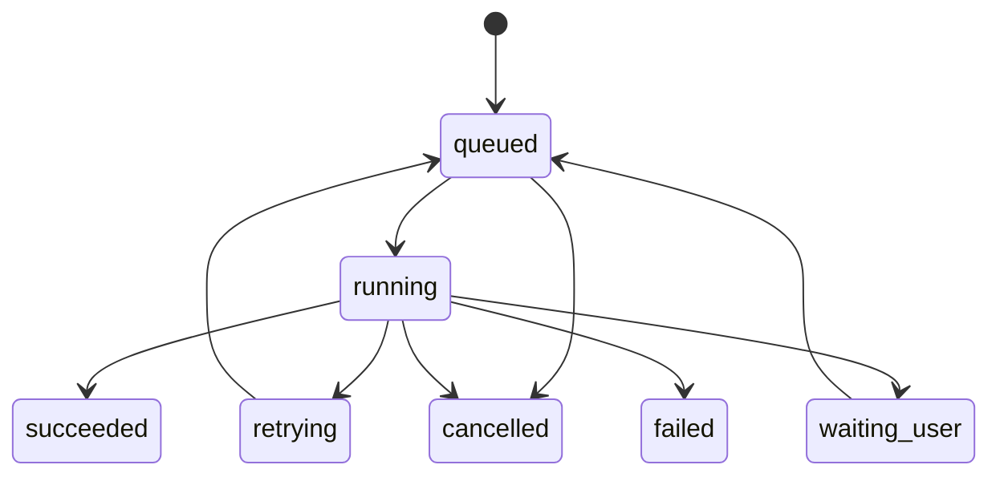

# DD-03 状态机、版本与事务设计

> 版本：1.0-draft
> 需求来源：FR-STATE-001～004、FR-EDIT-004～008、FR-ORD、FR-EXP、FR-AUD、FR-SHARE、FR-BACK；SRS 7～9

## 1. 状态设计规则

1. 生命周期状态、偏好标签和锁定约束必须分字段保存；
2. 所有状态迁移由应用命令触发，禁止 API 直接写状态字段；
3. 每个命令声明所需权限、允许前置状态、幂等键和预期版本；
4. 高影响命令必须生成审计；正式 Trip 变更必须生成不可变版本；
5. 网络调用和模型调用不进入数据库写事务；
6. 失败状态必须说明是否可重试、是否需要用户输入、是否已经产生副作用。

## 2. Trip 生命周期



约束：

- `generating` 只是界面主状态，PlanningRun 自己保存更细状态；用户仍可查看已确认旧版本；
- 生成失败不删除旧正式行程；没有旧行程时回到可编辑需求；
- `proposed` 不代表 Proposal 已生效；
- `in_progress` 下允许局部调整，优先当天，已完成项默认锁定；
- `cancelled` 不删除订单和消费；
- 从归档恢复产生新版本和审计，不修改历史状态记录。

## 3. TripItem 状态

执行状态：



标签单独保存：`must_visit`、`want`、`ai_recommended`、`alternative`、`not_interested`。锁定不是状态，使用字段级锁：`date/place/time/duration/order/route/participants/all`。

规则：已完成项不得被行中 Agent 修改；用户显式执行历史更正时可创建新版本，但必须标记 `historical_correction`。已预订项变更必须展示订单冲突，不能静默移动。

## 4. PlanningRun 与节点



节点状态为 `pending/running/succeeded/skipped/failed/waiting_user/invalidated`。一个 Run 只有一个节点执行；Provider 请求可在节点内部受限并发。每个成功节点创建 Checkpoint。

等待用户超过默认 7 天后 Run 可标记过期；原 Proposal 不自动应用。用户回复时先校验 Trip 当前版本，变更导致依赖失效则从最早受影响节点重新运行。

## 5. Proposal 状态

```text
draft → validating → ready → approved → applying → applied
                    ↘ rejected       ↘ conflict
                    ↘ expired        ↘ failed
```

| 状态 | 含义 |
|---|---|
| `draft` | Agent 正在构造 Patch |
| `validating` | Schema、权限、锁定、路线、预算、质量门检查 |
| `ready` | 可供用户查看 Diff |
| `approved` | 用户确认，但尚未开始提交 |
| `applying` | 正在执行确定性事务 |
| `applied` | 已产生新 Trip 版本 |
| `rejected` | 用户拒绝，可保留用于比较 |
| `conflict` | 基线版本过旧或锁定变化 |
| `expired` | 超过有效期或依赖事实过期 |
| `failed` | 应用时非冲突错误；可按错误类型重试 |

审批动作和应用动作可以在同一 HTTP 请求中连续执行，但数据库中仍保留两个状态事件。系统不得因为“用户曾允许自动优化”而跳过必须确认的硬约束、订单、消费、分享或删除变更。

## 6. BackgroundJob 状态



任务领取使用租约：事务内从可执行任务中选择一条，写 `lease_owner` 与 `lease_expires_at`。执行器每 15 秒续租；进程死亡后租约过期可重领。`attempt_no` 与最大重试次数决定是否进入 `failed`。发送邮件等可能有外部副作用的任务必须携带稳定去重键。

## 7. 订单与消费状态

### 7.1 OrderRecord

```text
recognized_draft → pending_confirmation → confirmed → active
                                            ↘ cancelled
active → changed → active
active/cancelled → partially_refunded → refunded
```

OrderRecord 当前状态来自 OrderEvent 投影。识别草稿不进入正式订单。任何变更、取消和退款追加事件，保留原订单与原估价。

### 7.2 Expense

Expense 不使用“修改状态机”，而使用复式式追加链：

```text
charge A(100) → correction B(reverses A) → charge C(80)
deposit D(500) → refund E(300) → retained F(200,分类为实际费用)
```

报表按事件类型和冲销关系计算净额。删除操作创建 `reversal`，仅隐私彻底删除可擦除正文。

## 8. 分享状态

```text
draft_preview → pending_confirmation → published → expired/revoked/hidden
published → superseded（新脱敏版本发布）
```

公开发布必须保存脱敏扫描结果。撤销立即阻止新访问；已生成的外部下载无法远程收回，界面需明确提示。公开页默认不加载外部地图脚本，点击地图链接才离开系统。

## 9. TripPatch 契约

Patch 是领域操作列表，不使用任意 JSON Patch 路径直接改库。允许操作示例：

```json
{
  "schema_version": "trip-patch/1.0",
  "trip_id": "019...",
  "base_version": 12,
  "reason": "将午餐延后并减少折返",
  "operations": [
    {
      "op": "move_item",
      "item_logical_id": "019...",
      "to_day": "2026-10-03",
      "after_item_logical_id": "019...",
      "expected_item_hash": "sha256:..."
    },
    {
      "op": "update_item",
      "item_logical_id": "019...",
      "fields": {"start_time": "12:30", "duration_minutes": 75}
    },
    {
      "op": "replace_leg",
      "from_item_logical_id": "019...",
      "to_item_logical_id": "019...",
      "route_quote_id": "019..."
    }
  ],
  "assumptions": [],
  "source_refs": ["evidence:019..."],
  "quality_report_id": "019..."
}
```

允许操作白名单：`add_item`、`update_item`、`move_item`、`remove_item`、`set_item_status`、`set_locks`、`add_leg`、`replace_leg`、`remove_leg`、`update_requirement`、`set_participants`、`attach_order`、`select_budget_option`。订单、消费、权限、发布和彻底删除使用独立 Command，不允许混入普通 TripPatch。

每个操作必须声明目标稳定逻辑 ID；更新/删除携带对象哈希或字段旧值，用于细粒度冲突识别。

## 10. Diff 与影响分析

Patch 在进入 `ready` 前由确定性模拟器应用到内存副本，生成：

- 字段级 Before/After；
- 受影响日期、地点、交通段、预算分类、参与人和订单；
- 新增/删除/移动/时间变化；
- 路线距离、总时长、步行量、费用区间变化；
- 被锁定项和无法应用项；
- 已过期证据或假设；
- 风险严重度 `blocking/warning/info`。

移动端默认展示摘要，用户可展开完整字段差异。`blocking` 问题禁止应用；`warning` 需确认；`info` 只提示。

## 11. 乐观并发控制

### 11.1 Trip 版本

所有修改命令携带 `expected_version`。应用事务伪流程：

```text
BEGIN IMMEDIATE
  SELECT current_version_no FROM trips WHERE id=?
  若不等于 expected_version → ROLLBACK / 409
  加载并验证 ACL、锁定、订单和当前结构
  确定性应用 Command/Patch
  写 ItineraryVersion(version=expected+1)
  INSERT AuditEvent / OutboxEvent
  UPDATE trips SET current_version_no=expected+1 ...
    WHERE id=? AND current_version_no=expected
  若更新行数 != 1 → ROLLBACK / 409
COMMIT
```

### 11.2 自动合并

只允许以下无交叉修改自动重放：

- 不同 TripItem 的备注或非锁定字段；
- 不同日期且不影响跨日交通/酒店的项目；
- 清单勾选、评论等独立资源；
- 新增消费等追加事实。

时间、排序、地点、参与人、预算上限、订单关联、锁定和权限变更默认不自动合并。系统可生成基于新版本的替代 Proposal，但不能静默应用。

## 12. 幂等性

写请求支持 `Idempotency-Key`。`idempotency_records` 按 `(actor_id,route,key)` 唯一，保存请求体哈希、状态、响应摘要和 24 小时过期时间。

- 同 Key、同请求体：返回原结果；
- 同 Key、不同请求体：`409 idempotency_key_reused`；
- 正在处理：`409 request_in_progress` 或短轮询；
- 文件上传使用上传会话 ID + 文件哈希；
- Proposal apply 使用 `proposal_id` 天然幂等，已应用时返回 `applied_version`；
- Expense/Order 追加命令必须带客户端生成的稳定 ID，防止离线重发重复入账。

## 13. 事务边界

### 13.1 必须同事务

- 正式业务状态 + ItineraryVersion；
- AuditEvent；
- OutboxEvent；
- Proposal `applied` 状态与 `applied_version`；
- 订单/消费事件与当前投影；
- 权限变更与 Session epoch/通知 Outbox。

### 13.2 必须在事务外

- LLM、地图、天气、SMTP、MCP；
- OCR、PDF、浏览器；
- 文件大块写入和杀毒/格式扫描；
- SSE 推送。

文件导入采用“先写临时加密文件并 fsync → 数据库事务登记 → 提交后原子重命名”；失败由清理任务移除孤儿。删除采用“事务标记待删 + Outbox 物理清理”，下载端点在标记后立即拒绝访问。

## 14. Outbox 消费

事件示例：`trip.version.created`、`proposal.applied`、`order.confirmed`、`expense.recorded`、`share.revoked`、`user.security.changed`。消费者用于：

- 失效路线/预算/导出缓存；
- 重建查询投影；
- 生成提醒；
- 发送站内/SSE/邮件通知；
- 更新用量和搜索索引。

消费者至少一次执行，因此必须以 `event_id + consumer_name` 去重。消费失败不回滚业务事务；管理页展示积压和最后错误。

## 15. 锁定与约束执行

锁定规则在三层执行：Agent Prompt 告知、Proposal Validator 拒绝、Application Command 最终拒绝。只有最后一层是安全边界。

硬约束必须含 `confirmed_at`。模型推断的硬约束处于 `pending_confirmation`，不得参与“必须满足”的自动决策。若两个硬约束不可同时满足，PlanningRun 进入 `waiting_user`，提供冲突原因和可选放宽项。

## 16. 恢复历史版本

恢复不是数据库回滚：

1. 用户选择历史版本；
2. 系统与当前版本生成 Diff；
3. 检查当前订单、消费和已完成项；
4. 默认只恢复行程结构，不删除后来产生的订单/消费；
5. 用户确认；
6. 以当前版本为父版本创建一个“内容等同于历史快照”的新版本；
7. 写审计和 Outbox。

若恢复会冲突已确认订单，必须提供“保留订单并重算”“仅预览”“强制恢复结构”选项，强制项要求额外确认。

## 17. 错误与恢复语义

| 错误 | HTTP/任务结果 | 系统动作 |
|---|---|---|
| 基线版本过旧 | 409 | Proposal 标记 conflict，返回当前版本和可重算入口 |
| 锁定项被修改 | 422 | 拒绝操作，列出字段 |
| Provider 超时 | 节点可重试/降级 | 使用缓存或估算，标记可信状态 |
| 配额耗尽 | 429/节点降级 | 不重试风暴，提示配置或稍后执行 |
| 模型 Schema 错误 | 节点内最多修复两次 | 仍失败则终止并保留诊断摘要 |
| SQLite busy | 短抖动重试 | 超限返回 503，不重放非幂等请求 |
| 进程终止 | Job 租约过期 | 从最后安全 Checkpoint 重领 |
| Outbox 失败 | 业务仍成功 | 后台重试并管理页告警 |

## 18. 状态与事务验收

- 并发编辑同一 Trip 时最多一个事务成功，另一个得到可理解冲突；
- 旧版本 Proposal 永不直接应用；
- AI、拖动、订单导入和管理员恢复都产生版本与审计；
- 任意故障注入点都不会出现“业务已改但审计缺失”；
- Outbox 重放不会重复邮件、重复消费或重复版本；
- 取消 PlanningRun 不会中断正在提交的短事务；
- 历史版本和原消费事实不可被普通更新语句改变。
