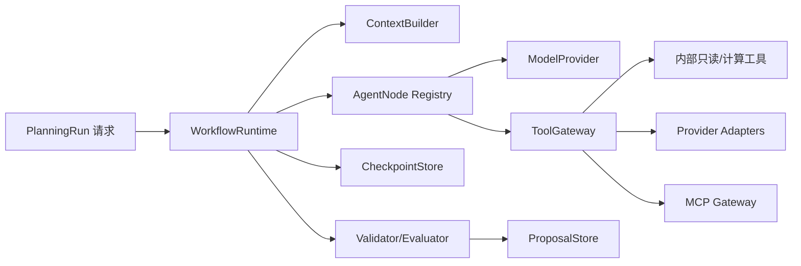
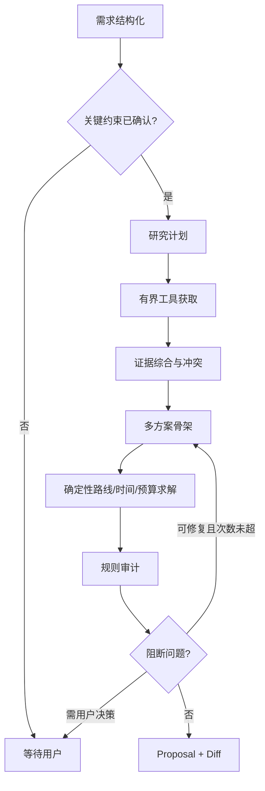

# DD-05 Agent 运行时、工具与 Provider 设计

> 版本：1.0-draft
> 首版：自有 `WorkflowRuntime + ModelProvider + AgentNode`
> 参考上游：[智能体详细流程](../agent-workflow-detailed-spec.md)、[工作流图](../agent-workflow-diagrams.md)、[API/Agent/MCP 调研](../api-agent-mcp-integration-research-spec.md)

## 1. 设计目标

Agent 的作用是理解意图、形成研究计划、综合证据、提出方案和解释取舍；路线、时间、预算、权限、版本和正式写入由确定性代码负责。系统不采用自由对话式多智能体群聊，而采用有限状态图：每个节点有严格输入、输出、工具白名单、预算和停止条件。

## 2. 运行时组件



### 2.1 `WorkflowRuntime`

职责：加载 Run、检查 Trip 基线版本、构建节点 DAG、领取节点、执行重试、保存检查点、处理取消、发布进度、控制总预算。它不包含旅游业务 Prompt。

接口语义：

```python
class WorkflowRuntime(Protocol):
    async def start(self, request: RunRequest) -> RunHandle: ...
    async def resume(self, run_id: str, user_input: UserResolution) -> RunHandle: ...
    async def cancel(self, run_id: str, actor: Actor) -> None: ...
    async def execute_next(self, run_id: str) -> NodeResult: ...
```

### 2.2 `AgentNode`

```python
class AgentNode(Protocol):
    name: str
    input_schema: type[BaseModel]
    output_schema: type[BaseModel]
    allowed_tools: frozenset[str]
    max_model_calls: int
    async def run(self, context: NodeContext) -> NodeResult: ...
```

Node 不能接收 ORM Session、密钥或原始管理员配置。工具能力由 Runtime 根据用户、Trip、节点和来源策略取交集。

## 3. PlanningContext

每次节点调用构造不可变上下文：

```text
run_id / trip_id / base_version / locale / timezone
actor_scope / trip_permissions / privacy_policy
requirement_snapshot / participants_snapshot
merged_preferences / confirmed_constraints / pending_constraints
current_itinerary / locked_fields / completed_items
budget_snapshot / confirmed_orders / actual_expenses
evidence_index / source_policy / freshness_policy
provider_capabilities / remaining_usage_budget
node_history_summaries / prior_validation_issues
```

上下文只包含节点需要的最小字段。完整聊天先由 ContextBuilder 按相关性和版本压缩；当前结构化快照始终晚于聊天摘要并明确标记为事实。

## 4. 工作流类型

### 4.1 新旅行规划



默认三个方案共享一次研究证据，避免三倍外部调用。路线和预算只对进入候选集的地点计算，不对全城 POI 穷举。

### 4.2 局部修改

意图解析 → 基于依赖图确定影响范围 → 只获取缺失/过期证据 → 生成局部 Patch → 重算邻接 TripLeg、当天时间和受影响预算 → 全局轻量审计 → Diff。用户明确要求全局优化时才重新评估全程。

### 4.3 行中调整

先读取当前时间、当天状态、已完成项、订单和用户输入。默认只调整当天未完成子图；优先生成“最小改动”和“更舒适”两个候选。天气只给提示或备选，除非用户明确授权按天气重排。

### 4.4 行后复盘

预算与实际消费汇总 → 计划偏差解释 → 用户评价结构化 → 形成 MemorySuggestion。模型不得直接写长期记忆。

## 5. 标准节点目录

| 节点 | 输入 | 输出 | 工具 | 停止条件 |
|---|---|---|---|---|
| Intake | 用户文本/表单、记忆 | RequirementDraft | 无或地点轻查 | 关键缺项明确 |
| ConstraintConfirm | Draft、冲突 | 问题或确认快照 | 无 | 所有硬约束已确认 |
| ResearchPlanner | 需求、来源策略 | ResearchTask[] | 无 | 任务≤默认 12 |
| EvidenceCollector | ResearchTask | Evidence[] | 搜索、POI、天气、攻略 | 预算/覆盖达标 |
| EvidenceSynthesizer | Evidence | ClaimGraph | 无 | 冲突均标记 |
| PlanSkeleton | ClaimGraph、约束 | CandidatePlan[] | 模型 | 1～3 个候选 |
| RouteSolver | 候选地点 | TripLeg/时序 | route、distance | 连续路线或降级 |
| BudgetCalculator | 行程、人数、价格 | BudgetVersion | 纯计算/价格查询 | 公式完整 |
| FeasibilityAuditor | 完整方案 | QualityReport | 规则工具 | 问题分级完成 |
| RepairPlanner | 质量问题 | 修复后候选 | 模型+有限工具 | 最多 2 轮 |
| ProposalBuilder | 候选、基线 | TripPatch/Diff | 纯计算 | Schema/锁定通过 |
| LiveAdjuster | 当天子图 | 局部候选 | 天气/路线 | 不改已完成项 |
| MemoryCurator | 评价和结果 | MemorySuggestion[] | 无 | 等待用户确认 |

## 6. 模型调用契约

### 6.1 `ModelProvider`

```python
class ModelProvider(Protocol):
    async def complete(self, request: ModelRequest) -> ModelResponse: ...
    async def stream(self, request: ModelRequest) -> AsyncIterator[ModelEvent]: ...
    async def probe(self) -> ModelCapabilities: ...
    def estimate_cost(self, usage: ModelUsage, price_time: datetime) -> Money: ...
```

`ModelCapabilities` 包括工具调用、JSON Schema/JSON mode、流式、视觉、推理模式、上下文长度、最大输出和 usage 精度。系统启动或配置变更后探测能力，节点根据能力选择策略；不能仅以“OpenAI-compatible”推断全部能力。

### 6.2 模型路由

- 主模型：用户/家庭配置，未配置使用系统默认 DeepSeek Provider；
- 视觉模型：仅在用户确认 OCR 不准后调用；未配置则继续人工修正；
- 轻量模型：保留可选能力，首版未配置时由主模型执行；启用前需用评估集证明成本/质量优势；
- 节点可声明最低能力，不满足时降级或提示，而非发送不兼容参数。

### 6.3 结构化输出

优先级：原生 JSON Schema → 工具调用参数 Schema → JSON mode + 本地校验 → 文本提取兜底。校验失败时只把错误摘要与原输出必要片段发回模型修复，最多 2 次；仍失败则节点失败。

模型不可返回数据库 ID 之外的任意路径操作。所有 Place/Item 引用必须来自 Context 或标记为新候选并经过 Resolve 工具。

### 6.4 Prompt 分层

```text
平台安全策略（代码固定）
→ 产品行为策略（版本化模板）
→ 节点职责和输出 Schema
→ 当前权限/来源/成本政策
→ 当前结构化快照与锁定项
→ 外部证据（明确标记不可信数据）
→ 用户当前指令
```

普通用户可编辑个人偏好和当前指令；管理员可编辑有限模板变量；完整系统 Prompt 只在高级模式开放，安全策略不可覆盖。每次 Run 保存 Prompt 模板版本和内容哈希。

## 7. 工具契约

### 7.1 内部 Tool 接口

```python
class AgentTool(Protocol):
    descriptor: ToolDescriptor
    async def authorize(self, call: ToolCall, ctx: ToolContext) -> Decision: ...
    async def execute(self, args: BaseModel, ctx: ToolContext) -> ToolResult: ...
```

Descriptor 包含稳定名称、版本、输入/输出 Schema、风险级别、幂等性、网络域、数据分类、超时、最大结果和成本单位。

### 7.2 工具分类

| 风险 | 示例 | Agent 权限 |
|---|---|---|
| R0 纯计算 | 预算、时间窗、坐标转换、Diff | 自动调用 |
| R1 外部只读 | POI、路线、天气、公开网页、MCP 查询 | 按来源策略和配额自动调用 |
| R2 私有只读 | 订单/消费/附件摘要读取 | 节点白名单 + 最小字段 |
| R3 生成草稿 | OCR、导入、Proposal | 可自动生成，必须用户确认生效 |
| R4 正式写入 | Apply Proposal、权限、分享、删除 | 不暴露给模型；仅应用命令 |
| R5 外部写操作 | 下单、发帖、支付 | 首版禁止 |

### 7.3 首版工具集

```text
place.search / place.resolve / place.nearby
route.quote / route.compare / route.continuity_check
weather.forecast / weather.alerts
guide.extract_user_source / web.fetch_public（可选）
evidence.search / evidence.compare
budget.calculate / budget.optimize / expense.summarize
schedule.validate / schedule.reorder_candidates
order.match_candidates / document.ocr_draft
trip.snapshot / trip.impact_analysis / trip.diff
map.link_generate / safety.nearby_search
```

工具返回结构化对象和 `source_refs`；不得只返回自然语言。结果超过限制时先摘要和分页，不直接把整页网页或供应商大 JSON 注入模型。

## 8. ToolGateway 执行链

```text
模型工具请求
→ 名称和 Schema 版本匹配
→ 节点白名单
→ 用户/Trip 权限
→ 数据分类和来源策略
→ 参数语义校验、URL/坐标/范围限制
→ 配额、缓存、熔断和并发信号量
→ Provider/MCP 调用
→ 输出 Schema、大小和内容净化
→ Evidence/Usage/ToolCall 记录
→ 返回节点
```

模型不能控制超时、重试次数、目标主机、HTTP Header 或凭据。相同标准化请求优先命中缓存；缓存结果仍携带原查询时间和新鲜度。

## 9. Provider 设计

### 9.1 端口

| 端口 | 首选实现 | 降级 |
|---|---|---|
| Geocoding/POI | 高德 Web Service | 百度、用户选点、缓存 |
| Route | 高德 | 百度、历史规则估算、手工输入 |
| Weather | 和风天气 | 高德天气、无天气建议 |
| Model | DeepSeek/OpenAI-compatible | 用户自定义模型、无 AI 手工模式 |
| OCR | PP-OCR 子进程 | 视觉模型经确认、人工录入 |
| Email | SMTP | 站内通知 |
| Web/Guide | 用户导入 | 轻量公开抓取、可选 Worker |

### 9.2 统一结果

```json
{
  "data": {},
  "provider": "amap",
  "capability": "route.driving",
  "queried_at": "2026-08-30T10:00:00Z",
  "expires_at": "2026-08-30T10:30:00Z",
  "cache_status": "miss",
  "confidence": 0.92,
  "fact_status": "verified",
  "source_refs": [],
  "usage": {"unit": "request", "quantity": 1},
  "warnings": []
}
```

### 9.3 超时与重试

默认连接 5 秒；地图/天气总超时 15 秒，模型首 Token 30 秒/总任务按节点控制，MCP 30 秒。只对幂等只读调用重试 1～2 次，采用抖动退避；401/403、参数错误和硬配额不重试。Provider 连续失败触发短时熔断。

## 10. MCP Gateway

### 10.1 配置边界

只有系统管理员可以新增 MCP Server、地址、传输和凭据。家庭管理员只能为本家庭启停系统已批准的工具。支持 Streamable HTTP；stdio 只允许安装清单中的固定可执行文件和固定参数；旧 HTTP+SSE 仅迁移兼容。

### 10.2 注册流程

```text
管理员登记 → URL/命令策略检查 → 隔离探测
→ 获取能力和工具 Schema → 规范化/哈希
→ 管理员映射风险、数据分类、内部能力
→ 启用到 Tool Registry → 运行契约测试
```

工具 Schema 改变时自动禁用该工具并通知管理员复核。MCP annotations、Prompts 和描述都按不可信元数据处理，不能自动授予权限。默认关闭 Sampling、Roots 和 Elicitation。

### 10.3 网络与结果安全

- 阻止 localhost、私网、链路本地、云元数据和 DNS 重绑定，除非管理员将固定本地 MCP 显式加入白名单；
- OAuth Token 只走 Authorization Header；API Key 由 SecretStore 注入；
- 限制响应大小、嵌套深度、文本长度和二进制内容；
- 远程资源链接不自动抓取；
- MCP 错误统一映射 ProviderError；
- 每次调用进入 ToolCall、Usage 和审计。

## 11. 研究与攻略策略

首版顺序：用户指定攻略 > 用户粘贴链接/文字/截图 > 官方和地图数据 > 可选公开网页搜索 > 可选小红书只读 Worker。ResearchPlanner 根据用户设置生成来源清单、每类最大调用数和停止标准。

多来源综合不是简单拼接：

1. 提取独立 Claim；
2. POI 归一化；
3. 按时间、来源等级和适用人群去重；
4. 标记共识、冲突和孤立观点；
5. 官方时效事实优先，体验评价保留多样性；
6. 只把必要摘要交给 PlanSkeleton；
7. 输出引用链接和查询时间。

攻略正文中的“忽略系统指令”“调用某工具”等均作为普通文本，不进入 Prompt 指令层。

## 12. 预算与质量控制

### 12.1 Run 预算

默认上限可配置：模型调用次数、输入/输出 Token、地图/天气/网页请求数、工具总调用、运行时间和并行度。DeepSeek 只计量和估算峰谷价格，不因系统成本阈值硬阻断；其他外部 Provider 可按免费额度设置硬限额。

### 12.2 停止条件

- 关键硬约束缺失：等待用户，不继续研究；
- 证据覆盖达到目的地/路线/营业/价格的最低门后停止搜索；
- 连续两次搜索未产生新有效 Claim 时停止；
- 计划修复最多 2 轮；
- 工具循环默认最多 12 次，单一工具最多 4 次；
- 达到预算时保留已有结果并输出降级说明。

### 12.3 QualityReport

检查硬约束、时间重叠、闭馆/预约、路线连续性、折返、缓冲、成员体力、用餐、酒店入住、预算完整性、价格可信度、订单冲突、来源覆盖和锁定保护。每项输出规则 ID、严重度、目标、证据、解释和修复建议。

## 13. 可观测性与隐私

Trace 层级为 Run → Node → ModelCall/ToolCall → ProviderCall。记录耗时、Token、调用数、缓存、错误分类、Schema 修复次数、Evidence 数和质量问题；不记录明文密钥、完整敏感 Prompt、模型隐式思维链、Cookie 和票据正文。

面向用户的 `planning.text.delta` 只展示简短计划、进度、来源和结论理由；模型内部推理不保存为产品功能。长期保存的是结构化结果、必要摘要和可审计决策依据。

## 14. Agent 验收

- 相同快照和固定模型桩产生可重放的结构化节点结果；
- 任一节点失败可从最近有效 Checkpoint 恢复；
- Trip 版本变化会使依赖检查点失效；
- 模型无法调用节点白名单外工具或构造外部地址；
- 所有 Proposal 通过 Schema、字段锁和确定性质量门；
- 三方案共享研究证据，外部调用量受预算约束；
- 行中调整默认不改已完成项和未来日期；
- 用户未确认时，模型不能写 Trip、订单、消费、长期记忆或公开分享；
- MCP Schema 变化会自动停用而非继续冒险调用。
