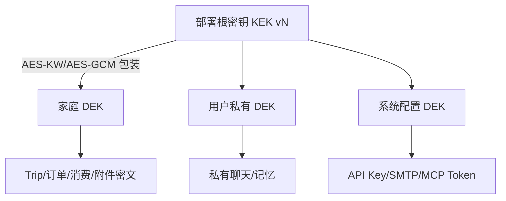

# DD-06 安全、加密、权限与隐私设计

> 版本：1.0-draft
> 范围：自托管家庭系统，不假设局域网天然可信
> 需求来源：FR-AUTH、FR-FAM-005、FR-SHARE、FR-AUD、FR-BACK、NFR-SEC、NFR-PRI

## 1. 安全目标

- 数据卷、数据库或单个备份泄露时，敏感正文和凭据不能直接读取；
- 普通成员、家庭管理员、访客和匿名分享访问严格按 Trip 范围授权；
- AI、MCP、网页、文件和第三方 Provider 都不成为越权通道；
- 重要操作有明确确认、审计和恢复路径；
- 默认关闭公网注册、匿名遥测和非必要远程能力；
- 安全措施不得使 2 GB NAS 无法运行。

## 2. 威胁模型

| 威胁 | 主要控制 |
|---|---|
| 数据卷/备份被复制 | 应用层信封加密、备份密码加密、Secret 不入备份 |
| 弱密码和撞库 | Argon2id、速率限制、失败审计、可选 TOTP P2 |
| 家庭管理员越权 | Trip ACL、字段可见性、恢复访问专用流程和通知 |
| CSRF/XSS/Session 窃取 | CSRF Token、HttpOnly Cookie、CSP、输出编码、Session 轮换 |
| 文件解析攻击 | MIME/魔数/尺寸检查、隔离子进程、资源上限、临时文件清理 |
| SSRF/DNS 重绑定 | URL 规范化、解析后 IP 检查、重定向逐跳检查、域名策略 |
| Prompt 注入/工具越权 | 外部文本降权、节点工具白名单、确定性授权、输出净化 |
| 恶意 MCP | 管理员批准、Schema 哈希、网络隔离、结果大小和风险映射 |
| 日志泄露 | 字段级脱敏、禁止正文/Key/Cookie、保留期 |
| 恶意公开分享 | 独立脱敏副本、白名单 DTO、预览二次确认、有效期/撤销 |
| 容器逃逸或宿主机管理员 | 不在应用威胁边界内；文档提示宿主机加密和最小权限 |

## 3. 身份认证

### 3.1 密码

使用 Argon2id。默认参数以目标 NAS 上单次验证约 150～350 ms 为校准目标，初始建议 `memory_cost=64 MiB`、`time_cost=3`、`parallelism=1`、盐 16 字节；部署初始化时可基准测试并保存参数版本。若 2 GB 主机并发登录，认证信号量默认 2，避免内存尖峰。

密码最少 10 字符，允许长密码和密码管理器；不设置降低安全性的复杂字符组合规则。常见泄露密码使用随版本附带的本地摘要列表检查，不把密码发往外部服务。

### 3.2 Session

- Session ID：32 字节 CSPRNG，数据库只存 SHA-256/HMAC 哈希；
- Cookie：`HttpOnly; Secure`（HTTPS）、`SameSite=Lax`、`Path=/`；
- 空闲有效期默认 7 天，绝对有效期默认 30 天，可配置；
- 登录、权限提升和密码修改后轮换 Session；
- User `session_epoch` 变化立即使旧 Session 失效；
- 高风险操作要求最近 15 分钟内重新输入密码；
- 登录接口按 IP 哈希 + 用户名键限流，失败次数不泄露账号是否存在。

### 3.3 CSRF

采用 Session 绑定的随机 CSRF Token，写请求通过 `X-CSRF-Token` 发送；Token 不写 Cookie。Origin/Referer 检查作为附加防护。GET、HEAD 不得产生业务状态变更。

### 3.4 初始化与恢复码

首次初始化只能在未存在用户时执行。生成至少 128 bit 随机恢复码，分组显示一次；数据库只存 Argon2id 哈希。恢复流程需要恢复码 + 新管理员密码，并使所有 Session 失效、写审计和站内安全通知。恢复码使用后轮换。

## 4. 授权模型

授权决策输入：`actor`、`system_role`、`family_membership`、`trip_acl`、`resource_owner`、`field_visibility`、`share_scope`、`action`。Router 的角色检查只是前置优化，Application Policy 才是最终边界。

### 4.1 角色能力

| 动作 | 系统管理员 | 家庭管理员 | 成员 | 登录访客 | 匿名分享 |
|---|---:|---:|---:|---:|---:|
| 管理系统 Provider/MCP/备份 | 是 | 否 | 否 | 否 | 否 |
| 管理家庭和邀请 | 是（恢复场景） | 是 | 否 | 否 | 否 |
| 查看成员私有 Trip | 专用恢复流程 | 否，除非 ACL | 仅 ACL | 仅 ACL | 否 |
| 创建 Trip | 是 | 是 | 是 | 按家庭策略 | 否 |
| 编辑 Trip | ACL `edit/manage` | ACL | ACL | ACL | 否 |
| 管理 Trip 权限/发布 | ACL `manage` | ACL `manage` | ACL `manage` | 否 | 否 |
| 查看公开脱敏副本 | 是 | 是 | 是 | 是 | 链接允许 |
| 复制公开计划 | 是 | 是 | 是 | 需登录 | 需登录 |

系统管理员不是数据库内容的常规超级读者。紧急恢复私有内容需填写原因、近期密码确认，产生高优先级审计，并通知数据主体。

### 4.2 对象权限

权限顺序采用显式拒绝优先：主体禁用/删除 → 资源删除/撤销 → 字段可见性拒绝 → ACL 允许 → 家庭默认 → 拒绝。不存在“知道 ID 即可读取”。批量列表查询必须在 SQL 层按授权范围过滤，不能先取全量再在 Python 过滤。

### 4.3 AI 权限

Agent 使用触发用户的权限快照，但只允许节点白名单内的最小只读能力。Run 等待期间用户权限改变时，恢复前重新授权。Agent 永远不继承系统管理员部署权限，不能读取 SecretStore、管理审计或备份。

## 5. 信封加密

### 5.1 密钥层级



部署 KEK 由 32 字节随机 `APP_MASTER_KEY` 提供，优先 Docker Secret/只读文件，环境变量仅作为兼容方式。不得从管理员登录密码直接派生在线数据库 KEK，否则无人登录时任务无法运行。

### 5.2 数据加密格式

使用 AES-256-GCM，每个记录/文件随机 96 bit nonce。关联数据 AAD 至少含 `table/resource_type + record_id + field_name + schema_version`，防止密文跨字段替换。密文封装：

```json
{
  "v": 1,
  "alg": "A256GCM",
  "kid": "family:019...:3",
  "nonce": "base64url",
  "ciphertext": "base64url"
}
```

DEK 每家庭/用户生成，密钥版本化。大附件使用分块 AEAD 格式：随机文件 DEK、固定最大块、每块独立 nonce 和序号 AAD，支持流式下载且检测截断/重排。原始哈希另以 HMAC 形式保存，避免通过公开哈希确认敏感文件。

### 5.3 明文最小化

为了列表和调度，可明文保存内部 ID、状态、粗粒度日期、城市行政编码、资源大小、Provider 名称和非敏感统计。姓名、精确住址、健康、联系方式、订单号、票据、聊天、备注、支付方式、API Key 和附件正文加密。

首版不对密文正文提供全文搜索。需要查找时优先结构化非敏感标签；用户名/邮箱使用规范化登录索引，因为它们是认证标识，并限制管理界面展示。

### 5.4 密钥轮换

- KEK 轮换只重新包装 DEK，不立即重加密全部数据；
- DEK 轮换对新写入使用新版本，后台低优先级迁移旧数据；
- 所有解密支持当前和受支持旧版本；
- 轮换任务可中断恢复，记录数量而不记录正文；
- 丢失 KEK 无法恢复密文，初始化和备份 UI 必须明确警告。

## 6. Secret 管理

Secret 只通过 `SecretStore` 按逻辑名称读取，应用日志和异常对象不得包含值。管理页保存时只返回 `configured`、尾部 4 位可选指纹和更新时间，不能回显完整 Secret。

配置优先级：Docker Secret 文件 > 加密数据库配置 > 环境变量。`.env.example` 只写变量名和占位符；真实 `.env` 必须在 `.gitignore`。前端构建变量只允许公开 JS Key，不得使用 Server Key。

百度 `Server SK` 只有当所选 API/控制台明确要求签名时配置；适配器能力探测决定是否需要，不把 SK 猜测为必填项。

## 7. Web 安全

- CSP 默认：`default-src 'self'`，按配置允许高德 JS/图片/连接域；禁止 `unsafe-eval`；
- `frame-ancestors 'none'`，公开嵌入后续单独配置；
- `X-Content-Type-Options: nosniff`、`Referrer-Policy: strict-origin-when-cross-origin`；
- 富文本使用 Markdown 白名单渲染，移除 HTML、脚本、事件属性、危险 URL；
- 外部链接添加 `rel="noopener noreferrer"`，明确域名；
- 公开页面不自动加载地图和第三方追踪内容；
- 登录、恢复、分享解锁和文件下载实施速率限制。

## 8. SSRF 与外部内容

URL 获取器仅支持 HTTP/HTTPS，拒绝用户名密码、非标准编码主机、IP 字面量默认拒绝。DNS 解析后拒绝 loopback、private、link-local、multicast、保留地址和云元数据；连接时固定已验证 IP，重定向每跳重检，最多 3 跳。

可选本地 MCP 使用独立“管理员固定端点”策略，不复用用户网页抓取器。网页响应限制 10 MB、30 秒和支持 MIME；不执行脚本。动态浏览器 Worker 运行在独立 Profile，限制目标域、下载、剪贴板和文件系统。

外部文本前后加不可伪造的结构标签，Prompt 明示为数据。模型输出仍通过 ToolGateway 和 Proposal Validator，Prompt 注入成功也不能产生越权副作用。

## 9. 文件与 OCR 安全

- 随机路径，禁止使用原文件名拼接路径；
- 上传先进入不可执行临时目录；
- 检查文件签名、MIME、页数、像素、压缩比和嵌套对象；
- OCR/PDF 子进程使用非 root 用户、只读模型目录、临时工作目录、CPU/内存/时限；
- 不支持宏、Office、压缩包和任意 HTML 首版导入；
- EXIF 默认在派生预览中移除；原件加密且受原权限保护；
- 视觉模型调用前展示将发送的页面，并允许用户只选指定页/区域；
- OCR 草稿由用户确认，临时明文退出即清理。

## 10. 分享脱敏

发布器采用字段白名单构造 Public DTO，而非黑名单删除。至少移除：精确家庭地址、真实姓名、订单号、附件、付款/房间/座位、联系方式、健康/饮食私密备注、聊天、内部审计和精确实时位置。

脱敏预览显示“保留字段、移除字段、可能仍有识别风险的自由文本”。自由备注额外运行规则扫描，模型扫描只能补充建议，不能替代字段白名单。用户二次确认后生成独立副本。

## 11. 审计与日志

安全审计包括登录失败、密码/恢复、角色和 ACL、管理员恢复访问、Secret/MCP 配置、备份恢复、公开发布、彻底删除和 AI Proposal 应用。审计为追加写；应用账号不提供普通 DELETE/UPDATE 路径。

应用日志用结构化 JSON，包含 request/trace ID、模块、等级、错误分类和耗时。脱敏器默认替换 Authorization、Cookie、Key、Token、邮箱、电话、订单号和文件路径。日志查看权限仅系统管理员；下载日志再次提示可能含运维元数据。

## 12. 备份安全

备份先对 SQLite 做一致性在线备份/快照，再打包数据库、加密附件、必要配置和 Manifest。API Key 默认不包含；若管理员明确包含，仍保持加密且在恢复目标要求新的部署 KEK 重新包装。

备份归档使用管理员提供密码，经 Argon2id 派生归档密钥，参数/盐写 Manifest；内容使用 AEAD 加密并签名/校验。密码不保存。恢复分为验证、影响预览、暂停写入、恢复到临时目录、校验、原子切换；原部署数据保留为恢复前备份。

## 13. 隐私删除

删除范围先展示：账号、成员档案、私有 Trip、共享 Trip 所有权、评论、附件、聊天、订单和消费。共享资源需转移所有权或删除。删除 Job 擦除密文和 DEK 包装后，即使物理块残留也不可解密；再删除文件和去标识化审计。

家庭管理员可恢复误删的普通软删除数据；隐私彻底删除开始并跨过最终确认后不可恢复，UI 必须区别两者。

## 14. 安全验证门

- 权限矩阵和对象级授权测试全覆盖；
- 任意 ID 枚举不能读取未授权资源；
- 数据库/附件/备份样本中检索不到敏感明文；
- 密文篡改、字段替换和截断均解密失败；
- SSRF 测试覆盖 IPv4/IPv6、重定向、DNS 重绑定和编码绕过；
- XSS/Markdown/文件上传恶意语料测试通过；
- Agent/MCP 提示注入不能越过工具授权；
- 公开快照敏感字段自动检查为零；
- 恢复码、Session、密码和 Key 不出现在日志/错误/SSE；
- 备份在全新实例验证恢复成功，并验证错误密码不泄漏内容。
