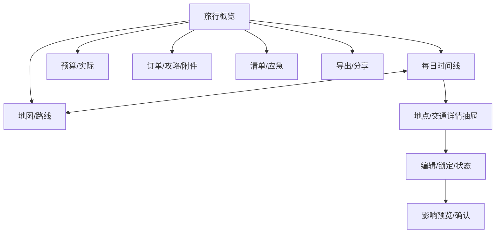

# DD-07 移动端 PWA 信息架构与交互设计

> 版本：1.0-draft
> 首要设备：手机浏览器/PWA；兼容平板和桌面
> 需求来源：FR-TRIP、FR-EDIT、FR-MAP、FR-LIVE、FR-NOT、FR-SHARE、FR-ADM、NFR-UX

## 1. 体验原则

- 首页优先展示旅行中“现在要做什么”，复杂配置进入二级页面；
- 卡片、时间线、地图和对话操作同一套结构化状态；
- AI 变更先看影响和差异，再确认；
- 关键票据、地址、路线和电话在弱网/离线时仍可查看；
- 主操作单手可达，危险操作不依赖滑动隐藏手势；
- 外部高德/百度/订票链接可直接跳转，但明确离开系统；
- 地图不是唯一信息载体，路线始终有文本可访问表示。

## 2. 顶层信息架构

移动端底部最多四个主入口：

| 入口 | 无当前旅行 | 有规划旅行 | 行中模式 |
|---|---|---|---|
| 首页 | 最近旅行、创建、导入 | 倒计时、待确认、下一事项 | 当前/下一项、导航、票据、提醒 |
| 行程 | 旅行列表 | 每日时间线 | 今日优先，可切其他日期 |
| 助手 | 通用创建对话 | 当前 Trip 对话和建议 | 局部调整快捷指令 |
| 我的 | 家庭、偏好、消费汇总、设置 | 同左 | 离线包、应急、设置 |

地图、预算、订单、消费、清单和资料是当前旅行工作区的标签/抽屉，不占全局底部栏。系统管理只对管理员显示在“我的 → 系统管理”。

## 3. 旅行工作区



工作区顶部固定显示旅行名、日期、版本/同步状态和更多菜单。横向标签可滚动，但核心“行程、地图、预算”始终在前。

## 4. 页面规格

### 4.1 首页

非行中：最近旅行卡、创建旅行、导入计划、待确认 Proposal、即将到来的订单/提醒。行中首页按顺序展示：

1. 当前本地时间、城市、天气提示和离线状态；
2. “现在”卡：当前事项、已开始/完成/跳过；
3. “下一项”卡：出发倒计时、预计路程、导航；
4. 关键凭证：车次/航班/酒店/门票摘要，点击需解锁敏感详情；
5. 风险与提醒；
6. 快捷操作：延迟、跳过、体力不足、下雨、超预算、临时加地点；
7. 今日预算和实际消费；
8. 应急入口。

天气默认只提示，不自动重排。用户点“按天气调整”后才启动对应 Agent 流程。

### 4.2 创建旅行

首屏采用分步短表单：日期/天数 → 出发与目的地 → 人数/成员 → 预算 → 风格/特殊偏好。目的地可选择“让 AI 推荐”。每一步支持“稍后决定”，但关键缺项在生成前统一确认。

自然语言入口与表单共存。对话提取后展示结构化摘要，硬约束用醒目标记并要求确认；模型推断的“必须满足”默认是待确认。

### 4.3 方案比较

默认三方案使用横向卡片和统一指标：总费用范围、人均、路途时间、步行、节奏、核心亮点、风险和证据覆盖。手机一次显示一个方案，顶部固定对比指标切换；支持勾选两个方案看字段差异。选择方案仍要进入完整预览后确认。

### 4.4 时间线

按目的地本地日期分组。每个 TripItem 卡片显示类型、时间、地点、时长、费用、可信状态、前后交通、来源和状态；卡片左侧为连续时间线，交通段可折叠。

拖动排序：长按把手进入，不占用卡片垂直滚动；放下后只产生预览，不立即保存。预览显示受影响项目、时间、路线、费用和订单冲突，用户确认后提交。无精细手势的设备提供“移到…之前/之后”按钮。

### 4.5 地图

默认按天显示 GCJ-02 高德地图，标记编号与时间线一致。点击标记打开底部详情抽屉；点击卡片居中并高亮标记。地图全屏时保留日期、类别筛选和返回时间线。

拖动标记后进入“重新绑定地点”流程：显示附近 POI、原/新地址、距离和影响；用户选择 POI 或保留手动坐标，再确认重算。地图失败时展示文本路线和高德/百度外部链接。

### 4.6 对话助手

顶部固定当前 Trip 和版本，消息下方可附结构化对象卡：地点候选、方案、来源、预算、Proposal。助手必须明确区分“建议”“正在查询”“等待确认”“已应用”。

快捷提示包括：优化今天、只改午餐、减少步行、不改已订项目、控制在某预算、参考这篇攻略。每个助手变更都链接到统一 Diff 页面，而非在聊天气泡内用“好的，已修改”作为唯一反馈。

### 4.7 预算与消费

顶部切换计划/订单/实际/差异。显示总额、人均、区间、硬上限和剩余预算；分类条目可展开计算公式和来源。消费快速录入只需要金额、分类和付款人，其他字段可后补；截图识别结果逐项确认。

多人分摊提供均分、指定成员、家庭统一、朋友 AA 快捷方式。更正操作展示原记录并创建冲销，不使用覆盖编辑造成历史丢失。

### 4.8 订单与资料

按交通、住宿、门票、餐饮和其他分类。默认卡片只显示脱敏摘要；点击后展示完整信息，允许关联行程项、查看冲突、打开附件。上传流程展示“上传 → 识别 → 核对 → 入库”，识别草稿不计入正式预算。

### 4.9 分享与导出

先选择范围和格式，再生成预览。公开分享必须显示脱敏报告和自由文本风险；确认页说明公开副本不会随私有计划自动更新。地图按钮默认生成可点击链接，不在公开页自动加载第三方地图。

### 4.10 简化管理页

移动端分组为：连接与 Key、模型、地图天气、邮件、存储备份、任务与用量、用户注册、安全、更新、日志。首页只显示状态灯和需处理问题；高级参数折叠。Secret 保存后不回显，连接测试显示能力、延迟、配额提示和脱敏错误。

## 5. 组件体系

| 组件 | 必要状态 |
|---|---|
| TripCard | draft/proposed/confirmed/in_progress/completed/offline |
| TripItemCard | execution status、锁定、可信度、冲突、选中 |
| TripLegCard | mode、估算/已验证、折叠、备用 |
| FactBadge | verified/estimated/suggested/unknown/stale |
| SourceChip | 来源、时间、打开链接、冲突 |
| MoneyRange | 下限/目标/上限、币种、计价单位 |
| DiffCard | add/remove/move/update/conflict |
| AsyncTaskBar | queued/running/waiting/succeeded/failed/cancelled |
| OfflineBanner | online/stale/offline/syncing/conflict |
| SensitiveReveal | 遮罩、重新认证、复制计时清除 |

设计 Token 支持明暗主题；状态不能只依赖颜色，必须有图标/文字。

## 6. Proposal 与确认交互

```text
AI/拖动/订单产生提案
→ 摘要：改了什么、为什么、影响多少
→ 按天/预算/路线分组 Diff
→ 风险与锁定冲突
→ 来源与假设
→ [继续修改] [拒绝] [确认应用]
```

确认按钮显示基线版本；提交期间禁用重复点击但允许安全重试。若 409，展示“已有新修改”，让用户查看当前版本差异并选择重新计算，不丢失原 Proposal。

低风险直接保存仅限用户自己的备注、清单勾选、评论和通知偏好；仍记录审计，但不要求 AI 式确认。

## 7. 异步和错误状态

长任务页面展示当前阶段而不是虚假精确百分比，例如“整理需求 → 查询路线 → 计算预算 → 检查合理性”。用户可离开页面，任务完成产生站内提醒。SSE 断开后自动退避重连并 GET 当前状态。

错误必须包含：发生在哪一步、已经保留什么、用户可做什么。Provider 失败时展示缓存/估算降级标签；不能用全屏错误遮住已有行程。

## 8. 离线设计

### 8.1 离线包

用户可为已确认旅行下载离线包，包含：脱敏行程摘要、每日时间线、文本路线、已选择的地图静态摘要/外部链接、用户选择的订单摘要、清单、应急信息和最近同步版本。默认不缓存原始票据和健康信息；用户可显式选择敏感内容，并提示设备风险。

### 8.2 PWA 缓存

- App Shell 使用版本化 Cache First；
- Trip API 使用 Network First，失败读取加密/受控 IndexedDB 快照；
- 不缓存管理页、Secret、完整附件下载响应；
- 登出时清除当前用户离线密钥和私有缓存；
- 多用户共用设备时离线数据按用户命名空间隔离。

### 8.3 离线写入

P0 支持清单勾选、Item 状态和消费草稿排队。每条命令包含客户端 ID、base version 和时间；恢复联网后按顺序提交。追加消费可幂等合并；时间线结构变更遇到新版本则要求用户解决冲突。

## 9. 地图唤端

提供高德、百度和 Web 链接三种选项，记住用户偏好。生成链接时使用入口点和正确坐标系；点击前显示目的地名称，精确家庭地址链接不出现在公开分享。无法唤端时回退 HTTPS 页面。

系统不声称已经“导入高德/百度行程”；首版是逐地点/路线跳转链接。未来若平台提供稳定正式导入接口，可由 Provider 扩展。

## 10. 可访问性与适配

- 触控目标至少 44×44 CSS px；
- 正文最小 16 px，支持系统字体放大到 200%；
- 键盘可完成所有操作，焦点顺序与视觉一致；
- Dialog/Drawer 管理焦点并可被屏幕阅读器识别；
- 路线图、预算图都提供文本/表格等价表示；
- `prefers-reduced-motion` 关闭非必要动画；
- 刘海和底部安全区使用 `env(safe-area-inset-*)`；
- 320 px 宽度仍可完成核心流程，桌面扩展为时间线+地图双栏。

## 11. 前端状态架构

- 服务端状态：TanStack Query 类查询缓存，以 Trip version 作为关键失效标识；
- 表单状态：页面局部，提交前不污染查询缓存；
- UI 状态：地图选中、抽屉、筛选使用轻量 Store；
- 离线命令：IndexedDB 队列；
- SSE：事件只触发缓存更新/失效，不直接作为最终状态；
- 乐观更新：仅清单、评论等低冲突资源；行程结构等待服务器新版本。

## 12. 移动端验收

- 360×800 视口可完成创建、确认方案、编辑、导航、记账和分享；
- 时间线与地图选择双向同步；
- 标记拖动不会未经确认改变行程；
- 弱网/离线可查看今日关键内容和已缓存应急信息；
- 所有 AI 修改都有可展开 Diff；
- 公开页不自动请求地图第三方域；
- 字体放大和屏幕阅读器可识别核心流程；
- 多用户切换后看不到前一用户离线数据；
- Provider 失败时仍可使用已有正式行程。
