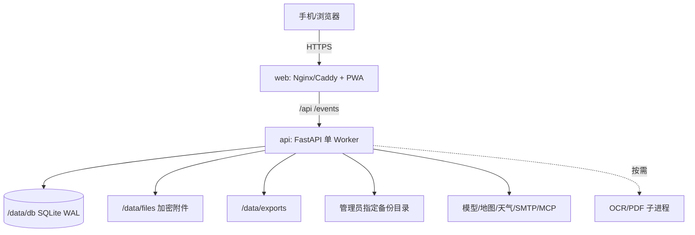

# DD-08 部署、任务、可观测性与运维设计

> 版本：1.0-draft
> 目标：AMD64 NAS、Docker Compose、2 核/2 GB 最低、4 GB 推荐
> 资源目标：空闲 <512 MB，正常峰值 <2 GB

## 1. 默认部署拓扑



`web` 可由用户已有反向代理替换。默认 Compose 不强制自动签发公网证书；文档提供局域网 HTTP 和反向代理 HTTPS 两种模式，任何公网暴露必须使用 HTTPS。

## 2. 目录和卷

| 容器路径 | 内容 | 权限/备份 |
|---|---|---|
| `/data/db` | SQLite、WAL、迁移状态 | API 独占写，必须备份 |
| `/data/files` | 加密附件 | 必须备份 |
| `/data/exports` | 临时/长期导出 | 临时可重建，长期纳入备份 |
| `/data/cache` | 可丢弃 Provider/OCR 缓存 | 不必备份 |
| `/data/tmp` | 任务临时文件 | 启动和定时清理 |
| `/run/secrets` | 主密钥/可选 Secret 文件 | 只读，不进入普通备份 |
| `/backups` | 管理员指定目录挂载 | 仅备份任务写入 |

宿主机目录由用户显式配置，不使用未知 `$HOME`。容器以固定非 root UID/GID 运行，初始化命令检查目录可写性和剩余空间。

## 3. Compose 服务

### 3.1 `web`

- 提供压缩静态资源和 SPA fallback；
- `/api`、`/events` 反代 API，SSE 禁用代理缓冲；
- 安全响应头和合理上传体积限制；
- 健康检查为静态资源 + 上游可选检查。

### 3.2 `api`

- 单 Uvicorn Worker；
- 异步网络 I/O，数据库操作保持短事务；
- 内置轻量调度器、Outbox 消费和 Job 租约；
- OCR/PDF 通过受控子进程，不常驻模型；
- `init` 过程执行配置校验和数据库迁移；
- `SIGTERM` 后停止领取任务、关闭 SSE、等待短事务和安全点，默认 30 秒退出。

### 3.3 可选 Profile

`guide-worker` 只读攻略浏览器默认关闭，独立资源上限和数据卷；`postgres` 未来替换 SQLite；两者不得成为基础健康检查前提。

## 4. 启动流程

```text
加载非敏感配置
→ 读取/验证 APP_MASTER_KEY
→ 检查目录权限和磁盘余量
→ 获取实例迁移锁
→ SQLite PRAGMA 与 integrity quick_check
→ 执行向前迁移
→ 启动 Repository/Provider Registry
→ 恢复过期任务租约
→ 启动 Outbox/调度器
→ readiness=true
```

没有模型、地图、天气或 SMTP Key 时仍可启动；Provider 状态为 `not_configured`。缺失主密钥、数据库迁移失败或目录不可写属于启动阻断。

## 5. 配置规范

配置分为：

- 启动级：端口、数据目录、数据库 URL、主密钥路径、日志等级；
- 加密运行级：Provider Key、SMTP、MCP Token；
- 产品级：注册、配额、保留期、模型选择、来源策略；
- 用户/家庭级：偏好、可用 Provider、通知。

环境变量前缀统一 `TRAVEL_`。配置加载后由 Pydantic Settings 校验；未知变量警告但不泄漏值。管理页更改运行级配置写加密数据库并产生审计，必要组件安全热加载；启动级变化提示重启。

当前实现将管理页中的模型、地图、天气、攻略 MCP 和预留 SMTP 配置用 `APP_MASTER_KEY` 派生密钥加密，原子写入 `/config/runtime-integrations.enc`（`0600`）。API 不返回秘密明文，空白表示保留，显式“清除”才删除覆盖值；审计只记录变更字段名，不记录值。为保证进程内 Provider 一致性，首版保存后要求重启容器。

`APP_MASTER_KEY`、数据/配置目录、端口和运行环境仍属于启动级配置，必须保留在权限为 `0600` 的 bootstrap env 或 Docker Secret 中。主密钥不得通过设置页更改，以免现有密文失去可读性。

## 6. 后台任务调度

### 6.1 调度器

单 API Worker 内每 2～5 秒扫描到期 Job 和 Outbox；一次领取有限条数，避免阻塞请求。任务租约存在数据库，应用崩溃后可恢复。系统时间统一 UTC，并检测明显时钟回拨。

### 6.2 任务类型和资源等级

| 任务 | 等级 | 默认并发 | 超时 |
|---|---|---:|---:|
| Outbox/站内通知 | light | 4 | 30 s |
| Provider 刷新 | network | 每 Provider 1～3 | 15～60 s |
| Agent Run | network/mixed | 全局 1～2 | 节点级 |
| OCR | cpu-heavy | 1 | 单页/任务限制 |
| PDF | memory-heavy | 全局 1 | 120 s |
| 备份/恢复验证 | io-heavy | 1 | 按体积 |
| 浏览器攻略 | memory-heavy | 全局 1 | 120 s |
| 清理/统计 | low | 1 | 5 min |

`memory-heavy` 共用一个跨任务信号量，因此 OCR 大模型、Chromium PDF 和攻略浏览器不会并行制造峰值。任务排队时 UI 明确显示，不通过启动更多进程解决。

### 6.3 定时任务

- 每分钟：提醒扫描、过期租约；
- 每 5 分钟：Outbox 重试、存储告警；
- 每日：备份、缓存/临时文件/日志清理、Provider 用量汇总；
- 每周：完整备份、数据库 `integrity_check`、孤儿附件扫描；
- 按旅行：天气/营业信息只在用户允许和临近出行时刷新；
- 更新前：强制一致性备份和恢复可读性验证。

避免无旅行时仍频繁调用外部 API。天气/路线定时刷新必须按活跃旅行、时间窗口、新鲜度和免费额度过滤。

## 7. 资源预算

### 7.1 常驻预算

| 部分 | 目标 RSS |
|---|---:|
| API Python + FastAPI + ORM + 调度 | 180～300 MB |
| Web/反向代理 | 20～50 MB |
| SQLite page cache/系统计入容器 | 20～80 MB |
| 安全余量 | 50～100 MB |
| 合计空闲 | 270～500 MB |

这是设计预算，不是保证值；必须在目标 AMD64 镜像实测。禁止在 API 启动时导入 PaddleOCR、Playwright、浏览器或大型数据科学库；相关 import 在子进程入口内完成。

### 7.2 峰值预算

| 场景 | 额外内存目标 |
|---|---:|
| 普通 Agent 网络调用 | 50～200 MB |
| PP-OCR 单任务 | 400～900 MB，需以选定模型实测 |
| Chromium PDF | 250～600 MB |
| 可选浏览器攻略 | 400～800 MB |

全局串行后，正常峰值目标 1.2～1.8 GB，容器上限建议 1.9 GB；接近 85% 内存阈值时拒绝启动新的高内存任务并提示稍后重试。若 PP-OCR 单任务无法满足门槛，切换更轻模型/远程 OCR Profile，而不让主 API 被 OOM。

### 7.3 优化规则

- Uvicorn 只开一个 Worker；
- SQL 查询分页，快照流式压缩/加密；
- 上传和下载流式处理，不把完整文件读入内存；
- LLM SSE 文本设最大缓冲；
- Provider 响应有大小限制并尽早转换；
- PDF 分章节渲染或低内存渲染器降级；
- 子进程结束后清理临时目录，并监测 RSS/退出码。

## 8. 健康检查

| 端点 | 语义 |
|---|---|
| `GET /health/live` | 进程事件循环存活，不访问外部 Provider |
| `GET /health/ready` | 配置、数据库、迁移、主目录可用 |
| `GET /health/detail` | 管理员认证后查看磁盘、任务、Provider 状态 |

地图/模型未配置或暂时失败不让 readiness 失败；只标记能力降级。数据库不可写、密钥不可读、迁移不一致和磁盘极低使 readiness 失败。

## 9. 可观测性

### 9.1 日志

JSON 行日志输出 stdout，字段：时间、级别、service/version、request/trace/run/job ID、模块、事件、耗时、错误分类。默认 INFO，30 天由宿主机/应用轮换。禁止正文、Key、Cookie、票据和完整上游响应。

### 9.2 指标

首版管理页从内部聚合表展示，不要求 Prometheus 常驻：

- HTTP 请求量、p50/p95、4xx/5xx；
- 活跃 SSE、PlanningRun/Job 状态和队列等待；
- 模型 Token/估算成本；
- Provider 请求、缓存命中、限流、失败；
- SQLite 写等待、WAL 大小、数据库/附件/备份磁盘；
- 进程/子进程 RSS 峰值；
- OCR/PDF 成功和耗时；
- 最近备份和恢复验证。

提供可选 `/metrics`，默认仅管理网络可见且关闭，不为指标引入高内存服务。

### 9.3 Trace

内部生成 Trace ID 并贯穿 HTTP → Run → Node → Tool → Provider；首版保存精简 Span 元数据到数据库/日志。OpenTelemetry 作为可选导出，默认关闭。

## 10. 配额与成本

`UsageLedger` 对模型、地图、天气、MCP、网页、OCR 和浏览器统一计量。DeepSeek 按调用发生时间和峰谷价格表计算估算成本，只告警不硬阻断；外部 Provider 支持日/月软告警和硬限额。

省额度顺序：缓存稳定 POI/路线 → 同一 Run 共享证据 → 批量/合并请求 → 只刷新临近且活跃旅行 → 达阈值使用高德天气/历史估算/用户手工值。管理页展示“请求数、缓存节省、剩余额度（若 Provider 可得）、估算费用、最近限流”。

## 11. 备份

### 11.1 创建

1. 检查目标目录和空间；
2. 暂停新的高影响写入或使用 SQLite Online Backup API 获取一致副本；
3. checkpoint WAL；
4. 收集数据库、加密附件、长期导出和 Manifest；
5. 校验文件哈希；
6. 使用用户密码加密归档；
7. 写临时文件并 fsync，原子改名；
8. 重新打开归档执行快速验证；
9. 按 7 日 + 4 周策略清理。

目标目录由管理员指定。备份失败不删除上一份成功备份。

### 11.2 恢复

恢复必须在维护模式：上传/选择归档 → 密码解密验证 → 版本/空间/Manifest 检查 → 影响预览 → 当前实例自动备份 → 解包到新目录 → 数据库完整性与迁移试跑 → 原子切换 → 启动检查。失败切回原目录。

## 12. 数据库迁移与升级

- 使用线性迁移版本，容器镜像声明最小/最大数据库版本；
- 每次升级先备份；
- 迁移在单独 init 阶段持锁，失败不启动新版本；
- 大表迁移分阶段，避免长时间复制；
- 向下回滚不保证数据库逆迁移，使用升级前备份恢复；
- 前端和 API 镜像使用同一发布版本，OpenAPI/Export Schema 兼容检查进入 CI；
- 管理页只检查更新，必须用户确认安装。

## 13. 故障场景

| 故障 | 行为 |
|---|---|
| 外网断开 | 正式行程/离线包可用，外部查询排队或降级 |
| 模型失败 | 保留已有数据和 Run 检查点，可重试/换 Provider |
| 地图失败 | 文本路线、缓存和外部链接；不阻断编辑 |
| SQLite busy | 短重试，超限 503；不扩大事务 |
| API 崩溃 | Docker 重启，任务租约恢复，未提交事务回滚 |
| OCR/PDF OOM | 仅子进程失败，主服务存活，降低模型/分页重试 |
| 磁盘不足 | 拒绝上传/高体积任务，保留读取和清理入口 |
| 主密钥缺失 | 不启动 readiness，禁止用新密钥覆盖现有数据 |
| 备份目标不可写 | 告警，不删除历史备份 |

## 14. 运维验收

- 空 Key 环境可启动并完成管理员初始化；
- AMD64 镜像和 Compose 一键启动，数据只写指定目录；
- 空闲 30 分钟 RSS <512 MB；
- 典型 Agent/OCR/PDF 串行场景峰值 <2 GB；
- 杀死 API 后 Job 可恢复且无重复副作用；
- 数据库/附件磁盘告警和只读降级可验证；
- 每日/每周/手工/升级前备份均可恢复到新实例；
- 更新迁移失败时旧版本和数据仍可恢复；
- 外部 Provider 不可用不会使 `/health/ready` 失败；
- 管理页能够解释最近错误、用量、任务和备份状态。
