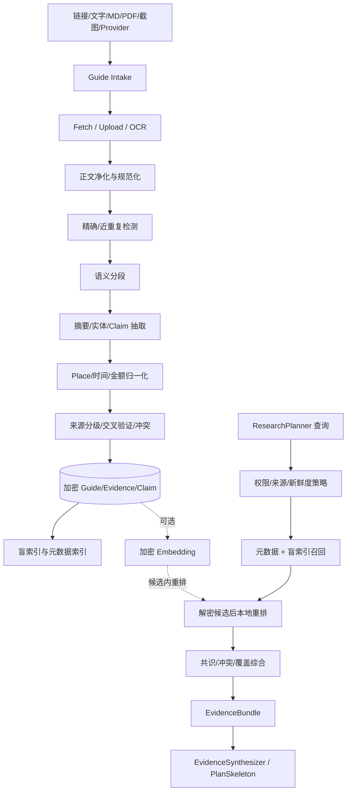
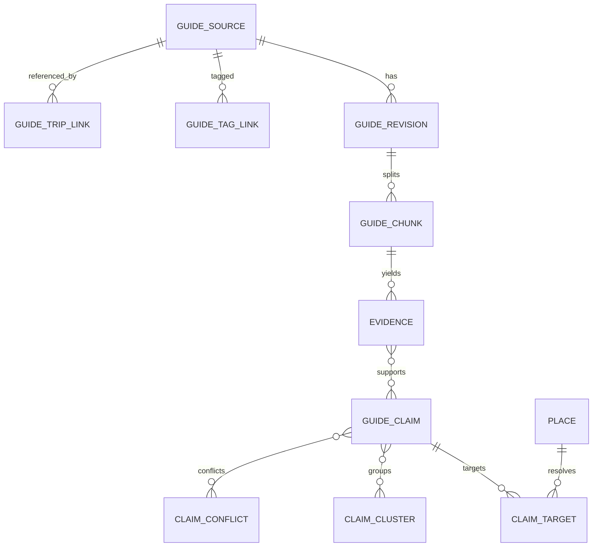
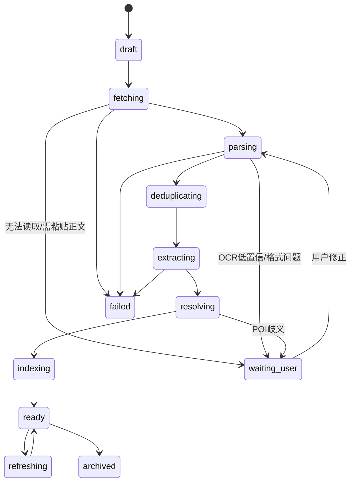

# DD-12 攻略知识库与检索详细设计

> 版本：1.0-review
> 设计日期：2026-08-31
> 需求来源：FR-GUIDE-001～011、FR-POI、FR-FOOD、FR-HOTEL、FR-PLAN、FR-LLM、NFR-SEC、NFR-PRI、NFR-PERF
> 关联设计：DD-02 Evidence 数据模型、DD-05 Research 工作流、DD-06 加密与权限、DD-08 资源控制

## 1. 目标与范围

攻略知识库负责把分散的链接、文字、文件、截图和受控外部搜索结果转换为可检索、可引用、可验证的旅行知识，并向 Agent 提供有界的 `EvidenceBundle`。它不是通用网页搜索引擎，也不是把全部正文放入模型上下文的文档聊天系统。

### 1.1 P0 基础能力

- 在旅行内导入链接、文字、Markdown、图片和 PDF；
- OCR、正文净化、摘要、POI 和 Claim 提取；
- 默认保存链接、摘要、短证据、内容哈希和获取时间；
- 用户可选择保存当前可见正文快照；
- 支持用户指定攻略、来源信任/不信任/忽略和来源策略；
- Agent 按当前旅行、权限和目的地检索 Claim；
- 多来源去重、共识、冲突、新鲜度和疑似推广分析；
- 每个进入计划的攻略结论保留可点击来源。

### 1.2 P1 独立资料库

- 独立攻略资料库页面；
- 按目的地、来源、旅行、标签、时间和适用人群检索；
- 私有、家庭共享和指定旅行范围复用；
- 批量标签、归档、重新解析和索引重建；
- 可选全文检索增强和加密 Embedding 重排；
- 经专项 PoC 通过后接入小红书只读 Worker。

P1 UI 不改变 P0 底层模型。P0 已保存的 GuideSource、Evidence 和 Claim 可以直接迁移到资料库视图。

### 1.3 非目标

- 大规模复制或镜像第三方攻略平台；
- 自动登录、绕过验证码/风控或保存平台账号密码；
- 把点赞量、收藏量直接作为真实性证明；
- 把攻略价格当作实时票价、菜单价或库存；
- 让规划模型直接浏览全部正文、Cookie、原始网页或数据库；
- 默认常驻向量数据库、本地 Embedding 模型或浏览器。

## 2. 核心设计原则

1. **来源先于结论**：每个 Claim 必须能回到 Source 和 Evidence；
2. **检索先于生成**：模型只读检索结果，不靠聊天历史记住攻略；
3. **观点与事实分层**：官方时效事实、社区体验、用户确认和模型推断分开；
4. **最小上下文**：Planner 默认读取标准化 Claim，不读取完整正文；
5. **权限参与索引**：搜索候选阶段就限制作用域，不能先全库召回再过滤；
6. **加密优先**：私有攻略不会为了全文搜索而明文落盘；
7. **轻量可降级**：无 Embedding、无外部搜索、无 OCR 时仍可粘贴文本并检索；
8. **时效可见**：过期内容保留历史但不得伪装成当前事实；
9. **研究有预算**：查询数量、候选数、模型 Token 和外部调用都有上限；
10. **用户可纠正**：用户可以修正 POI、Claim、标签、可信设置和摘要。

## 3. 总体架构



## 4. 领域对象

### 4.1 `GuideSource`

代表一个逻辑攻略来源，而不是某次下载响应。

| 字段 | 含义 |
|---|---|
| `id` | UUIDv7 |
| `owner_scope_type/id` | `user/family/trip/public` 及主体 |
| `source_type` | `url/text/markdown/pdf/image/provider` |
| `platform` | official、amap、xiaohongshu、mafengwo、wechat、other |
| `canonical_url_ciphertext` | 规范化 URL 密文 |
| `url_hmac` | 当前作用域内精确 URL 去重 |
| `title_ciphertext` | 标题 |
| `author_ciphertext` | 作者/机构，可空 |
| `published_at` | 来源发布时间，可空 |
| `importance` | `normal/high/required_reference` |
| `trust_setting` | `default/trusted/distrusted/ignored` |
| `retention_mode` | `link_summary/visible_snapshot/user_file` |
| `ingestion_status` | 导入状态机 |
| `current_revision_id` | 当前解析修订 |
| `deleted_at` | 软删除 |

`ignored` 表示默认检索不返回，但不删除历史 Evidence；若历史计划引用过它，引用仍可查看并显示已忽略。

### 4.2 `GuideRevision`

同一 URL 或文件可能重复采集。Revision 保存：

- `guide_source_id`、修订号；
- 获取/上传时间和访问方式；
- HTTP 元数据或附件引用；
- 规范化正文密文引用；
- 正文字符数、语言、截断状态；
- 作用域内内容 HMAC；
- 解析器版本、抽取器版本、Prompt 版本；
- 原始/净化内容安全报告；
- 是否成为当前修订。

新 Revision 不覆盖旧 Revision。内容未变化时只更新检查时间，不重复抽取和调用模型。

### 4.3 `GuideChunk`

| 字段 | 含义 |
|---|---|
| `revision_id` | 所属修订 |
| `sequence_no` | 原文顺序 |
| `section_path_ciphertext` | 标题层级 |
| `chunk_ciphertext` | 净化后的分块正文 |
| `char_start/end` | 在规范化正文中的位置 |
| `page_no` | PDF/图片页，可空 |
| `token_estimate` | 模型 Token 预估 |
| `chunk_hmac` | 同作用域去重 |
| `safety_flags_json` | 提示注入、联系方式、广告等标记 |

Chunk 是溯源和二次抽取单元，不直接作为 Planner 的默认上下文。

### 4.4 `GuideClaim`

Claim 是模型可读取的最小知识单元：

```json
{
  "id": "019...",
  "claim_type": "VISIT_DURATION",
  "subject": {
    "type": "place",
    "place_id": "019...",
    "display_name": "成都大熊猫繁育研究基地"
  },
  "value": {"min_minutes": 180, "max_minutes": 300},
  "qualifiers": {
    "season": ["summer"],
    "time_of_day": ["morning"],
    "participant_tags": ["老人", "儿童"]
  },
  "stance": "recommendation",
  "verification_status": "community_opinion",
  "confidence": 0.72,
  "evidence_ids": ["019..."],
  "valid_from": null,
  "expires_at": null
}
```

首版 Claim 类型：

| 类别 | Claim Type |
|---|---|
| 地点 | `PLACE_RECOMMENDATION`、`PLACE_AVOID`、`HIDDEN_GEM` |
| 时间 | `VISIT_DURATION`、`BEST_TIME`、`QUEUE_RISK`、`SEASONALITY` |
| 路线 | `ROUTE_TIP`、`TRANSFER_RISK`、`ENTRANCE_TIP`、`PARKING_TIP` |
| 餐饮 | `RESTAURANT_RECOMMENDATION`、`DISH_TIP`、`COST_HINT`、`WAITING_TIP` |
| 酒店 | `HOTEL_AREA_TIP`、`HOTEL_TIP`、`CHECKIN_TIP` |
| 人群 | `SUITABILITY`、`ACCESSIBILITY`、`CHILD_FRIENDLY`、`ELDERLY_FRIENDLY` |
| 风险 | `RESERVATION_REQUIRED`、`CLOSURE_RISK`、`SAFETY_TIP`、`SCAM_WARNING` |
| 体验 | `PHOTO_SPOT`、`CROWD_EXPERIENCE`、`SERVICE_EXPERIENCE` |

`COST_HINT` 永远是价格线索，只能生成 PriceObservation 的 `statistical/suggested` 层，不能升级为查询报价或实际价格。

### 4.5 `Evidence` 与 `ClaimEvidenceLink`

Evidence 保存与 Claim 直接相关的短引用、位置、来源、时间、提取方式和可信状态。一个 Claim 可以由多个 Evidence 支持或反驳；一个 Evidence 可以关联多个 Claim。

链接字段含 `relation=supports/contradicts/context`、抽取置信度和人工确认状态。引用片段默认限制为满足解释所需的短内容，并保留原链接，不复制无关正文。

### 4.6 `GuideEntityMention`

保存原文地点/餐厅/酒店/线路名称、别名、文本位置、候选 Place、匹配置信度和用户确认状态。未完成 POI 归一化的 Claim 可以检索，但不能直接进入路线求解。

### 4.7 `ClaimCluster` 与 `ClaimConflict`

- ClaimCluster：同一主题、相同方向、近似值的主张集合；
- ClaimConflict：主题相同但值、方向、适用时间或适用人群冲突；
- 保存成员 Claim、独立来源数、共识等级、范围聚合和最后计算时间；
- 聚类是可重建投影，不替代原 Claim。

## 5. 数据关系



## 6. 导入状态机



每阶段保存 Checkpoint；失败不删除原文件。`ready` 只表示知识可检索，不表示每条 Claim 已被官方验证。

## 7. 内容获取与净化

### 7.1 输入处理

| 输入 | 处理方式 | 降级 |
|---|---|---|
| URL | SSRF 安全 HTTP 获取、正文提取 | 提示粘贴正文/截图 |
| 粘贴文字/Markdown | Unicode 和 Markdown 净化 | 保存纯文本 |
| PDF | 隔离解析文本和页码 | 页面 OCR/人工选择 |
| 图片 | PP-OCR 草稿 | 用户修正/确认后视觉模型 |
| Provider | Adapter 转为 GuideRevision | 仅保存候选和链接 |

动态网页不会默认启动浏览器。用户明确启用可选 Provider 后，浏览器 Worker 仍只返回标准化 GuideDocument，不把会话交给主服务或模型。

### 7.2 规范化

- Unicode NFKC、统一换行和空白；
- 保留标题、段落、列表和页码边界；
- 移除脚本、样式、隐藏节点、导航和重复页脚；
- URL 规范化但保存原始展示链接；
- 电话、账号、精确地址等敏感内容标记，不默认进入模型；
- 外部文本中的系统指令样式只标记为 `prompt_injection_like`，不作为指令执行；
- 图片 OCR 同时保留字符/字段置信度，低于阈值需用户确认。

## 8. 分块设计

### 8.1 分块顺序

1. 按 Markdown/HTML 标题和 PDF 页切分；
2. 按段落、列表、表格和图片说明保持语义组；
3. 超长段落按中文句号、问号、分号和换行切分；
4. 目标每块 400～900 个中文字符，最大约 1200 字符；
5. 相邻块保留最多 80 字符重叠，只用于语义连续；
6. 餐厅清单、每日路线和价格表不得在单个条目中间切断；
7. 保存原始位置，引用可以回到页码或段落。

分块阈值是默认配置，应在中文攻略评估集上校准，不作为业务不变量。

### 8.2 摘要层级

- L0 GuideSummary：整篇攻略 100～300 字摘要、目的地、风格和关键标签；
- L1 Claim：可计算、可引用的独立观点；
- L2 EvidenceExcerpt：支撑 Claim 的短片段；
- L3 Chunk/正文：仅在用户查看或研究节点明确展开时读取。

PlanSkeleton 默认只能读取 L0/L1 和必要 L2，不允许直接请求 L3 全文。

## 9. 去重与转载识别

### 9.1 精确去重

- URL：规范化 URL 后按作用域 HMAC；
- 文件：规范化内容按作用域 HMAC；
- Chunk：净化文本按作用域 HMAC；
- 同内容重复上传只创建引用关系，不重复 OCR/抽取。

使用作用域 HMAC 而非公开 SHA-256，避免不同家庭之间通过哈希确认对方是否保存过某份私有资料。

### 9.2 近重复

先通过盲索引 Token 重叠召回候选，再在内存中解密候选并计算：

- 标题/作者/发布时间相似；
- 字符 3-gram Jaccard；
- 段落顺序相似；
- 可选 Embedding 余弦相似度。

相似度达到阈值时标记 `duplicate/repost/derived`，用户可以合并或保留。转载簇在共识计算中只算一个独立来源，避免“十篇转载”等于十个共识。

## 10. Claim 抽取

### 10.1 两阶段抽取

第一阶段使用确定性规则识别：日期、时间、金额、地点候选、交通方式、预约词、排队词和人群标签。第二阶段由模型把相关 Chunk 转换为严格 `GuideClaim[]` JSON Schema。

模型输入只含当前 Chunk、来源元数据和候选实体；输出必须给出：

- Claim 类型、主题、类型化值和单位；
- 适用日期/季节/时段/成员；
- 主观观点或事实类别；
- 证据位置；
- 置信度；
- 是否需要地图/官方复核；
- 疑似推广和不确定性。

Schema 修复最多两次。失败时保留 Chunk 和规则提取结果，不阻断其他攻略。

### 10.2 POI 归一化

```text
原文实体 → 城市/上下文限定 → Place 搜索候选
→ 名称/地址/类别/距离评分 → 高置信自动绑定
→ 中置信作为候选 → 低置信等待用户确认
```

同名景点、景区入口、机场航站楼和商场内餐厅不得仅按名称绑定。路线求解只接受已绑定 Place 或用户确认坐标。

## 11. 来源分级与用户控制

### 11.1 来源类别

| 类别 | 适合支持 | 不应单独支持 |
|---|---|---|
| 用户明确确认 | 个人偏好、实际体验、当前选择 | 第三方实时营业事实 |
| 官方/政府/交通 | 营业、预约、规则、安全 | 主观体验 |
| 地图/天气 API | POI、路线、天气、部分营业 | 实际菜单/库存保证 |
| 用户指定攻略 | 用户希望重点参考的体验 | 当前官方规则替代 |
| 多篇独立攻略 | 节奏、拥挤、体验和避坑共识 | 实时价格/库存 |
| 单篇攻略 | 候选和风险线索 | 已验证事实 |
| 模型推断 | 解释和建议 | 无来源外部事实 |

### 11.2 信任设置

- `trusted`：提高检索和展示权重，但不能覆盖更新的官方事实；
- `distrusted`：降低权重，默认只在冲突说明中展示；
- `ignored`：默认不参与新计划，但保留历史引用；
- `required_reference`：研究必须尝试覆盖该来源，读取失败时告知用户。

信任设置作用于排序，不修改 Evidence 的历史内容或伪造可信状态。

## 12. 共识与冲突

### 12.1 独立来源

满足以下条件才计为不同来源：不同作者/机构、非明显转载、内容哈希/近重复不属于同簇。平台不同不自动代表独立来源。

### 12.2 共识等级

| 等级 | 条件 |
|---|---|
| `single_source` | 一个独立来源 |
| `weak_consensus` | 两个独立来源方向一致 |
| `multi_source_consensus` | 至少三个独立来源，且无高权重反证 |
| `verified_consensus` | 多来源体验与官方/地图事实不冲突 |

数量阈值只形成基础等级，还需考虑发布时间、适用季节、人群和具体程度。

### 12.3 数值聚合

游玩时长、人均价格等不取虚假精确平均值。系统保留分布，使用加权中位数和分位范围，例如“多数攻略建议 3～4 小时，带老人建议预留 4～5 小时”。离群值继续可查。

### 12.4 冲突处理

冲突按主题分组并输出：双方主张、来源、新鲜度、适用条件、可能原因和计划采用值。官方时效事实通常决定可执行计划；社区相反体验作为提示。无法解析的硬冲突由用户确认。

## 13. 新鲜度

默认策略：

| Claim | 建议有效期 |
|---|---:|
| 营业/闭馆/预约/票价 | 1～7 天，临行复核 |
| 餐厅营业/菜单价格 | 7～30 天 |
| 路线/交通费用 | 查询时短期有效 |
| 排队/拥挤 | 同季节、同工作日类型优先；90～180 天 |
| 建议时长/适用人群 | 180～365 天 |
| 固定文化背景 | 长期，仍保留来源时间 |
| 用户个人体验 | 不自动过期，显示发生日期 |

来源发布日未知时降低新鲜度分。`stale` Claim 可以用于历史参考，但进入计划前必须显示过期状态，关键时效事实触发官方/地图复核。

## 14. 私有内容的加密检索

### 14.1 为什么不默认使用明文 FTS

SQLite FTS5 索引会保存可恢复的正文 Token；如果直接索引私有攻略、聊天式摘要或健康相关适用条件，会绕过 DD-06 的应用层加密。因此默认 Profile 不把私有正文写入明文 FTS 表。

### 14.2 盲索引

每个用户/家庭作用域从 DEK 派生搜索密钥：

```text
K_search = HKDF(scope_DEK, salt=key_version, info="guide-search-v1")
token_digest = HMAC-SHA256(K_search, normalized_token)[0:16]
```

`guide_search_tokens` 保存：

```text
scope_type, scope_id, search_key_version,
token_digest, object_type, object_id,
field_type, term_frequency, field_weight
```

中文 Token 采用领域词典词元 + 连续汉字 2-gram；英文/数字按小写词和标准化数字；去掉低信息停用词。查询时只为当前用户有权访问的作用域生成 Token HMAC，在 SQL 中召回对象 ID，然后在内存解密最多 200 个候选并精排。

盲索引会泄漏同一作用域内 Token 频率和文档关联模式，但不保存可直接阅读的正文。此限制写入安全说明；高敏内容可以设置 `searchable=false`，完全不建索引。

### 14.3 可选 FTS5

仅对公开资料、用户明确标记为非敏感的资料，或管理员在具备全盘加密的环境显式启用。FTS5 不是功能依赖；关闭后使用盲索引。切换配置需要重建索引并写审计。

## 15. 可选 Embedding

默认不部署向量数据库和本地 Embedding 模型。Embedding 仅用于候选内语义重排：

1. 元数据和盲索引先召回最多 200 个候选；
2. 对有向量的候选解密向量，在 Python 进程计算余弦相似度；
3. 向量以加密 BLOB 保存，不建立明文 ANN 索引；
4. 无向量或解密失败直接使用词法排序。

Embedding Provider 分为：

- `local_optional`：可选外部地址或按需子进程，不进入默认镜像常驻；
- `cloud_opt_in`：用户明确授权发送的摘要/Claim，不默认发送完整正文和敏感字段；
- `none`：默认，完整功能可用。

向量保存 `provider/model/dimension/input_hash/schema_version`。模型变化触发后台重建，旧向量在新向量可用前仍可读。向量本身存在语义泄漏风险，必须与正文同权限和删除策略。

## 16. 查询与召回

### 16.1 `KnowledgeQuery`

```json
{
  "trip_id": "019...",
  "destinations": ["成都"],
  "place_ids": ["019..."],
  "claim_types": ["VISIT_DURATION", "QUEUE_RISK", "SUITABILITY"],
  "travel_window": {"start": "2026-10-03", "end": "2026-10-05"},
  "participant_tags": ["老人", "儿童"],
  "styles": ["休闲", "亲子"],
  "include_scopes": ["trip", "user", "family"],
  "source_policy": {
    "required_guide_ids": [],
    "allow_public_web": false,
    "include_stale": true,
    "exclude_ignored": true
  },
  "limit": 40
}
```

客户端/模型不能指定任意 `scope_id`；服务端根据 Actor 和 Trip ACL 计算实际作用域。

### 16.2 召回步骤

1. 权限和可见范围；
2. 目的地/Place/行政区硬过滤；
3. Claim 类型、日期、季节、人群和来源策略过滤；
4. 必选 GuideSource 直接召回；
5. 盲索引词法候选；
6. 解密候选并计算相关性；
7. 可选 Embedding 重排；
8. 来源独立性、信任、新鲜度、广告风险和验证状态加权；
9. 结果多样化，避免一个来源占满；
10. 形成 ClaimCluster/Conflict 和 EvidenceBundle。

### 16.3 排序公式

默认归一化评分：

```text
score = 0.28 lexical_relevance
      + 0.16 destination_place_match
      + 0.12 participant_style_match
      + 0.12 source_priority
      + 0.10 freshness
      + 0.10 verification
      + 0.08 consensus
      + 0.04 semantic_similarity
      - promotion_penalty
      - duplicate_penalty
      - conflict_uncertainty_penalty
```

用户指定高权重攻略通过 `source_priority` 加权，但任何来源都不能突破权限、`ignored`、硬时效事实或安全过滤。权重版本化并通过评估集校准。

### 16.4 多样性

默认每个逻辑来源最多提供 5 个 Claim，每个 ClaimCluster 最多返回 3 条代表 Evidence；官方和社区至少各保留一个代表（存在时）。使用简化 MMR/规则去重，避免同一攻略的相似段落挤占上下文。

## 17. 模型读取契约

### 17.1 分工

| Agent/节点 | 可读取内容 |
|---|---|
| ResearchPlanner | GuideSummary 索引、来源能力，不读全文 |
| EvidenceCollector | 查询结果、必要 Chunk，允许继续受限检索 |
| EvidenceSynthesizer | Claim、Evidence、冲突和来源元数据 |
| PlanSkeleton | 只读综合后的 EvidenceBundle |
| RouteSolver/BudgetCalculator | 不读攻略正文，只读确定性地点/价格线索对象 |
| Presenter | 读取用于解释的引用和摘要 |

### 17.2 `EvidenceBundle`

```json
{
  "schema_version": "evidence-bundle/1.0",
  "query_summary": "成都亲子且有老人，重点考虑体力与排队",
  "generated_at": "2026-08-31T08:00:00Z",
  "claims": [],
  "consensus_groups": [],
  "conflicts": [],
  "coverage": {
    "place": 0.9,
    "duration": 0.8,
    "crowd": 0.7,
    "cost": 0.4
  },
  "missing_information": ["缺少近期餐厅菜单价格"],
  "source_refs": [],
  "warnings": ["两条排队经验发布时间超过一年"]
}
```

默认最多 40 个 Claim、每个 Claim 最多 3 条 Evidence，攻略上下文最多占模型上下文窗口的 25%，且默认不超过约 6000 输入 Token。超过时优先保留用户指定来源、硬风险、与当前候选地点直接相关和多来源共识。

### 17.3 引用规则

模型输出的外部事实和社区建议通过 `claim_id/source_ref` 引用。Presenter 把内部引用映射为标题、平台、发布时间、查询时间和可点击链接。链接不可用时仍保留来源描述和内容哈希。

模型不得引用未出现在 EvidenceBundle 中的外部事实；自身推断必须标记为“AI 建议”。

### 17.4 Prompt 注入隔离

EvidenceBundle 使用结构化 JSON/对象，不把正文拼接到系统指令。EvidenceExcerpt 加明确不可信数据标签。正文中的工具名、角色文本、JSON 或“忽略规则”都不会改变 ToolGateway 权限。Planner 不能调用网页和小红书工具，避免边规划边无限搜索。

## 18. 内部工具

| 工具 | 调用者 | 风险 | 输出 |
|---|---|---|---|
| `guide.import_draft` | 应用/UI | R3 | ImportDraft |
| `guide.extract` | EvidenceCollector/任务 | R3 | GuideSummary/ClaimDraft |
| `guide.search` | ResearchPlanner/Collector | R1/R2 | GuideSummary[] |
| `evidence.search` | Collector/Synthesizer | R1/R2 | Claim[] |
| `evidence.expand` | Collector | R2 | 受限 EvidenceExcerpt |
| `evidence.compare` | Synthesizer | R0 | Cluster/Conflict |
| `guide.resolve_place` | Collector/用户 | R1 | PlaceCandidate[] |
| `guide.mark_trust` | 用户应用命令 | R4 | 审计后的状态 |
| `guide.reindex` | 管理任务 | R4 | Job，不暴露模型 |

`evidence.expand` 必须传 Claim ID、目的和最大字符数；不提供“返回整篇攻略”的 Agent 工具。

## 19. REST API

```text
POST   /trips/{trip_id}/guide-sources
GET    /trips/{trip_id}/guide-sources
GET    /guide-sources/{guide_id}
PATCH  /guide-sources/{guide_id}
DELETE /guide-sources/{guide_id}
POST   /guide-sources/{guide_id}/refresh
POST   /guide-sources/{guide_id}/reprocess
GET    /guide-sources/{guide_id}/revisions
GET    /guide-sources/{guide_id}/claims
PATCH  /guide-claims/{claim_id}
POST   /guide-claims/{claim_id}/confirm
POST   /guide-claims/{claim_id}/reject
POST   /knowledge/search
GET    /knowledge/sources                 P1
GET    /knowledge/tags                    P1
POST   /knowledge/reindex                 管理员/P1
GET    /knowledge/index-status            管理员/P1
```

上传仍复用 DD-04 Import Session。知识库接口返回状态、摘要和引用，不直接返回附件物理路径或完整密文。

## 20. 移动端交互

### 20.1 旅行内攻略

- “添加攻略”：粘贴链接、文字或上传；
- 状态卡：获取、OCR、解析、待确认、可用、失败；
- 摘要卡：目的地、标签、关键建议、来源和新鲜度；
- Claim 列表：事实/社区观点/价格线索/AI 推断明确区分；
- POI 歧义、OCR 低置信和冲突使用逐项确认；
- “作为重要参考”“信任”“不信任”“忽略”快捷操作；
- 规划结果可从建议反向打开对应攻略和证据。

### 20.2 独立资料库 P1

顶部搜索，筛选目的地、来源、旅行、标签、时间、适用人群和状态。默认只搜有权限内容。批量操作不包含“公开发布”，共享必须走既有 ACL/分享确认。

## 21. 缓存与失效

| 缓存 | Key | 默认 TTL/失效 |
|---|---|---|
| URL 获取 | canonical URL + header policy | 6 小时～7 天 |
| 解析结果 | content HMAC + parser version | 内容/版本变化 |
| Claim 抽取 | chunk HMAC + extractor/prompt/model | 任一版本变化 |
| POI 绑定 | entity + city + provider | Place 合并/纠正 |
| Query 结果 | scope/version + query hash + policy | 10～60 分钟；ACL/信任/Claim变化立即失效 |
| EvidenceBundle | Trip version + research policy | Trip/攻略/来源策略变化 |

缓存命中也必须重新执行当前权限检查。删除、撤权和设置 `ignored` 立即使相关查询缓存失效。

## 22. 后台任务与资源

| 阶段 | 资源等级 | 默认并发 |
|---|---|---:|
| HTTP 获取/轻解析 | network/light | 2 |
| PDF 文本提取 | cpu | 1 |
| OCR | memory-heavy | 全局 1 |
| Claim 模型抽取 | network | 模型 Provider 1～2 |
| POI 解析 | network | 地图 Provider 1～2 |
| 盲索引构建 | cpu-light | 1 |
| Embedding | optional-heavy | 全局 1 |

任务按 Revision 检查点恢复。单次默认最多导入 20 文件；超大攻略按块流式处理。每批模型抽取使用合并请求但限制 Token，避免每段单独调用浪费费用。

空闲时知识库不加载 OCR、Embedding 或浏览器模型，不新增常驻服务。索引表体积和待处理任务显示在管理页。

## 23. 用量与成本

记录获取请求、OCR 页数、模型抽取 Token、POI 查询、Embedding 数、缓存命中和失败。节省顺序：

1. 内容 HMAC 命中跳过重复解析；
2. 相同 Chunk/抽取器版本复用 Claim；
3. 规则先筛出相关 Chunk，再调用模型；
4. 多 Chunk 批处理；
5. 相同实体批量 POI 解析；
6. 默认无 Embedding；
7. 旅行规划复用已构建 EvidenceBundle。

DeepSeek 抽取费用按峰谷价格记录，不硬阻断；外部网页/地图按管理员免费额度策略限流。达到外部限额时保留已导入资料并允许手工补充。

## 24. 安全与隐私

- GuideSource、Revision、Chunk、Claim 自由文本、作者和 URL 使用作用域 DEK 加密；
- 搜索默认使用盲索引；高敏资料可完全禁止索引；
- 模型调用前按用户云模型授权和数据分类最小化正文；
- 精确家庭地址、联系方式、健康信息和账号标识默认脱敏；
- 第三方正文不进入普通日志、SSE 和 ToolCall 摘要；
- 原始网页和文件按不可信数据解析；
- URL 获取沿用 SSRF 防护，重定向逐跳检查；
- 删除 GuideSource 会撤销检索、删除索引 Token，并按保留规则清理附件/密文；
- 家庭共享只共享标准化知识和用户明确选择的来源，不共享第三方登录会话；
- 小红书 Cookie、Storage State、`xsec_token` 永不进入知识库或模型上下文。

## 25. 可观测性

管理与诊断指标：

- GuideSource/Revision/Chunk/Claim 数量和存储；
- 导入成功率、各阶段耗时和等待用户数量；
- OCR/抽取/POI 匹配置信度分布；
- 精确/近重复率；
- 查询 p50/p95、候选数、解密重排数；
- 零结果率、EvidenceBundle 覆盖率；
- 引用点击和用户纠错率；
- 新鲜/过期 Claim 数；
- 外部调用、Token、缓存命中和估算成本；
- 索引版本、重建进度和孤儿索引数。

不记录查询正文；使用作用域内 HMAC 查询哈希做重复统计。

## 26. 测试与质量门

### 26.1 导入

- URL、重定向、无法访问、乱码、超大正文；
- 中文 Markdown、PDF 页码、长图 OCR、表格和清单；
- 重复 URL、重复文件、转载和局部更新；
- OCR 低置信等待确认；
- 解析失败保留原件并可重试。

### 26.2 Claim 质量

建立不少于 200 条人工标注中文攻略片段，覆盖景点、餐厅、酒店、交通、亲子、老人、价格和风险。门槛：

| 指标 | 初始门槛 |
|---|---:|
| Claim Schema 两次修复后通过率 | ≥99% |
| Claim 类型 Macro F1 | ≥0.85 |
| 数值/单位准确率 | ≥0.95 |
| Evidence 位置可追溯率 | 100% |
| POI 高置信自动绑定准确率 | ≥0.98 |
| 未绑定 POI 进入路线率 | 0 |
| 攻略价格误标为实时报价率 | 0 |

### 26.3 检索

建立至少 60 个目的地/人群/风格 Query，以人工相关性标注评估：`Recall@20`、`nDCG@10`、MRR、来源多样性、零结果率和过期误用率。安全指标：未授权内容召回率必须为 0。

### 26.4 综合

- 两篇转载只能算一个独立来源；
- 官方新规则与旧攻略冲突时计划采用官方事实并展示体验提示；
- 用户设为 ignored 后新 Run 不再使用；
- required_reference 读取失败时显式告知；
- Planner 上下文不超过预算且每条外部结论可引用；
- Prompt 注入攻略无法调用工具或改写锁定项；
- 删除/撤权后缓存、索引和模型检索立即失效。

### 26.5 性能

在 2 核/2 GB AMD64 环境使用 500 篇 Guide、5000 Claim、100000 Token 索引进行测试：

- 无任务时不增加独立常驻进程；
- 元数据 + 盲索引查询 p95 目标 <500 ms；
- 候选内解密重排最多 200 条，p95 目标 <1 s；
- 索引重建后台执行且普通页面可用；
- OCR/Embedding 与 PDF 共享高内存并发 1，总峰值 <2 GB。

## 27. 迁移与重建

- Guide/Claim Schema、分词规则、盲索引和排序权重各自版本化；
- 内容密文是权威数据，索引和 ClaimCluster 都可重建；
- 分词器更新创建新索引版本，构建完成后原子切换；
- 搜索密钥轮换期间同时读取新旧 Token，重建完成后删除旧索引；
- 抽取器升级不覆盖人工确认 Claim；自动 Claim 创建新修订并生成差异；
- 恢复备份后验证索引版本，不一致则排队重建，不阻断历史行程查看。

## 28. 实施顺序

### Phase A：P0 数据骨架

GuideSource/Revision/Chunk/Claim/Evidence 表、附件、加密、状态机、文本/Markdown 导入和人工确认。

### Phase B：P0 检索闭环

作用域盲索引、元数据过滤、`evidence.search`、EvidenceBundle、Planner 引用和缓存失效。

### Phase C：P0 多模态和综合

PDF/图片 OCR、POI 绑定、共识/冲突、来源信任和攻略价格线索。

### Phase D：P1 资料库

独立移动页面、跨旅行复用、批量标签、重新解析、索引管理和可选 Embedding。

### Phase E：P1/R Provider

公开网页自动搜索和经 PoC 验收的小红书只读 Worker；失败不影响 A～D。

## 29. 验收结论

该设计满足“攻略可长期复用、模型可按需读取、结果可引用、私有内容加密、低资源运行”的目标。默认实现为结构化 RAG：元数据和盲索引召回、内存重排、ClaimGraph/EvidenceBundle 供模型读取；不需要常驻向量数据库，也不把私有正文作为明文 FTS 索引。

任何替换方案必须继续满足：未授权召回为零、Planner 不直读全文、每个结论可溯源、外部内容不能控制工具、默认部署空闲和峰值资源门不变。
