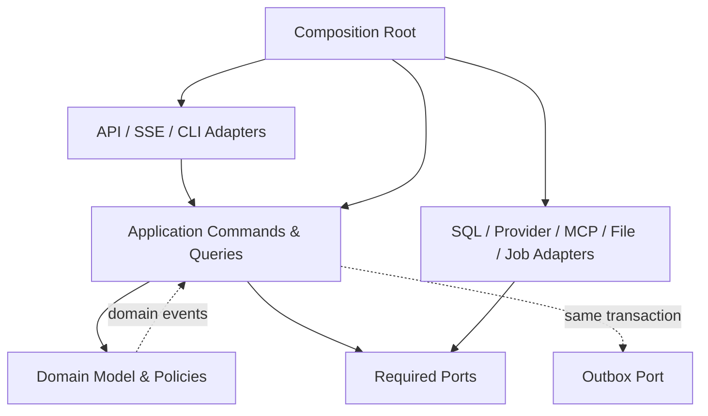

# DD-13 实现架构、设计模式与扩展契约

> 版本：1.0-review
> 设计日期：2026-08-31
> 目标：在模块化单体内保证高内聚、低耦合、可测试和可渐进扩展
> 约束：模式服务于变化点，不为“模式齐全”增加抽象层

## 1. 审查结论

现有 DD-01～DD-12 已具备进入实现的主架构条件：模块化单体、端口与适配器、结构化状态、Proposal、Repository、Provider、Workflow、Outbox 和测试门均已定义。实现前还需要把以下内容固化为代码约束：

1. 模块所有权和允许依赖；
2. Unit of Work 与事务边界；
3. Command/Query Handler 契约；
4. 端口由谁定义、适配器如何注册；
5. 领域事件到 Outbox 的映射；
6. 组合根和依赖注入方式；
7. 跨模块调用和查询投影边界；
8. 架构测试，防止实现过程中逐渐退化为“大 Service + ORM 到处传”。

本文件补齐这些实现契约。结论不是引入更多框架，而是让扩展点可预测、核心逻辑可独立测试。

## 2. 架构风格

采用三种互补风格：

- **模块化单体**：部署和事务保持简单，领域模块独立演进；
- **六边形架构/Ports and Adapters**：核心业务不依赖 FastAPI、SQLAlchemy 和供应商 SDK；
- **轻量 CQRS**：写入使用 Command/聚合/事务，读取使用专用 Query/View；不拆分数据库，不引入消息中间件。



依赖箭头表示编译/导入依赖：基础设施实现应用/领域定义的 Port，而不是领域导入基础设施。

## 3. 模块划分与所有权

### 3.1 业务模块

| 模块 | 拥有的数据/规则 | 对外公开 Facade | 不允许直接访问 |
|---|---|---|---|
| `identity` | User、Credential、Session | IdentityCommands/Queries | Trip、Provider SDK |
| `families` | Family、Membership、MemberProfile | FamilyFacade | Trip 私有表 |
| `preferences` | Preference、MemorySuggestion | PreferenceFacade | 聊天原文数据库 |
| `trips` | Trip、Requirement、Participant、ACL | TripFacade | LLM/地图 SDK |
| `itinerary` | Version、Day、Item、Leg、Patch | ItineraryFacade | FastAPI/供应商结构 |
| `planning` | PlanningRun、Proposal、QualityReport | PlanningFacade | ORM Session、Secret |
| `knowledge` | Guide、Evidence、Claim、检索 | KnowledgeFacade | 浏览器会话、Trip 表写入 |
| `geography` | Place、坐标、ProviderRef | GeographyFacade | Trip 业务规则 |
| `routing` | RouteQuote、路线连续性 | RoutingFacade | Budget 写表 |
| `budgeting` | BudgetVersion、PriceObservation | BudgetFacade | Expense ORM |
| `orders` | OrderRecord/Event、匹配 | OrderFacade | 自动支付/下单 |
| `expenses` | Expense、Correction、Allocation | ExpenseFacade | 订单原事实覆盖 |
| `documents` | Attachment、ImportDraft、Export | DocumentFacade | 物理路径直出 |
| `sharing` | ACL 链接、脱敏发布副本 | SharingFacade | 私有 DTO 序列化器 |
| `notifications` | Reminder、DeliveryAttempt | NotificationFacade | 主事务内 SMTP |
| `operations` | Job、Usage、Backup、Audit 查询 | OperationsFacade | 绕过领域写表 |

### 3.2 所有权规则

- 每张业务表只有一个模块拥有写权限；
- 其他模块只通过拥有者的 Facade/Port 访问，或读取明确发布的 Read Model；
- 跨模块只传 ID、Value Object 或公开 DTO，不传 ORM Entity；
- 禁止跨模块 `JOIN` 作为写业务规则的依赖；复杂读取可由 Query 层使用只读投影；
- 一个 UseCase 可以协调多个模块，但事务和写入仍由 Application 层显式控制；
- 模块内部目录默认不公开，只有 `public.py`/`contracts.py`/`ports.py` 可被外部模块导入。

## 4. 推荐代码结构

```text
apps/api/src/travel_agent/
  bootstrap/
    container.py                 唯一组合根
    settings.py
    lifecycle.py
  api/
    http/
      routers/
      dependencies.py
      problem_details.py
    sse/
    dto/
  modules/
    trips/
      domain/
        entities.py
        value_objects.py
        policies.py
        events.py
        errors.py
      application/
        commands.py
        command_handlers.py
        queries.py
        query_handlers.py
        ports.py
        dto.py
      infrastructure/
        sqlalchemy_models.py
        repositories.py
        read_models.py
      public.py
    planning/
      domain/
      application/
      infrastructure/
      public.py
    knowledge/
      ...
  agents/
    runtime/
    nodes/
    tools/
    prompts/
    evals/
  shared/
    domain/
      ids.py
      money.py
      time.py
      result.py
    application/
      uow.py
      clock.py
      event_bus.py
    infrastructure/
      db/
      crypto/
      observability/
```

`shared` 必须保持很小。进入 shared 的条件是：至少三个模块使用、语义完全相同、没有明确业务所有者。不得建立 `shared/utils.py`、`common/helpers.py` 或通用 `BaseService` 垃圾抽屉。

## 5. 依赖规则

### 5.1 后端允许依赖

```text
domain
  → Python标准库、领域共享Value Object

application
  → domain、application contracts/ports

agents
  → application public contracts、Agent contracts

infrastructure
  → application/domain ports、第三方SDK

api
  → application public commands/queries、API DTO

bootstrap
  → 所有层，仅负责装配
```

### 5.2 强制禁止

- Domain 导入 FastAPI、Pydantic Settings、SQLAlchemy、httpx、模型/地图/MCP SDK；
- API Router 直接执行 SQL 或调用 Provider；
- AgentNode 获取 ORM Session、Repository 实例或 SecretStore；
- Repository 调用外部 API、做权限决策或计算预算；
- Provider Adapter 返回供应商原始 JSON 到 Application；
- 一个模块导入另一个模块的 `infrastructure` 或 ORM Model；
- 在全局变量里保存可变 Repository、Session、用户上下文或 Provider 客户端；
- 使用 Service Locator 在业务代码中按字符串查依赖；
- 在数据库事务内调用模型、地图、天气、SMTP、OCR 或文件大块 I/O。

## 6. 核心模式目录

| 模式 | 使用位置 | 解决的问题 | 避免的滥用 |
|---|---|---|---|
| Aggregate | Trip、Order、Expense、PlanningRun | 强一致边界和不变量 | 不把整套系统做成一个超级聚合 |
| Value Object | Money、DateRange、Coordinate、Version | 类型安全、不可变、规则集中 | 不为每个字符串造无意义类 |
| Repository | 聚合持久化 | 隔离 ORM 和存储 | 不做通用 CRUD BaseRepository |
| Unit of Work | 写 UseCase | 事务、审计、Outbox 原子提交 | 不跨网络请求持有事务 |
| Command | 所有状态变化 | 明确意图、权限、幂等、审计 | 不用任意字典更新实体 |
| Query/Read Model | 列表、工作区、报表 | 优化读取且不污染领域模型 | 不建立第二套微服务/数据库 |
| Strategy/Policy | 路线、预算、排序、来源、脱敏 | 可替换算法 | 不为不会变化的简单 if 提前抽象 |
| Port/Adapter | 模型、地图、天气、OCR、文件、邮件、MCP | 隔离外部变化 | 不泄漏上游 DTO |
| Abstract Factory/Registry | Provider、Parser、Exporter、Tool | 依据配置选择实现 | 不做可变全局单例 |
| Pipeline | 攻略导入、OCR、Agent Workflow | 可恢复分阶段处理 | 不隐藏事务和副作用 |
| State Machine | Trip、Proposal、Job、Import | 合法迁移 | 不散落状态字符串判断 |
| Specification/Rule | 合理性、权限、预算、检索条件 | 可组合确定性规则 | 不用反射式通用规则引擎 |
| Domain Event | 聚合内已发生事实 | 解耦后续副作用 | 不在 Handler 中隐式递归发布 |
| Transactional Outbox | 通知、缓存失效、任务 | 业务提交与异步副作用一致 | 不假设 exactly-once |
| Decorator/Middleware | 重试、限流、缓存、计量、Trace | 横切能力 | 不改变领域结果语义 |
| Anti-Corruption Layer | 第三方 Provider/MCP | 阻止供应商概念污染领域 | 不在 Domain 保存原始响应 |
| Proposal/Two-step Commit | AI、OCR、分享、恢复 | 预览确认和版本校验 | 不让模型调用写库工具 |

## 7. Domain Model

### 7.1 Entity 与 Value Object

Domain Entity 使用普通 Python dataclass/手写类，不继承 ORM Model。Entity 通过方法维护不变量：

```python
@dataclass
class Trip:
    id: TripId
    status: TripStatus
    version: TripVersion
    _events: list[DomainEvent] = field(default_factory=list)

    def confirm_plan(self, proposal: ApprovedProposal, actor: ActorId) -> None:
        if self.status not in {TripStatus.DRAFT, TripStatus.PROPOSED}:
            raise InvalidTripTransition(...)
        if proposal.base_version != self.version:
            raise TripVersionConflict(...)
        self.status = TripStatus.CONFIRMED
        self._events.append(TripPlanConfirmed(...))
```

禁止从 Router 直接修改 `trip.status`。Pydantic 负责边界 DTO 校验，领域不依赖 Pydantic 的 HTTP 错误语义。

### 7.2 Value Object 基线

首批共享 Value Object：`Money`、`Currency`、`DateRange`、`TimeWindow`、`Coordinate`（含坐标系）、`Distance`、`Duration`、`Percentage`、类型化 ID、`TripVersion`、`SourceRef`。Money 禁止 float；Coordinate 禁止脱离坐标系构造。

## 8. Command 与 Handler

### 8.1 契约

```python
@dataclass(frozen=True)
class MoveTripItem(Command):
    trip_id: TripId
    item_id: TripItemId
    target_day: date
    after_item_id: TripItemId | None
    expected_version: TripVersion
    idempotency_key: IdempotencyKey
    actor: ActorContext

class MoveTripItemHandler:
    def __init__(
        self,
        uow: UnitOfWork,
        authorization: TripAuthorizationPolicy,
        impact_analyzer: ItineraryImpactPort,
    ) -> None: ...

    async def handle(self, command: MoveTripItem) -> MoveTripItemResult: ...
```

Command 是不可变意图，不携带 ORM、Request 或未校验字典。Handler 编排权限、Repository、Domain 和事务，不包含 HTTP 映射。

### 8.2 Handler 标准顺序

```text
验证幂等记录
→ 加载最小聚合/当前版本
→ Application授权
→ Domain前置条件
→ 如需外部信息，事务外获取并标准化
→ 开启短UoW
→ 再校验版本/授权/锁定
→ 执行Domain方法
→ 保存聚合/Version/Audit/Outbox
→ commit
→ 返回Result DTO
```

外部信息在事务外获取后必须携带查询时间和输入哈希；提交前再次检查其仍适用于当前版本。

## 9. Unit of Work

### 9.1 Port

```python
class UnitOfWork(Protocol):
    trips: TripRepository
    proposals: ProposalRepository
    audit: AuditWriter
    outbox: OutboxWriter

    async def __aenter__(self) -> "UnitOfWork": ...
    async def __aexit__(self, exc_type, exc, tb) -> None: ...
    async def commit(self) -> None: ...
    async def rollback(self) -> None: ...
```

每次 Handler 创建独立 UoW。SQLite Profile 使用一个 AsyncSession/Connection 和短事务。UoW 退出但未显式 commit 时必须 rollback。

### 9.2 原子性

以下同一 UoW：业务状态、ItineraryVersion、AuditEvent、OutboxEvent、Proposal 应用状态。DomainEvent 在 commit 前由 Application 映射成 Audit/Outbox；不得在聚合方法内发送邮件或启动任务。

## 10. Repository

### 10.1 聚合专用接口

```python
class TripRepository(Protocol):
    async def get_for_update(self, trip_id: TripId) -> Trip | None: ...
    async def add(self, trip: Trip) -> None: ...
    async def save(self, trip: Trip, expected_version: TripVersion) -> None: ...
```

不提供 `BaseRepository[T].update(dict)`。每个 Repository 只持久化一个聚合语义，ORM 映射集中在 infrastructure。复杂列表和报表使用 QueryRepository/ReadModel，不强迫聚合承担展示需求。

### 10.2 Specification 边界

可复用业务条件使用类型化 Specification，例如 `VisibleTripsForActor`、`ActiveEvidenceForPolicy`。Specification 不暴露 SQLAlchemy 表达式给 Domain；Infrastructure 负责翻译。简单唯一查询直接用明确方法，避免通用查询 DSL。

## 11. Query 与 Read Model

轻量 CQRS 只分离代码路径：

```python
class GetTripWorkspaceHandler:
    def __init__(self, views: TripWorkspaceViewPort, authz: TripReadPolicy): ...
    async def handle(self, query: GetTripWorkspace) -> TripWorkspaceDTO: ...
```

Query Handler 可以通过只读 SQL 联接多个模块的投影，但必须：

- 不返回 ORM Entity；
- 不执行业务写入；
- 在查询中应用权限范围；
- DTO 有 Schema 版本；
- 不成为写 Command 的事实来源；
- 投影落后时能回到权威聚合/版本。

首版投影与主库同 SQLite，不引入独立读数据库。

## 12. Provider Port 与 Adapter

### 12.1 端口由消费者拥有

需要外部能力的 Application 模块定义 Port，例如 Routing 定义 `RouteProviderPort`，Infrastructure 提供 `AmapRouteAdapter`、`BaiduRouteAdapter` 和 `EstimatedRouteAdapter`。供应商模块不能反向规定领域模型。

```python
class RouteProviderPort(Protocol):
    capabilities: frozenset[RouteCapability]
    async def quote(
        self, request: RouteRequest, context: ProviderRequestContext
    ) -> ProviderResult[RouteQuote]: ...
```

### 12.2 Strategy 与选择器

`RouteProviderSelector` 根据用户配置、能力、坐标区域、配额和熔断状态选择 Adapter。Selector 只选择，不做路线业务计算。降级链以配置数据声明：高德 → 百度 → 规则估算 → 手工值。

### 12.3 Decorator 链

```text
Adapter
← SchemaValidationDecorator
← UsageMeteringDecorator
← CacheDecorator
← RetryCircuitBreakerDecorator
← TracingDecorator
```

Decorator 顺序由组合根固定并测试。鉴权/Secret 注入在最靠近 Adapter 的位置；缓存不能绕过当前权限和来源策略。

### 12.4 注册

Provider 使用显式 Registry，不做运行时扫描任意 Python 包：

```python
registry.register("route", "amap", build_amap_route_adapter)
registry.register("model", "deepseek", build_openai_compatible_model)
```

新增内部 Provider 需要实现 Port、能力声明、配置 Schema、错误映射和契约测试。远程 MCP 仍走 MCP Gateway，不能借 Registry 获得内部写权限。

## 13. Parser、Exporter 与通知扩展

### 13.1 Parser Strategy

`DocumentParserPort` 按 MIME 和能力选择 `MarkdownParser`、`PdfTextParser`、`ImageOcrParser`。Parser 返回标准化 DocumentDraft，不创建正式 Order/Guide。用户确认由独立 Command 完成。

### 13.2 Export Renderer

`ExportRendererPort` 实现 Markdown、JSON、CSV、PDF、未来 ICS。Renderer 只读稳定 ExportSnapshot，不查询 ORM 或调用模型。这样替换 Chromium PDF 不改变业务/API。

### 13.3 Notification Channel

`NotificationChannelPort` 实现 InApp、SMTP 和未来 Push。Outbox Consumer 根据用户偏好选择 Channel；业务 Handler 只创建领域通知意图。

## 14. Agent 扩展模式

### 14.1 Workflow Graph

Workflow 是版本化 DAG 定义：节点 ID、输入/输出 Schema、依赖、工具白名单、重试和停止条件。Runtime 解释 DAG；节点不调用下一个节点，避免控制流耦合。

### 14.2 Node 插件契约

新增 AgentNode 必须提供：

- 稳定 `node_type` 和版本；
- 输入/输出 Pydantic Schema；
- Context 最小字段声明；
- 工具白名单和风险等级；
- 模型能力要求；
- 最大调用/Token/时间；
- Checkpoint 可序列化结果；
- 固定桩测试、安全测试和评估用例。

节点不能依赖其他具体节点类，只依赖上游输出契约。跨节点共享逻辑进入确定性 Domain/Application Service，不复制 Prompt。

### 14.3 Tool Command Query Separation

Agent Tool 分成只读查询、纯计算和 Draft 生成。正式写 Command 不注册到 Agent Tool Registry。即使未来 MCP 提供写工具，也不能映射到 R4/R5 内部能力，除非产品需求和安全设计单独变更。

## 15. 状态机实现

使用显式 Enum + Transition Table + Domain 方法，不引入重量级状态机框架：

```python
TRIP_TRANSITIONS: dict[TripStatus, frozenset[TripStatus]] = {
    TripStatus.DRAFT: frozenset({TripStatus.GENERATING, TripStatus.CANCELLED}),
    TripStatus.PROPOSED: frozenset({TripStatus.GENERATING, TripStatus.CONFIRMED}),
    ...
}
```

状态迁移必须通过领域方法并产生 Event。数据库 Check 约束防止非法字符串，但业务合法性由 Domain 决定。API 不接受任意 `status` PATCH。

## 16. Domain Event 与 Outbox

### 16.1 分层

- DomainEvent：进程内、描述聚合内已发生事实；
- IntegrationEvent：稳定、可序列化的模块间/异步事件；
- OutboxRecord：IntegrationEvent 的事务存储形式；
- SSEEvent：面向 UI 的安全投影，不等同于 DomainEvent。

### 16.2 映射

```text
Trip.confirm_plan()
  → TripPlanConfirmed DomainEvent
  → Handler/EventMapper
  → AuditEvent + trip.version.created IntegrationEvent
  → 同事务 Outbox
  → Consumer 失效缓存/创建提醒/SSE
```

Domain Event Handler 在 commit 前只允许同事务确定性操作；所有网络或重任务必须变成 Outbox/Job。消费者至少一次执行，使用 Event ID 去重。

## 17. Policy 与 Rule Engine

### 17.1 Policy

适合可替换决策：授权、来源优先级、天气影响、Provider 选择、脱敏、预算优化。Policy 输入和输出必须类型化，不读取全局配置；配置通过构造参数传入。

### 17.2 Deterministic Rule

合理性审计使用规则对象：

```python
class FeasibilityRule(Protocol):
    rule_id: str
    def evaluate(self, context: FeasibilityContext) -> list[QualityIssue]: ...
```

Rule Registry 显式列出顺序和适用范围。模型可解释或建议修复，但不能修改规则结果严重度。首版不开发用户脚本式通用规则语言，避免安全和维护复杂度。

## 18. 错误模型

Domain/Application 使用稳定异常或 Result 类型：

```text
DomainError
  ValidationError
  InvariantViolation
  InvalidStateTransition
  VersionConflict
  PermissionDenied
  ResourceNotFound
  QuotaExceeded
  ProviderUnavailable
```

API Adapter 将其映射为 Problem Details；Job 映射为任务错误；Agent 映射为可重试/等待用户/终止。Domain Error 不包含 HTTP 状态，Provider 原始错误在 Adapter 内归一化并脱敏。

## 19. 依赖注入与组合根

首版采用显式构造器注入，不要求重量级 DI 框架。`bootstrap/container.py` 是唯一装配位置：

- 创建 Engine/Session Factory；
- 创建 SecretStore、Clock、ID Generator；
- 创建 Repository/UoW Factory；
- 创建 Provider Adapter 与 Decorator；
- 创建 Application Handler；
- 创建 Workflow/Tool Registry；
- 把 Handler 暴露给 FastAPI Dependency。

测试可以直接构造 Handler 并传 Fake Port。禁止在业务代码中调用 `get_container()` 或读取全局单例。

## 20. 扩展场景验证

### 20.1 新增模型 Provider

只需实现 `ModelProvider`、配置 Schema、能力探测、错误/用量映射和契约测试；不修改 AgentNode、Trip Domain 或 API。

### 20.2 新增地图/路线 Provider

实现对应 Port 和坐标转换 ACL，注册 Selector 策略；不修改行程实体或预算核心。若上游特有字段不能映射，保存在 Adapter 私有诊断/原始响应附件，不扩散到领域。

### 20.3 新增交通方式

增加受支持的 `TransportMode`、路线策略、预算计算器和展示映射；现有 TripLeg 使用统一 Value Object。需要新业务规则时新增 Rule，不在各页面散落 if。

### 20.4 新增文件类型

新增 Parser Strategy 和安全限制；输出仍为 ImportDraft，用户确认流程不变。

### 20.5 新增 Agent 节点

实现 Node 契约并修改版本化 Workflow Graph；既有 Runtime/Checkpoint/ToolGateway 不变。输出 Schema 变更需迁移旧 Checkpoint。

### 20.6 SQLite 切换 PostgreSQL

替换 UoW/Repository/ReadModel Adapter；Domain/Application 不变。数据库特有功能只能位于 Infrastructure，并运行同一 Repository 契约测试。

### 20.7 独立 Worker

当实测需要拆进程时，Job/Outbox 契约成为进程边界；业务模块不改为网络微服务。只有吞吐和故障隔离数据证明必要时才拆。

## 21. 前端模块化

```text
apps/web/src/
  app/                         路由、Provider、全局Shell
  features/
    trips/
    planning/
    itinerary/
    map/
    budget/
    orders/
    expenses/
    knowledge/
    admin/
  entities/                    生成的API类型之上的视图模型
  shared/
    api/                       OpenAPI生成客户端
    ui/                        无业务语义基础组件
    lib/                       严格受限工具
    styles/
```

规则：

- Feature 通过公开 `index.ts` 暴露组件/Hook，不深层导入其他 Feature 私有文件；
- OpenAPI 类型生成，不重复手写后端 DTO；
- Server State 使用 Query Cache，Trip version 是失效依据；
- 地图 SDK 封装在 `features/map/adapters`，其他 Feature 使用 MapFacade；
- UI 组件不直接调用 fetch，不知道 Provider Key；
- SSE 只更新/失效查询缓存，不成为事实状态；
- 业务 Feature 不导入管理功能；
- 使用 ESLint boundaries/import 规则检查依赖。

## 22. 架构自动检查

### 22.1 Python

CI 添加导入边界测试，工具可选 `import-linter` 或自有 AST 检查。最少规则：

```text
domain !-> fastapi/sqlalchemy/httpx/pydantic_settings/providers
application !-> api/infrastructure
module A !-> module B.infrastructure
agents !-> sqlalchemy/repositories/secret_store
api !-> sqlalchemy_models/provider_sdk
```

运行循环依赖检查；任何豁免必须在 ADR/配置中说明，不能使用广泛 ignore。

### 22.2 TypeScript

- ESLint `no-restricted-imports`/boundaries；
- Features 禁止深层互相导入；
- 生成 API 目录禁止手工修改；
- bundle size、循环依赖和未使用导出检查；
- 地图 SDK 只允许 map adapter 导入。

### 22.3 结构测试

- 每个模块只有一个 infrastructure 所有者；
- Router 只依赖 Handler/Query Bus Facade；
- Handler 构造器所有依赖均为 Port/Policy/UoW；
- Domain Entity 不含 ORM 基类；
- Agent Tool Registry 不含 R4/R5 工具；
- Repository 契约对 Fake/SQLite 两套实现运行。

## 23. 测试替身策略

| 类型 | 使用场景 |
|---|---|
| Fake | 内存 Repository、Clock、ID、Provider；领域/Application 单测 |
| Stub | 固定模型/地图响应；Agent 和 API 测试 |
| Spy | 验证 Outbox、审计、Provider 调用次数 |
| Mock Server | HTTP Provider 契约和错误映射 |
| Real Adapter Smoke | 少量真实 API 联调，不进普通 CI |

避免深度 Mock 内部实现；测试应断言公开结果、状态、事件和不变量。Fake 必须通过与真实 Adapter 相同的 Contract Test，防止行为漂移。

## 24. 反模式禁令

- `GodService`：一个 TravelService 同时规划、地图、预算、订单、导出；
- `Anemic Domain`：全部规则写在 Router/Handler，Entity 只是字典；
- `Generic Repository`：任意表通用 CRUD 和字典 Patch；
- `Shared Database Coupling`：跨模块直接更新别人的表；
- `SDK Leakage`：高德/DeepSeek 响应贯穿 UI/Domain；
- `Service Locator/Global Singleton`：运行时隐藏依赖；
- `Boolean Explosion`：大量布尔参数控制同一方法行为，应使用 Command/Strategy；
- `Stringly Typed`：金额、坐标、状态、Provider 能力使用裸字符串；
- `Premature Microservices`：没有测量就拆网络边界；
- `Framework Domain`：领域依赖 LangGraph、FastAPI 或 ORM 生命周期；
- `Model as Business Logic`：让 LLM 计算总价、决定权限或提交状态；
- `Catch Exception and Continue`：吞掉错误后生成看似成功的计划。

## 25. 复杂度预算

扩展性不是无限抽象。首版控制：

- 一个部署单体、一个 API Worker、一个数据库；
- 不引入通用 Event Sourcing、Message Broker、GraphQL、插件沙箱和动态脚本；
- Port 只建立在已知替换点：模型、地图、天气、OCR、文件、邮件、MCP、数据库、渲染器；
- Domain Service 只有在规则横跨多个 Entity 且不属于单一 Entity 时使用；
- 一个接口若目前只有一个实现但外部变化明确，可保留；纯内部稳定逻辑不预抽象；
- 新模式必须说明变化点、替代方案和删除成本。

## 26. 第一阶段纵向切片

不要先一次性创建全部表和空 Service。按可运行纵向切片推进：

### Slice 0：工程与架构门

- Python/前端项目骨架；
- 格式、类型、测试、导入边界；
- Settings、日志、Request ID、健康检查；
- SQLite Engine/UoW 最小实现；
- Docker 开发 Profile。

### Slice 1：初始化、登录、家庭

- 首次管理员与恢复码；
- 密码/Session/CSRF；
- 家庭与成员；
- 权限和审计最小闭环。

### Slice 2：Trip Draft 与版本

- 创建 Trip、需求、参与者；
- Trip Version、乐观锁、Audit/Outbox；
- 移动端旅行列表和详情。

### Slice 3：手工行程编辑

- TripDay/Item/Leg；
- 卡片编辑、拖动预览、锁定、Diff；
- 不依赖模型即可完整运行。

### Slice 4：Provider 薄切片

- 高德 POI/路线 Adapter；
- 百度补充接口；
- 和风天气；
- 缓存、用量、错误和降级；
- JS 地图真机 PoC。

### Slice 5：Agent 最小闭环

- DeepSeek ModelProvider；
- Runtime、两个节点、ToolGateway、Checkpoint；
- RequirementDraft → Proposal → 用户确认 → 新版本；
- 不先实现所有节点。

### Slice 6：预算与合理性

- 确定性预算策略；
- 路线/时间/预算规则；
- 多方案和 QualityReport。

### Slice 7：攻略知识库

- GuideSource/Claim/盲索引；
- EvidenceBundle；
- 用户导入参与规划。

### Slice 8：订单、消费、导出和运维

- OCR PoC/确认、订单事件、消费冲销；
- MD/JSON/CSV/PDF；
- 备份恢复和资源门。

每个 Slice 都必须能启动、迁移、测试和演示，不能长期保留无法运行的“大骨架”。

## 27. 模块完成定义

一个新增功能只有同时满足以下条件才算完成：

- 业务所有者模块明确；
- Command/Query 和权限明确；
- Domain 不变量与状态迁移测试；
- Port/Adapter 无供应商 DTO 泄漏；
- 写入通过 UoW，Audit/Outbox 完整；
- API/OpenAPI 和前端生成类型同步；
- 错误、幂等、版本和降级语义；
- 用量、日志和敏感字段脱敏；
- Unit/Contract/Integration/E2E 按风险覆盖；
- 架构边界检查通过；
- 资源和外部调用未突破预算；
- 文档/ADR/迁移随代码更新。

## 28. 实现准入检查

| 检查项 | 结论 |
|---|---|
| 领域边界 | 已定义模块所有权与 Facade |
| 依赖倒置 | Port 由消费者定义，Adapter 实现 |
| 事务 | UoW + Version + Audit + Outbox |
| 外部扩展 | Provider/Parser/Renderer/Channel Strategy |
| Agent 扩展 | DAG + Node/Tool 契约，框架不侵入 Domain |
| 查询扩展 | 同库轻量 CQRS/Read Model |
| 数据库替换 | Repository/UoW Contract Test |
| 前端模块 | Feature 边界 + 生成 API 类型 |
| 防架构腐化 | Python/TS 导入边界自动检查 |
| 复杂度控制 | 明确禁止微服务、通用仓库和全局 Locator |

结论：设计满足高内聚、低耦合和未来扩展要求，可以从 Slice 0 开始实现。实现过程中最需要守住的不是“使用更多模式”，而是模块数据所有权、依赖方向、UoW 事务边界、供应商 DTO 隔离和 Agent 无正式写权限。
