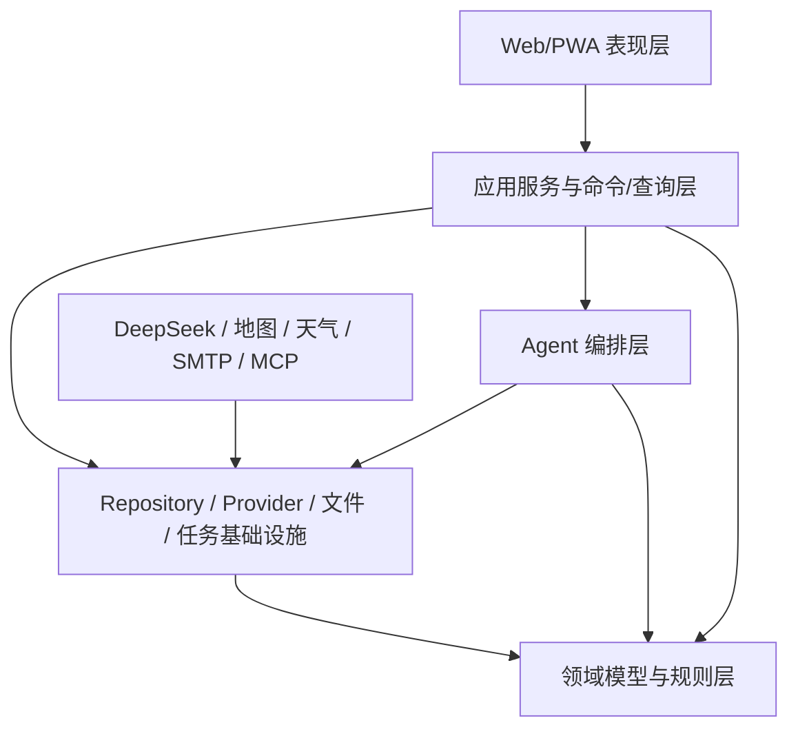

# 智能旅游规划系统详细设计文档集

> 设计基线版本：1.0-draft
> 设计日期：2026-08-30
> 上游需求基线：`software-requirements-specification.md` 1.0-baseline
> 当前状态：详细设计已完成，交叉校验通过，可进入实现契约与骨架开发

## 1. 文档目的

本目录把已经确认的产品需求转换为可以实施、测试和审计的详细设计契约。设计遵循以下约束：

1. 数据库中的结构化旅行状态是唯一事实来源；
2. AI 只能形成提案，不能绕过授权直接修改正式行程；
3. 所有外部信息必须携带来源、采集时间、可信状态和失效时间；
4. 所有重要数据变更必须可追踪、可比较、可恢复；
5. 默认部署应适合 AMD64 NAS，空闲内存低于 512 MB，正常峰值低于 2 GB；
6. 首版是模块化单体，不把未来扩展需求提前实现成微服务；
7. 外部 Provider、模型和 MCP 通过稳定的内部接口隔离。

## 2. 上游权威文档

当详细设计与需求文档冲突时，按下列顺序处理：先记录冲突，不静默改变需求；产品行为以 SRS 为准；技术取舍以已批准 ADR 为准；仍不能判断时进入设计问题清单。

| 优先级 | 文档 | 用途 |
|---|---|---|
| 1 | [软件需求规格说明书](../software-requirements-specification.md) | 267 条功能/非功能需求和验收基线 |
| 2 | [运行流程与设计准入复核](../system-runtime-flow-and-design-readiness-review.md) | 跨文档统一口径和端到端流程 |
| 3 | [智能体详细流程](../agent-workflow-detailed-spec.md) | Agent 节点、质量门、失败恢复 |
| 4 | [API、Agent 与 MCP 接入规格](../api-agent-mcp-integration-research-spec.md) | 外部接入和协议研究结论 |
| 5 | [自托管小型系统设计](../self-hosted-small-system-design.md) | 部署、资源和技术栈边界 |
| 6 | 其他专项调研 | Provider、价格、Key、小红书等专项证据 |

## 3. 详细设计文档清单

| 编号 | 文档 | 核心交付物 | 状态 |
|---|---|---|---|
| DD-01 | [系统架构与架构决策](./01-system-architecture-and-adrs.md) | 容器、模块、依赖规则、ADR、目录结构 | 已评审 |
| DD-02 | [领域模型与数据库设计](./02-domain-model-and-database-erd.md) | 聚合、ERD、表、索引、删除与保留策略 | 已评审 |
| DD-03 | [状态机、版本与事务设计](./03-state-machines-versioning-and-transactions.md) | 状态迁移、Proposal、并发、Outbox | 已评审 |
| DD-04 | [REST、SSE 与文件接口契约](./04-api-sse-and-file-contracts.md) | API 规则、资源端点、事件和错误 | 已评审 |
| DD-05 | [Agent 运行时、工具与 Provider 设计](./05-agent-runtime-tools-and-provider-design.md) | 节点契约、上下文、工具权限、MCP | 已评审 |
| DD-06 | [安全、加密、权限与隐私设计](./06-security-encryption-rbac-and-privacy.md) | RBAC、密钥、Session、附件、审计 | 已评审 |
| DD-07 | [移动端 PWA 与交互设计](./07-mobile-pwa-information-architecture-and-interaction.md) | 信息架构、页面状态、地图联动、离线 | 已评审 |
| DD-08 | [部署、任务、可观测性与运维设计](./08-deployment-jobs-observability-and-operations.md) | Compose、资源预算、任务、备份和升级 | 已评审 |
| DD-09 | [测试、Agent 评估与质量门](./09-testing-evaluation-and-quality-gates.md) | 测试分层、数据集、性能门和发布门 | 已评审 |
| DD-10 | [需求追踪与差异分析](./10-requirements-traceability-and-gap-analysis.md) | 需求到设计/测试映射、遗漏和冲突检查 | 已评审 |
| DD-11 | [详细设计最终评审记录](./11-detailed-design-review-record.md) | 迭代校验结果、遗留风险、设计准出结论 | 已评审 |
| DD-12 | [攻略知识库与检索详细设计](./12-guide-knowledge-base-and-retrieval-design.md) | 导入、Claim、加密检索、RAG、模型读取与质量门 | 已评审 |
| DD-13 | [实现架构、设计模式与扩展契约](./13-implementation-architecture-patterns-and-extension-contracts.md) | 模块边界、UoW、模式、依赖规则、扩展点与纵向切片 | 已评审 |

## 4. 设计层级与依赖方向

依赖规则：领域层不得导入 FastAPI、SQLAlchemy、LLM SDK、地图 SDK 或 MCP SDK；应用层依赖领域接口；基础设施层实现端口；API 层只做鉴权、解析、调用和输出映射。

## 5. 统一术语

| 术语 | 定义 |
|---|---|
| Trip | 一次旅行的顶级业务聚合和当前版本指针 |
| ItineraryVersion | 行程结构化状态的一次不可变版本 |
| TripItem | 景点、餐厅、住宿、休息、集合点等时间线模块 |
| TripLeg | 两个节点之间的交通段 |
| Evidence | 外部信息或用户资料形成的带来源证据 |
| Observation | 某一时间点观察到的价格、天气、营业等事实 |
| Proposal | 尚未改变正式状态的 AI/导入/重算提案 |
| TripPatch | 对指定基线版本的类型化变更集合 |
| PlanningRun | 一次可恢复的 Agent 工作流执行 |
| ToolCall | Agent 对受控内部工具的一次调用记录 |
| AuditEvent | 人或系统实施重要行为的不可变审计记录 |
| OutboxEvent | 与业务事务同提交、供异步副作用消费的事件 |

## 6. 设计完成判据

详细设计只有同时满足以下条件才可进入实现：

- 每个 P0 需求至少映射到一个设计章节和一个验证方式；
- 数据写路径都有授权、版本、事务、审计和失败语义；
- 外部调用都有超时、缓存、配额、降级和来源记录；
- Agent 每个节点都有输入、输出、工具白名单、停止条件和恢复点；
- 敏感字段、密钥、附件和备份都有明确加密边界；
- 移动端核心旅行闭环不依赖桌面页面；
- 资源预算有可执行的压测场景和失败门槛；
- 文档链接、术语、状态、接口和需求编号通过自动/人工交叉检查。

## 7. 变更控制

详细设计中的变更分三类：

- `Clarification`：不改变用户行为，只补足技术语义，可直接进入设计修订；
- `Design decision`：存在多个技术实现，必须新增或修订 ADR；
- `Requirement change`：改变范围、优先级、用户权限或验收行为，必须先修改 SRS，再更新追踪矩阵。

每份文档使用 `1.0-draft → 1.0-review → 1.0-approved` 状态。实现开始后，破坏性接口或数据模型变更必须有迁移方案。
