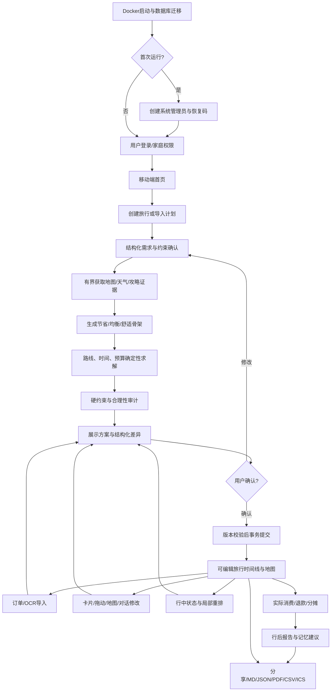

# 智能旅游规划系统运行流程与设计阶段准入复核

> 复核日期：2026-08-30
> 文档状态：需求基线交叉审查完成
> 结论：可以进入系统设计阶段；运行型 PoC 作为设计/实现验证门继续保留
> 主需求基线：[软件需求规格说明书](./software-requirements-specification.md)

## 1. 复核结论

当前需求规格已经覆盖本项目从部署、账号、家庭协作、旅行创建、智能规划、地图路线、预算、订单、消费、行中调整、分享导出到备份恢复的完整闭环。经过跨文档检查和口径修正后，**没有仍需产品选择、且会阻塞系统设计开始的需求问题**。

可以进入设计阶段，但“可以设计”不等于“所有外部能力已经完成运行验收”。地图 JS 渲染、OCR 模型、LangGraph 适配、PDF 峰值、小红书 Worker 和目标 NAS 资源表现仍需在对应模块设计/实现前通过 PoC。所有这些项目均已有默认方案、失败降级和 Go/No-Go 条件，不要求现在停下来继续需求访谈。

### 1.1 准入判断

| 检查项 | 结果 | 说明 |
|---|---|---|
| 产品目标和非目标 | 通过 | 自托管、小范围使用、不交易、不支付、国内优先边界明确 |
| 用户与权限 | 通过 | 系统管理员、家庭管理员、成员、访客和匿名公开访问边界明确 |
| 核心旅行闭环 | 通过 | 创建、规划、确认、编辑、订单、行中、消费、复盘完整 |
| 智能体流程 | 通过 | 状态、节点、工具权限、质量门、恢复和降级完整 |
| 外部 Provider | 通过 | 高德主用、百度补充、和风天气、DeepSeek、SMTP及可选攻略来源均有适配层 |
| 数据一致性 | 通过 | 数据库结构化状态是唯一事实来源，聊天不能覆盖当前状态 |
| 审批与审计 | 通过 | AI 只生成 Proposal，用户确认和版本校验后事务提交 |
| 成本与配额 | 通过 | DeepSeek 计量不阻断；其他外部 Provider 免费优先、硬限额和统一用量账本 |
| 安全与隐私 | 通过 | 加密、最小权限、脱敏、SSRF/提示注入防护、第三方会话边界明确 |
| 性能与部署 | 通过 | AMD64、Docker Compose、SQLite、空闲 <512 MB、正常峰值 <2 GB |
| 移动端 | 通过 | PWA/H5 优先，首页行中关键信息、卡片地图联动、外部唤端 |
| 可移植性 | 通过 | Markdown、JSON、PDF、CSV、ICS P1、加密全量归档 |
| 测试与验收 | 通过 | 267条需求、11个端到端验收场景、14项核心PoC、12项小红书PoC |
| 相对文档链接 | 通过 | 已检查 `docs/*.md`，没有失效的本地相对链接 |

### 1.2 本轮统一的口径

本轮发现并修正的是文档演进差异，不是新增产品范围：

1. **小红书凭据边界**：P0 不自动登录、不保存 Cookie；P1/R 可选只读 Worker 只保存用户扫码产生的加密浏览器会话，不保存账号密码，不提供写操作；
2. **OCR 首版范围**：统一为服务端轻量 PP-OCR 子进程 + 用户逐项确认；视觉模型仅在用户选择后复核；
3. **地图拖动**：基本地图标记拖动、影响预览和确认重算属于 P0，P1 只优化手势和批量体验；
4. **行中调整与记忆**：均属于 P0 Agent 节点，不再列入 P1；
5. **攻略能力分层**：用户导入攻略属于 P0，自主公开搜索和小红书查询属于可选增强；
6. **编排框架**：领域层使用自有 `WorkflowRuntime` 契约；LangGraph 是可替换候选而不是业务模型依赖；
7. **模型 Agent 库**：首版采用自有 `ModelProvider + AgentNode`，不强制引入 Pydantic AI；
8. **实时前端协议**：首版使用内部 SSE 事件子集，参考 AG-UI 语义但不承诺完整兼容；
9. **远程 MCP 权限**：只有系统管理员可以新增地址与凭据，家庭管理员只能启停已批准 Provider；
10. **公开地图隐私**：公开分享页不自动加载外部地图，用户主动点击后再跳转；
11. **PDF 基线**：结构化数据生成 HTML 后受控 Chromium 打印，内存不达标时替换渲染器而不改变导出契约；
12. **开源许可证**：项目设计基线采用 Apache-2.0，正式发布前完成第三方许可证复核。

## 2. 已审查文档与职责

| 文档 | 主要职责 | 复核结果 |
|---|---|---|
| [软件需求规格说明书](./software-requirements-specification.md) | 产品范围、267条需求、状态、验收和版本计划 | 主基线，完整 |
| [自托管小型系统设计](./self-hosted-small-system-design.md) | 单体技术路线、Docker、SQLite、FastAPI、资源和安全 | 与SRS一致 |
| [国内API与数据源调研](./domestic-travel-agent-integration-research.md) | 地图、交通、餐饮、酒店、攻略、MCP和开源工具 | 与Provider策略一致 |
| [API、Agent与MCP接入规格](./api-agent-mcp-integration-research-spec.md) | 内外接口、数据契约、Agent框架、MCP、安全、PoC | 设计基线已收敛 |
| [智能体详细流程](./agent-workflow-detailed-spec.md) | 完整规划、局部修改、行中调整、质量门、恢复和成本 | P0/P1节点已统一 |
| [智能体工作流图](./agent-workflow-diagrams.md) | 新旅行和局部调整的可视化流程 | 与详细流程一致 |
| [API Key申请与测试清单](./api-key-application-and-integration-test-checklist.md) | 配置项、环境变量和测试方式 | 可用于设计后的联调环境 |
| [API定价与配额](./api-pricing-quota-and-cost-control.md) | 免费额度、预算、限流、缓存、计量和熔断 | 与SRS成本规则一致 |
| [小红书查询专项规格](./xiaohongshu-guide-search-tool-spec-and-feasibility.md) | 只读Worker、工具、会话、安全、资源和PoC | 定位为P1/R，不阻塞主链路 |
| `data/integration-reports/*` | 已配置Provider的脱敏探测结果 | 14项通过、2项JS加载部分通过、0失败 |

## 3. 需求覆盖矩阵

| 需求域 | 用户目标 | 规格位置 | 运行闭环 | 状态 |
|---|---|---|---|---|
| 部署 | AMD64 NAS、Docker、小内存、自主使用 | SRS 11/12、Self-hosted 3/15 | Compose→迁移→健康→初始化 | 完整 |
| 认证 | 密码登录、管理员/成员/访客、恢复 | SRS 3、6.1、6.28 | 初始化→登录→Session→审计 | 完整 |
| 家庭组 | 多账号、家庭资料复用、公共历史 | SRS 6.2、6.24 | 家庭→成员→旅行权限→分享 | 完整 |
| 偏好记忆 | 家庭/个人/单次分层、旅行后评价 | SRS 6.3、Agent 15 | 读取→建议→用户确认→写入 | 完整 |
| 创建旅行 | 表单与对话、日期、出发地、目的地、人数、风格 | SRS 6.4 | Draft→结构化→约束确认 | 完整 |
| 目的地推荐 | 未确定目的地时推荐3～5项 | FR-TRIP-003/004 | 候选→交通/费用/风险→选择 | 完整 |
| 多方案 | 节省、均衡、舒适，可改数量 | SRS 6.5 | 同证据生成多骨架→求解→比较 | 完整 |
| 模块编辑 | 卡片、时间线、拖动、地图、对话修改 | SRS 6.6/6.7、Agent 8 | Patch→影响分析→差异→确认 | 完整 |
| 状态同步 | 所有UI修改对模型立即可见 | SRS 5.2 | DB快照→每次模型调用重建上下文 | 完整 |
| 全过程路线 | 家到机场/车站、城际、市内、返程到家 | SRS 6.8 | TripItem+TripLeg连续图 | 完整 |
| 交通方式 | 飞机、铁路、自驾、出租、公交、步行、轮渡 | FR-ROUTE-001 | Provider/估算/用户确认多级降级 | 完整 |
| 地图 | 高德展示、百度补充、移动唤端 | SRS 6.7、API Spec 5 | POI→坐标→路线→卡片→外部导航 | 完整 |
| 天气 | 提示优先，不擅自大改计划 | SRS 6.13 | 预报→规则→提示/备选→用户选择 | 完整 |
| 景点 | 时长、营业、预约、票种、合理性 | SRS 6.10 | 候选→证据→验证→日程 | 完整 |
| 餐饮 | 餐厅、菜单、套餐、人数和价格范围 | SRS 6.11 | POI/攻略→候选→菜单导入→预算 | 完整 |
| 酒店 | 区域优先、候选、确认导入、路线重算 | SRS 6.12 | 区域→酒店→用户确认→正式地点 | 完整 |
| 攻略 | 用户导入、多来源、自主搜索、小红书可选 | SRS 6.14、XHS Spec | 导入/搜索→证据→主张→复核 | 完整 |
| 模型 | DeepSeek、自定义模型、工具循环和结构化输出 | SRS 6.15、Agent Spec | 能力探测→节点调用→Schema校验 | 完整 |
| OCR | 截图/PDF、用户修正、视觉复核 | SRS 6.16 | 净化→OCR→草稿→确认→落库 | 完整 |
| 预算 | 多人、房晚、车辆、票种、范围和实价层次 | SRS 6.17 | PriceObservation→规则计算→审计 | 完整 |
| 订单 | 文字/截图/PDF、匹配、冲突和变更 | SRS 6.18 | 提取→确认→匹配→替换估价 | 完整 |
| 消费 | 记账、垫付、AA、退款、押金、报告 | SRS 6.19 | 追加事件→分摊→汇总→报告 | 完整 |
| 行中 | 今日首页、状态、位置、局部重排、离线查看 | SRS 6.20、Agent 9 | 状态更新→受影响子图→Patch | 完整 |
| 通知 | 站内、SMTP可选、ICS、Push预留 | SRS 6.21 | 事件→提醒任务→站内/邮件/导出 | 完整 |
| 清单应急 | 行李、责任人、医院、派出所、电话 | SRS 6.22/6.23 | 自动建议→编辑→行中查看 | 完整 |
| 分享公共库 | 私有/家庭/公开、脱敏、密码、有效期 | SRS 6.24 | 脱敏副本→预览→确认→分享 | 完整 |
| 审计历史 | AI、用户、订单、消费、管理员恢复均记录 | SRS 6.25 | 版本+事件→历史→恢复 | 完整 |
| 导入导出 | MD、JSON、PDF、CSV、ICS、地图链接 | SRS 6.26 | 结构化快照→渲染→下载/重导入 | 完整 |
| 管理运维 | Key、用量、任务、日志、备份、升级 | SRS 6.27/6.28 | 配置→探测→监控→备份恢复 | 完整 |

## 4. 系统总运行模型

系统运行围绕四条不可破坏的主线：

1. **结构化状态是事实**：数据库中的Trip、版本、订单和消费是当前事实，聊天只是输入与解释；
2. **AI先提案后提交**：模型不能直接改业务表，只能产生类型化Proposal/Patch；
3. **外部信息是证据**：地图、天气、攻略和价格均带来源、时间、有效期和可信状态；
4. **所有变化可追溯**：用户、AI、OCR、订单、系统任务和管理员恢复都生成审计事件。

### 4.1 总体流程图



### 4.2 权威数据写入链

```text
用户操作 / AI建议 / OCR结果 / 外部事件
  → Command 或 Draft
  → 权限、Schema、业务规则校验
  → 计算影响范围
  → Proposal + Before/After Diff
  → 用户确认（自动保存类低风险操作除外）
  → 检查 Trip expected_version
  → 单数据库事务
      ├─ 写业务实体
      ├─ 生成 ItineraryVersion
      ├─ 写 AuditEvent
      ├─ 写 OutboxEvent
      └─ 更新派生状态失效标记
  → 提交后异步刷新地图、预算、提醒、导出缓存
  → SSE 通知前端
```

订单、消费、退款、权限、公开分享、管理员恢复等高影响数据不允许跳过审计。AI Proposal在用户确认前不得改变Trip当前版本。

## 5. 部署、启动与初始化流程

## 5.1 默认Compose启动

```text
反向代理/Web容器启动
  → FastAPI单Worker启动
  → 加载APP_SECRET/Secret文件
  → 打开SQLite WAL
  → 获取迁移锁并执行迁移
  → 校验数据目录与附件目录权限
  → 恢复未完成任务状态
  → 注册内部Provider但不强制联网
  → 健康检查通过
  → 提供初始化页或登录页
```

系统没有DeepSeek、高德、百度、和风、SMTP Key时仍然能够启动。未配置能力在UI显示“未配置”，不能导致健康检查失败。

## 5.2 首次初始化

1. 检测数据库不存在或`system_initialized=false`；
2. 只允许本地/一次性初始化Token访问设置向导；
3. 创建系统管理员用户名/邮箱和密码；
4. 生成独立恢复码，界面只显示一次，数据库只保留验证材料；
5. 选择数据、附件和备份目录；
6. 可选配置DeepSeek、高德、百度、和风和SMTP；
7. 对每个Provider执行脱敏连接测试；
8. 保存系统配置并写审计事件；
9. 关闭初始化入口，进入登录页。

## 5.3 日常启动与恢复

- 被中断的只读任务可从安全检查点恢复或重新运行；
- 等待用户确认的Proposal保持等待状态；
- 已进入提交事务但未提交的数据由SQLite事务回滚；
- Outbox未投递事件重放时使用幂等键；
- OCR、PDF和Chromium等重任务不会在启动时同时恢复，进入单并发队列；
- 外部Provider故障不会阻止用户查看和编辑已有旅行。

## 6. 账号、家庭与权限流程

### 6.1 登录

```text
提交账号密码
  → 登录限流
  → 强密码哈希验证
  → 检查账号/家庭状态
  → 创建HttpOnly SameSite Session
  → 记录成功/失败审计
  → 加载用户、家庭、角色和最近旅行摘要
```

### 6.2 家庭组

1. 用户创建家庭或接受邀请；
2. 家庭管理员创建成员、设置角色和家庭默认偏好；
3. 成员资料可复用到旅行，但单次旅行复制后可覆盖；
4. 私有旅行和私有聊天默认只有本人可见；
5. 家庭管理员恢复成员数据必须走显式恢复流程、通知成员并审计；
6. 访客只通过旅行分享权限访问，不自动成为家庭成员。

### 6.3 权限检查位置

权限必须在服务端的Command/Query入口执行，不能依赖前端隐藏按钮。后台任务恢复、SSE订阅、附件下载、导出和外部Provider会话都要重新验证用户与旅行权限。

## 7. 新旅行完整规划流程

## 7.1 创建Draft

入口：结构化表单、自然语言、已有Markdown/PDF/截图/文本。

```text
创建Trip Draft
  → 选择可见性和参与者
  → 填写日期/范围、出发地、目的地、预算、人数、风格
  → 可选选择家庭/个人偏好
  → 可选导入已订订单、攻略和已有计划
  → 保存Draft并生成PlanningRun
```

## 7.2 需求结构化与确认

1. Intake Agent把输入转成`TripRequirementsDraft`；
2. 应用规则识别日期、目的地、参与者、订单时间和硬约束等阻塞缺项；
3. 一次最多询问三个真正阻塞的问题；
4. 模型记忆只能产生普通偏好，不能自行产生必须约束；
5. 移动端展示“本次规划依据”卡；
6. 用户确认后生成不可变`ConstraintSet`；
7. 后续研究和方案生成均引用该版本。

## 7.3 有界研究

```text
Research Planner生成最小查询计划
  ├─ 用户订单/已确认信息
  ├─ 高德POI、路线粗信息和基础天气
  ├─ 和风详细天气/预警（已配置时）
  ├─ 百度回退或关键事实抽样
  ├─ 官方景区/文旅/交通页面
  ├─ 用户导入攻略
  └─ 可选公开搜索/小红书只读Provider
      ↓
EvidenceNormalizer
      ↓
去重、时效、冲突、可信状态和适用人群
```

研究先验证决定可行性的事实，再收集用于推荐排序的经验。达到一个权威来源、两个独立一致来源、边际信息不足、调用预算或时间上限后停止。

## 7.4 候选、路线与预算

1. 按硬约束、区域和粗距离裁剪地点；
2. Designer一次生成节省、均衡、舒适三个日程骨架；
3. 粗粒度过滤明显不可行方案；
4. 只对入选地点执行精确路线和入口定位；
5. Route Solver补齐家到枢纽、城际、市内、返程到家的全部TripLeg；
6. Time Engine加入值机、安检、换乘、停车、排队、入住、寄存等缓冲；
7. Budget Engine按人、儿童、老人、车辆、房晚、订单和实际消费计算；
8. PriceObservation保留估算、报价、订单价和实付层次；
9. 确定性审计检查时间、营业、空间、体力、交通、天气、预算和预约；
10. 失败项最多进行两轮定向修复，不能无限重跑。

## 7.5 方案审批与提交

前端先显示预览，但只有通过硬质量门的方案可以确认。用户看到：

- 三方案差异；
- 每日时间线和地图；
- 总预算、分类预算和不确定价格；
- 风险、假设、来源和备选；
- 会被正式写入的结构化差异。

用户确认后，服务端重新加载Trip最新版本并检查动态事实。版本一致则事务提交；版本冲突则保留Proposal、显示新旧差异并要求重新合并。

## 8. 编辑与模型状态同步流程

## 8.1 手工卡片/拖动修改

```text
用户编辑卡片、拖动顺序或地图标记
  → 前端产生结构化Patch
  → 服务端验证权限与expected_version
  → 解析POI/坐标变化
  → 计算受影响子图
  → 重算相邻路线、时间和预算
  → 展示影响预览
  → 用户确认
  → 提交新版本与审计
```

地图拖动不能静默替换为另一个同名地点。系统需展示新坐标、候选POI、前后路线和费用变化。

## 8.2 对话修改

每次模型调用前重新加载：

- 当前Trip版本；
- 最新TripItem/TripLeg；
- 已确认ConstraintSet；
- 锁定、已订、已完成和已跳过项；
- 当前订单、预算和实际消费摘要；
- 用户/家庭/单次偏好；
- 最近相关变更摘要。

聊天历史不能替代这些数据。模型输出Patch后仍走同一影响、差异、确认和版本提交流程。

## 8.3 局部与全局优化

- 默认局部：只重算受影响地点及前后连接；
- 用户明确要求全局优化时重新评估整趟旅行；
- 全局优化仍冻结锁定、已订和已完成项目；
- 硬约束传播到全局时，系统说明为什么局部修改不足；
- 已过去较久或已有实际记录的项目不修改。

## 9. 订单、OCR和预算更新流程

```text
上传文字/截图/PDF
  → 文件类型、大小、恶意内容和图片重编码检查
  → 服务端轻量PP-OCR子进程
  → OrderDraft/ExpenseDraft结构化提取
  → 显示原图、OCR值、置信度和字段级编辑
  → 用户认为不准时可选择视觉模型复核
  → 用户确认最终字段
  → 匹配TripItem/TripLeg并检查时间/地点/人员冲突
  → 展示预算替换差异
  → 用户确认
  → 保存订单、保留原估价、更新预算和审计
```

OCR输出永远是Draft。订单价可以成为当前订单价格，但不能删除原来的计划估价。取消、改签和退款使用新状态事件或冲销记录。

## 10. 行前与行中流程

## 10.1 行前

- 手动或提醒任务刷新关键天气、营业、预约和交通事实；
- 变化默认以建议和备选展示，不因天气自动大改成熟计划；
- 用户明确启用“天气优先”后才允许跨日期调整主要项目；
- 生成清单、应急信息和离线可读旅行快照；
- SMTP未配置时所有提醒保留站内形式。

## 10.2 行中首页

手机首页优先展示：

```text
当前旅行/今天
下一地点与预计出发时间
一键打开地图/导航
相关订单与票据
天气/风险提醒
今日预算与已消费
完成/跳过/延迟/临时新增
附近找餐厅/医院/派出所
```

定位仅在用户打开页面并授权时获取，不后台持续跟踪。

## 10.3 行中局部重排

1. 用户输入“晚到了”“太累”“下雨”“预算不足”等；
2. 系统加载最新时间、状态、订单和可选位置；
3. 冻结已完成、较早已过去、锁定和已订项；
4. 默认只调整当天尚未完成的项目；
5. 刷新必要实时事实，不重新做整趟攻略研究；
6. 生成1～3个局部方案；
7. 重算相邻路线、时间、预算和订单影响；
8. 展示前后差异，用户确认后提交；
9. 需要影响未来日期时明确提示并征求扩大范围。

离线时可以查看、勾选状态、记账和保存待同步操作；需要地图、天气或模型的重排会提示联网后继续。

## 11. 消费、账单与行后流程

## 11.1 记账

消费可由手工输入、确认订单或票据Draft产生，包含金额、币种、时间、地点、付款人、参与人、分类、支付方式和计划关联。

```text
新增消费
  → 选择计划内/计划外
  → 选择付款人和参与人
  → 计算平均/指定/成员类型/AA分摊
  → 写Expense与分摊明细
  → 更新日/分类/成员/全程统计
  → 写AuditEvent
```

更正、删除、部分退款、押金返还和预授权释放均使用追加更正/冲销事件，原始记录保留。

## 11.2 行后报告

旅行结束后生成：

- 预算、订单价、实付和差异；
- 每日、分类、成员和付款人统计；
- 计划内/计划外消费；
- 跳过、新增、延迟和实际时间；
- 用户评价和来源复盘；
- 可选长期偏好建议。

模型提取的记忆必须展示给用户确认后才能写入`UserMemory`。用户可以查看、修改、禁用和删除记忆。

## 12. 分享、导出与外部跳转

## 12.1 分享

```text
选择私有/指定成员/家庭/公开
  → 配置只读/评论/复制/协作、密码、有效期
  → 生成独立脱敏副本
  → 隐藏地址、姓名、订单号、付款、房间、联系方式、健康和私密备注
  → 用户预览并二次确认
  → 发布不可变分享版本
```

后续私有旅行修改不会自动泄露到旧分享副本。公开页默认`noindex`，且不自动加载外部地图脚本；用户点击地图或导航后再跳转。

## 12.2 导出

- Markdown/PDF：完整路书、可点击地图链接和可选二维码；
- JSON：结构化版本，可重新导入本系统；
- CSV：预算、消费和分摊；
- ICS（P1）：行程事件、地点、提醒和地图链接；
- 家庭归档：密码加密，可在新部署恢复。

导出从指定的不可变旅行版本读取，避免生成过程中被并发修改。

## 13. 外部Provider和智能体运行流程

## 13.1 Provider调用

```text
业务节点提出类型化查询
  → ProviderPolicy检查权限、敏感数据和用户来源设置
  → QuotaManager检查缓存、免费配额、硬预算和熔断
  → ProviderAdapter调用REST/SDK/MCP/浏览器
  → 统一超时、重试和错误映射
  → Evidence/PriceObservation标准化
  → UsageLedger记录调用、重试、缓存和成本
  → 返回业务节点
```

DeepSeek使用`meter_only`：统计峰谷Token和估算费用，但不因普通金额阈值中断正常规划；异常循环仍由最大轮数、工具数和总时限保护。地图、天气、OCR、网页抓取等达到硬预算后停止潜在付费调用并降级。

## 13.2 MCP

- 模型不直接连接MCP Server；
- MCP Gateway负责工具发现、Schema hash、白名单、凭据、超时、结果大小和审计；
- 工具Annotation和Description不被视为权限证明；
- 系统管理员才能添加远程MCP；
- MCP结果转换为内部Place、Route、Evidence等对象；
- Schema变化、提示注入或超大结果触发隔离和降级。

## 13.3 Agent运行Profile

| Profile | 场景 | 模型上限 | 工具上限 | 总时限 |
|---|---|---:|---:|---:|
| CHAT_FAST | 解释和简单问答 | 1 | 0～2 | 30秒 |
| PATCH_LOCAL | 局部修改 | 2 | 8 | 90秒 |
| PLAN_STANDARD | 标准旅行 | 5 | 24 | 180秒 |
| PLAN_DEEP | 多城市/复杂成员/多攻略 | 8 | 60 | 300秒 |
| IN_TRIP | 行中调整 | 3 | 12 | 90秒 |

超出边界需要启动新的Run，不能在同一Run无限延长。

## 14. 重任务与资源控制流程

OCR、PDF和Chromium浏览器属于同一重任务资源组：

```text
任务提交
  → 进入SQLite任务队列
  → 获取global_heavy_task_slot（容量1）
  → 启动受控子进程/可选Worker中的Chromium
  → 监控时间、RSS/cgroup、页数和输出大小
  → 成功保存结果引用；失败保存可恢复状态
  → 终止子进程并释放内存
  → 释放槽位并唤醒下一任务
```

默认API单Worker、无Redis/Celery。超过资源预算的第二个重任务排队，不允许同时抢占内存。目标环境为2核/2GB最低可运行、4GB推荐；空闲服务端总内存低于512MB，正常受控任务峰值低于2GB。

## 15. 错误与降级总流程

| 故障 | 用户仍可完成的操作 | 降级策略 |
|---|---|---|
| 模型不可用 | 查看、编辑、记账、导入和导出已有旅行 | 保存Draft与证据，稍后继续生成 |
| 高德不可用 | 查看缓存和手工地点 | 百度回退或粗估并标待验证 |
| 百度不可用 | 高德主流程继续 | 停止影子校验 |
| 和风不可用 | 继续规划 | 使用高德基础天气或不调整计划 |
| 攻略不可用 | 继续规划 | 用户输入、官方和地图事实，不虚构评价 |
| OCR失败 | 查看原文件 | 用户手工录入或选择视觉复核 |
| SMTP失败 | 使用站内提醒 | 队列重试，邮件非启动依赖 |
| PDF失败 | 使用Markdown/JSON | 降低图片、换轻量渲染器或稍后重试 |
| 外部配额耗尽 | 继续离线/缓存功能 | 停止潜在付费调用并明确标记 |
| 版本冲突 | 保留用户输入与Proposal | 基于最新版本重新合并 |
| NAS重启 | 查看已提交数据 | 从检查点恢复，事务与幂等防重复 |
| 存储不足 | 查看现有数据 | 阻止新附件/备份并提示清理 |

任何降级都不能把`unknown`伪装成`verified`，也不能为了“给出答案”虚构营业、路线、价格或评价。

## 16. 数据状态与生命周期

| 数据 | 当前事实 | 默认保留与更新方式 |
|---|---|---|
| Trip/Item/Leg | 当前版本指针 | 不可变版本+当前投影 |
| 聊天 | 交互记录，不是事实 | 加密长期保留，用户可删 |
| Evidence | 某时间观察 | 来源、时间、有效期、冲突均保留 |
| PriceObservation | 价格层次观察 | 估算/报价/订单/实付互不覆盖删除 |
| OrderRecord | 用户确认订单 | 状态事件记录变更/取消/退款 |
| Expense | 实际账本 | 更正、冲销和删除事件追加 |
| UserMemory | 用户确认偏好 | 可查看、禁用、修改、删除 |
| 分享 | 脱敏不可变副本 | 撤销后不可访问，历史审计保留脱敏事件 |
| 附件 | 加密文件卷 | 哈希、MIME、权限和业务关联 |
| Provider Secret | Secret Store | 环境变量或应用层加密，日志不回显 |
| 备份 | 加密归档 | 7份日备份+4份周备份，可配置 |

## 17. 运维、备份与升级流程

### 17.1 管理页

管理员可以查看和管理：模型/地图/天气/SMTP连接、免费配额和用量、任务、磁盘、数据库、附件、最近错误、备份、更新和遥测。遥测默认关闭。

### 17.2 备份

```text
定时/手工/升级前触发
  → SQLite在线一致性备份
  → 收集附件、配置和Schema版本
  → 默认排除明文Secret
  → 用户密码加密归档
  → 写入管理员指定目录
  → 验证归档清单和可读取性
  → 按7日+4周策略轮换
```

### 17.3 升级

1. 管理页检查更新但不自动安装；
2. 用户确认升级；
3. 自动创建并验证备份；
4. 拉取固定版本镜像，不使用`latest`；
5. 执行向前数据库迁移；
6. 迁移失败停止新版本并提供恢复路径；
7. 健康检查通过后恢复任务；
8. 普通升级不得丢失行程、聊天、订单、消费和附件。

## 18. 设计阶段输入与输出

## 18.1 已冻结的设计输入

- React + TypeScript + Vite PWA；
- Python + FastAPI + Pydantic单体后端；
- SQLite WAL，Repository隔离，PostgreSQL仅后续Profile；
- OpenAI-compatible ModelProvider，DeepSeek为已验证默认候选；
- 高德主地图、百度补充、和风详细天气、高德天气降级；
- HTTP SSE进度；
- 自有WorkflowRuntime和AgentNode契约；
- AI Proposal/TripPatch + 用户审批 + 版本事务；
- 本地轻量OCR、受控重任务并发1；
- Docker Compose、AMD64、默认不启用重型可选服务；
- Apache-2.0项目许可证基线；
- 空闲 <512 MB、正常峰值 <2 GB。

## 18.2 设计阶段建议产物顺序

1. **架构决策记录ADR**：单体边界、WorkflowRuntime、任务模型、加密和Provider原则；
2. **领域模型与ERD**：Trip、版本、Item、Leg、Evidence、Price、Order、Expense、Audit、Memory、Share；
3. **状态机**：Trip、TripItem、PlanningRun、Proposal、Order、Expense更正、分享和后台任务；
4. **API契约**：OpenAPI、错误模型、expected_version、幂等键、分页、上传和SSE事件；
5. **Agent契约**：Node输入输出Schema、工具权限、Prompt版本、检查点和停止条件；
6. **Provider契约**：地图、天气、模型、网页、OCR、MCP和用量账本；
7. **安全设计**：认证、RBAC、加密密钥层次、恢复码、Secret Store、文件和URL沙箱；
8. **移动端信息架构和交互原型**：首页、创建向导、方案比较、旅行时间线、地图、预算、行中和设置；
9. **部署设计**：Compose、Volume、迁移、备份、升级、健康检查和资源限制；
10. **测试架构**：黄金旅行集、Provider契约测试、Agent评估、故障注入和2GB性能基线。

## 18.3 必须在设计阶段明确、但无需回到需求访谈的问题

这些是技术设计任务，不是产品需求缺口：

- 敏感字段的DEK/KEK层次、恢复码和密码重置如何解耦；
- SQLite当前投影与不可变版本/审计事件的具体表结构；
- WorkflowRuntime采用自有实现还是LangGraph Adapter的PoC结果；
- PP-OCR具体模型版本和进程封装；
- PDF Chromium打印的模板、字体和峰值控制；
- 高德/百度JS域名白名单和移动唤端实测；
- 可选小红书Worker是否通过专项Go/No-Go门。

每项都有既定默认方向与失败降级，不阻塞开始架构和数据设计。

## 19. 仍需执行的非阻塞验证

| 验证项 | 当前状态 | 最迟完成点 | 失败后的选择 |
|---|---|---|---|
| 高德/百度JS地图真实浏览器渲染 | 脚本加载部分通过 | 地图UI实现前 | 高德Web链接/静态占位，修正白名单 |
| 手机地图唤端 | 未实测 | 地图交互定稿前 | HTTPS地图页回退 |
| SMTP实际发送 | TLS与认证通过，未发送 | 通知模块验收前 | 站内提醒 |
| PP-OCR脱敏样本 | 待样本测试 | OCR实现选型前 | 手工录入+视觉模型可选 |
| LangGraph SQLite | 待PoC | WorkflowRuntime实现定稿前 | 自有显式状态机 |
| PDF中文和内存 | 待目标NAS测试 | PDF实现定稿前 | 轻量渲染/Markdown |
| 小红书只读Worker | 仅桌面与代码研究 | P1/R模块启动前 | 用户链接/截图/公开搜索 |
| 2核/2GB整机性能 | 待目标环境 | MVP合并前持续门 | 排队、降级或减少可选组件 |
| Provider免费配额 | API当前可用 | 上线配置向导前 | 硬限额、缓存、手工确认 |

## 20. 最终准入结论

需求规格已达到进入设计阶段的条件：

- P0产品范围明确；
- 技术栈、部署和资源目标明确；
- 核心数据对象和状态事实原则明确；
- AI、确定性引擎、外部Provider和用户审批的责任边界明确；
- 移动端、权限、审计、加密、备份和降级要求明确；
- 文档间关键冲突已修正；
- 尚未运行验证的项目都有默认方案、失败回退和完成节点。

**结论：没有需求级阻塞问题，可以正式进入系统设计阶段。**

设计阶段应从ADR、领域模型/ERD、状态机和API契约开始，不建议直接从页面或Agent Prompt编码开始。
